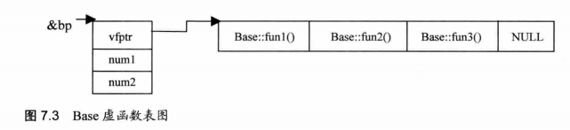
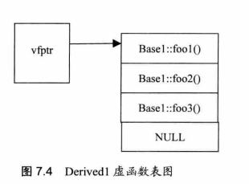
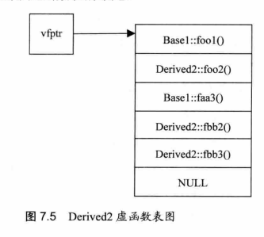
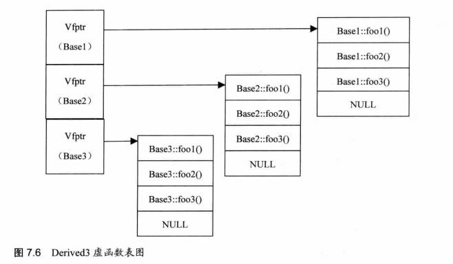
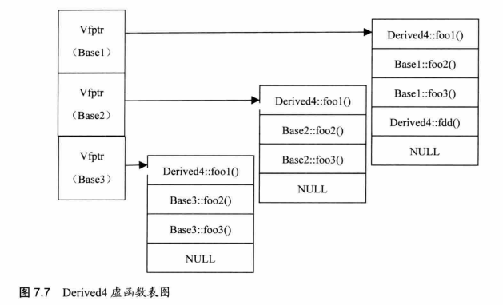

1.	C/C++程序基础

## 1.	一般赋值语句

```C
#include <stdio.h>

int main (){
    int x = 3, y, z;
    x *= (y = z = 4);
    printf("x = %d\n", x);
    z = 2;

    x =(y = z);
    printf("x = %d\n",x);
    x =(y == z);
    printf("X = %d\n",x);
    x = (y & z);
    printf("X = %d\n",x);
    x = (y && z);
    printf("X = %d\n",x);

    y = 4;
    x = (y  | z) ;
    printf("x = %d\n",x);
    x= ( y || z);
    printf("x = %d\n",x);

    x = (y == z) ? 4:5;
    printf("x = %d\n", x);

    x = (y == z) ? 1 : (y<z) ? 2 : 3;
    printf("x = %d\n",x);

    return  0;

}
```

## 2.	C++域操作符

```Cpp
#include <iostream>

int value = 0;
void printvalue(){
    printf("value = %d\n",value);
}

int main (){
    int value = 0;
    value = 1;
    printf("value = %d\n",value);
	//1
    
    ::value = 2;
    printvalue();
	//2
    return 0;
}
//C中无法通过编译,14行报错
//C++中无错误,在C++中可以通过域操作符::来直接操作全局变量
```

## 3.	i++和++i的区别

```cpp
#include <iostream>

int main(void) {
    int i = 8;
    printf("%d\n", ++i);
    //9
    printf("%d\n", --i);
    //8
    printf("%d\n", i++);
    //8
    printf("%d\n", i--);
    //9
    printf("%d\n", -i++);
    //-8
    printf("%d\n", -i--);
    //-9
    printf("------\n");
    return 0;
}	
```

## 4.	i++与++i哪个效率更高

```Cpp
#include <stdio.h>

int main() {
    int i = 0;
    int x = 0;
    i++;
    ++i;
    x = i++;
    x = ++i;
    return 0;
}
//内建数据类型的情况，效率没有区别。
//自定义数据类型(尤其是class时)的情况，++i 效率较高。因为(++i)可以返回对象的引用,而(i++)必须返回对象的值.
//后缀式（i++）必须产生一个临时对象保存更改前对象的值并返回，所以导致在大对象的时候产生了较大的复制开销，引起效率降低
```

## 5.	 选择编程风格良好的条件比较语句

```
#include <iostream>
//A.假设布尔变量名字为flag,它与零值比较的标准if语句如下。
//1
    if (flag == TRUE)
    if (flag == FALSE)
//2
    if (flag)
    if (!flag)
//A的第二种风格较良好。根据布尔类型的语义，零值为“假”(记为FALSE)，任何非零值都是“真”(记为TRUE)。TRUE的值究竟是什么并没有统一的标准。例如Visual C++将TRUE定义为1，而Visual Basic则将TRUE定义为-1。因此不可将布尔变量直接与TRUE、FALSE进行比较。

//B.假设整型变量的名字为value,它与零值比较的标准if语句如下。
//1
    if (value == 0)
    if (value != 0)
//2
    if (value)
    if (!value)
//B的第一种风格较良好，第二种风格会让人误解value是布尔变量，应该将整型变量用“==” 或“!=”直接与0比较。

//C.假设浮点变量的名字为x，它与0.0的比较如下。
//1
    if (x == 0.0)
    if (x != 0.0)
//2
    if ((x >= -EPSINON) && (x <= EPSINON))      //EPSINON为允许的误差(精度)
    if ((x < - EPSINON) || (x > EPSINON))
//C的第二种风格较为良好.注意:无论是float还是double类型的变量,都有精度限制.所以一定要避免将浮点变量用“==” 或“!=”与数字比较,应该设法转换成“>=” 或“<=”形式

//D 指针变量p与0的比较如下。
//1
    if (p == 0)
    if (p != NULL)
//2
    if (p == 0)
    if (p != 0)
//D的第一种风格较良好，指针变量的零值是“空”(记为 NULL)。尽管NULL的值与0相同，但是两者意义不同。用p与NULL显式比较，强调p是指针变量。如用p与0比较，容易让人误解p是整型变量。

```

## 6.	√有符号变量与无符号变量的值的转换

```
#include <stdio.h>
#include <iostream>

char getChar(int x,int y){
    char c;
    unsigned int a = x;
    printf("unsigned y = %u\n",y);
    (a+y >10)?(c=1):(c=2);
    return c;
}
int main(void){
    char c1 = getChar(7, 4);
    char c2 = getChar(7, 3);
    char c3 = getChar(7, -7);
    char c4 = getChar(7, -8);
    printf("c1 = %d\n",c1);
    printf("c2 = %d\n",c2);

    printf("c3 = %d\n",c3) ;
    printf("C4 = %d\n",c4) ;
    return 0;

}
//c1 = 1
//c2 = 2
//c3 = 2
//C4 = 1
//注意:当表达式中存在有符号类型和无符号类型时，所有的操作数都自动转换成无符号类型。
```

## 7.	不使用任何中间变量如何将a,b的值进行交换

```Cpp
#include <stdio.h>

void swap1(int& a, int& b)
{
    int temp = a; //1使用局部变量temp完成交换
    a=b;
    b = temp;
};

void swap2(int &a, int &b)
{
//缺点是加减法是容易导致数据溢出
    a=a+b; // 1使用加减运算完成交换
    b=a-b;
    a=a-b;
};

void swap3(int &a, int &b)
{
    a^=b; //使用异或运算完成交换
    b^=a;
    a^=b;
};

int main(void)
{
    int a1=1,b1=2;
    int a2=3,b2=4;
    int a3=5,b3=6;
    int a = 2147483647,b = 1;
    swap1(a1,b1); //测试使用临时变量进行交换的版本
    swap2(a2,b2); //测试使用加减运算进行交换的版本
    swap3(a3,b3); //测试使用异或运算进行交换的版本
    printf("after swap... \n") ;
    printf("a1 = %d,b1 = %d\n", a1, b1);
    printf("a2 = %d,b2 = %d\n", a2, b2) ;
    printf("a3 = %d,b3 = %d\n", a3, b3) ;
    swap2(a,b);
    printf("a = %d, b = %d\n",a, b);
    return 0;
}

```

异或原理：相同为0,0与不为0的a异或为a。且满足交换律和结合律。

原理：

- a=a^b；
- b = b ^ a = b ^ (a ^ b) = b ^ a ^ b = b ^ b ^ a = 0 ^ a = a；
- a = a ^ b = (a ^ b) ^ a = a ^ a ^ b = 0 ^ b = b;

## 8.	 C++与C有什么不同

C是一个结构化语言，它的重点在于算法和数据结构。对语言本身而言, C是C++的子集。C程序的设计首要考虑的是如何通过一个过程， 对输入进行运算处理，得到输出。对于C++,首要考虑的是如何构造一个对象模型，让这个模型能够配合对应的问题，这样就可以通过获取对象的状态信息得到输出或实现过程控制。

因此，C与C++的最大区别在于，他们用于解决问题的思想方法不一样。

C实现了C++中过程化控制及其他相关功能。而在C++中的C,相对于原来的C还有所加强，引入了重载、内联函数、异常处理等。C++更是拓展了面向对象设计的内容，类、继承、虚函数、模板和包容器类等。

在C++中，不仅需要考虑数据封装，还需要考虑对象粒度的选择、对象接口的设计和继承、组合与继承的使用等问题。

相对于C，C++包含了更丰富的设计概念。

## 9.	 如何理解C++是面向对象化的，而C是面向过程化的

C是面向过程化的，但是C++不是完全面向对象化的。在C++中也完全可以写出与C一样过程化的程序，所以只能说C++拥有面向对象的特性。Java 是真正面向对象化的。

## 10.	 √标准头文件的结构

```Cpp
#ifndef __INCvxWorksh
#define __INCvxWorksh
#ifdef __cplusplus      //使用C++编译器
//ifdef __STDC__		//使用C编译器
//首先，被它修饰的目标是'extern'的。也就是告诉编译器，其声明的函数和变量可以在本模块或其他模块中使用。通常，在模块的头文件中对本模块提供给其他模块引用的函数和全局变量以关键字extern声明。
extern "C"{
#endif
/*
 *
 */
#ifdef  __cplusplus
};
#endif
#endif /* __INCvxWorksh */


//1,2,13行的作用是防止该头文件被重复引用。
//代码第3、4行指定编译器
//

```

其次，被它修饰的目标是“C“的，意思是其修饰的变量和函数是按照C语言方式编译和连接的。我们来看看C++中对类似C的函数是怎样编译的。作为一种面向对象的语言，C++语言支持函数重载，而C不支持。函数被C++编译后在符号库中的名字与C语言的不同，如下:

```
void foo( int x，int y);
void foo( int x，float y );
```

这两个函数编译生成的符号是不相同的，前者可能为_foo_int_int 之类，而后者可能为_foo_int_float之类。可以发现，这样的名字包含了函数名、函数参数数量及类型信息，C++就是靠这种机制来实现函数重载的。这样，如果在C中连接C++编译的符号时，就会因找到符号问题发生连接错误。
    如果加extern "C"声明后，模块编译生成foo的目标代码时，就不会对其名字进行特殊处理，采用了C语言的方式，也就是_foo之类，不会加上后面函数参数数量及类型信息相关的那一串了。因此exten "C"是C++编译器提供的与C连接交换指定的符号，用来解决名字匹配问题。

## 11.	 #include <head.h>和#include "head.h"有什么区别

尖括号< >表明这个文件是一个工程或标准头文件。查找过程会首先检查预定义的目录，我们可以通过设置搜索路径环境变量或命令行选项来修改这些目录。

如果文件名用一对引号括起来，则表明该文件是用户提供的头文件，查找该文件时将从当前文件目录(或文件名指定的其他目录)中寻找文件，然后在标准位置寻找文件。

## 12.	 C++中main函数执完后还执行其他语句吗?

很多时候，我们需要在程序退出的时候做一些诸如释放资源的操作，但程序退出的方式有很多种，例如main()函数运行结束，在程序的某个地方用exit()结束程序，用户通过Ctrl+C等操作发信号来终止程序，等等，因此需要有一种与程序退出方式无关的方法来进行程序退出时的必要处理。方法就是用atexit()函数来注册程序正常终止时要被调用的函数。

atexit()函数的参数是一个函数指针，函数指针指向一个没有参数也没有返回值的函数。

在一个程序中最多可以用atexit()注册32个处理函数，这些**处理函数的调用顺序与其注册的顺序相反**，即最先注册的最后调用，最后注册的最先调用。请看下面的程序代码。

```
#include<stdlib.h>   //使用atexit()函数必须包含头文件stdlib.h
#include<stdio.h>

void fn1(void);
void fn2(void) ;

int main(void) {
    atexit(fn1);   //使用atexit注册fn1()函数
    atexit(fn2);   //使用atexit注册fn2()函数
    printf("main exit.. . \n");
    return 0;
}
void fn1() {
    printf("calling fn1()...\n");   //fn1()函数打印内容
}
void fn2() {
    printf("calling fn2()...\n");   //fn2()函数打印内容
}

//main exit.. .
//calling fn2()...
//calling fn1()...
```

# 2.	预处理、const、static 与sizeof

## 1.	预处理的使用

```cpp
#include <stdio.h>
#include <stdlib.h>

#define DEBUG

int main() {
    int i = 0;
    char c;
    while (1) {
        i++;
        c = getchar();
        if (c != '\n') {
            getchar();
        }
        if (c == 'q' || c == 'Q') {
#ifdef DEBUG
            printf("we got:%c, about to exit.\n", c);
#endif
            break;
        } else {
            printf("i = %d", i);
#ifdef DEBUG
            printf(",we got:%c", c);
#endif
            printf("\n");
        }
    }
    return 0;
}
//a
//i = 1,we got:a
//v
//i = 2,we got:v
//q
//we got:q, about to exit.
```

## 2.	用#define实现宏并求最大值和最小值

```c++
#define MAX(x,y)  ( ( (x) > (y) ) ? x : y )
#define MIN(x,y)  ( ( (x) < (y) ) ? x : y )

//(1) #define 在宏上应用的基本知识。
//(2)三元运算符(? :)的知识。这个运算符能产生比if-else 更优化的代码，并且书写上更加简洁明了。
//(3)在宏中需要把参数小心地用括号括起来。因为宏只是简单的文本替换，如果不注意，很容易引起歧义。
```

## 3.	宏定义的使用

```cpp
#include <stdio.h>
#define SQR(x) (x*x)
int main() {
    int a, b = 3;
    a = SQR(b + 2);
    printf("a = %d\n",a);
    return 0;
}
//因为宏只是简单的文本替换，在第六行展开为a = (b + 2 * b + 2);输出为11.
//应改为#define SQR(x) ((x)*(x)),此时输出为25.
```

## 4.	代码写输出----宏参数的连接

```c+
#include <stdio.h>
#define STR(s)  #s
#define CONS(a,b) (int) (a##e##b)
int main()
{
    printf(STR(vck)) ;
    printf("\n");
    printf("%d\n",CONS(2,3)) ;
    return 0;
}
//vck
//2000
```

**用#把宏参数变为一个字符串，用##把两个宏参数贴合在一起。**
		  第12行中STR(s)定义的是一个参数s表示的字符串。在第8行的调用中，STR(vck)实际表示就是字符串"vck"。第13行中CONS(a,b)定义的是一一个将参数a与b按aeb连接起来的一个整型值。在第18行的调用中，CONS(2,3)实际表示就是整型值2e3，也就是十进制数2000。

## 5.	**用宏定义得到一个字的高位和低位字节**

```
#include <stdio.h>
#include <stdlib.h>

#define WORD_LO(x) ((int)((x) & 15))
#define WORD_HI(x) ((int) (x) >> 4)

int main (){
    printf("%d\n", sizeof(int));        //int 为4位
    printf("%d\n",WORD_LO(31));
    printf("%d\n", WORD_HI(31));
    return 0;
}
//15
//1
//31的二进制为0001 1111；
//低八位为1111 所以对应的十进制为15
//高八位为0001 所以对应的十进制为1
```

## 6.	用宏定义得到一个数组所含的元素个数

```c++
#include <stdio.h>

#define ARR_SIZE(a) (sizeof((a)) / sizeof((a[0])))

int main() {
    char arr[] = "qwertyuiop";
    int a[] = {2, 3, 4, 5};
    printf("%d\n", ARR_SIZE(arr));
    printf("%d\n", ARR_SIZE(a));
}

```

## 7.	找错----const 的使用

详细见[常量指针与指针常量的区别](#指针常量与常量指针的区别)

```cpp
#include <stdio.h>

int main() {
    const int x = 1;
    //声明时必须初始化
    int b = 10;
    int c = 20;

    //常量指针:指针指向的地址可更改,但确定指针后，该地址的内容为常量，不可更改,声明时可以不初始化
    const int *a1 = &b;
    
    //指针常量:指针的内容可更改,指针指向的地址为常量,声明时必须初始化
    int* const a2 = &b;
    
    //地址和内容都不可修改,声明时必须初始化
    const int *const a3 = &b;
    
    
    x = 2;          //(×)
    //常数(const)不可更改

    //int const *型  (常量指针)
    a1 = &c;        //(√)
    *a1 = 1;        //(×)
    //将1隐式转换为const int *a型,即变为地址,但所改地址为系统保留,报断错误.

    //int * const 型   (指针常量)
    a2 = &c;        //(×)
    *a2 = 1;        //(√)

    //const int *const 型
    a3 = &c;        //(×)
    *a3 = 1;        //(×)

    return 0;
}
```

**常量指针**的本质是指针，指针指向的是一个**常量**的地址。所以指针存放的常量的地址可更改，确定地址后，改地址对应的内容不可更改。因此修改指向的常量的地址从而间接修改指针指向的值。

**指针常量**的本质是常量，因此指针指向的地址是常量，不可更改，而指针指向的地址内容可以更改。

## 8.	说明const与#define的特点及区别

```C++
#include <stdio.h>

#define PI 3.1415926

int main () {
    float angel;
    angel = 30 * PI / 180;
    printf("%f", PI);
}
```

当程序进行编译的时候，编译器会首先将“#define Pi 3.1415926”以后所有代码中的“PI”全部换成“3.1415926"，然后进行编译。因此，#define常量则是一个Compile-Time概念，它的生命周期止于编译期，它存在于程序的代码段，在实际程序中它只是一个常数、一个命令中的参数，并没有实际的存在。
		  const常量存在于程序的数据段，并在堆栈分配了空间。const 常量是一个Run-Time的概念，它在程序中确确实实地存在着并可以被调用、传递。const 常量有数据类型，而宏常量没有数据类型。编译器可以对const常量进行类型安全检查。

## 9.	C++中const有什么作用(至少说出3个)

 (1) const 用于定义常量: const 定义的常量编译器可以对其进行数据静态类型安全检查。
 		 (2) const 修饰函数形式参数:当输入参数为用户自定义类型和抽象数据类型时，应该将“值传递”改为“const &传递”，可以提高效率。比较下面两段代码:

```cpp
void fun(A a);
void fun(A const &a) ;
```

第一个函数效率低。函数体内产生A类型的临时对象用于复制参数a,临时对象的构造、复制、析构过程都将消耗时间。而第二个函数提高了 效率。用“引用传递” 不需要产生临时对象，节省了临时对象的构造、复制、析构过程消耗的时间。但光用引用有可能改变a,所以加const。

(3) const 修饰函数的返回值:如给“指针传递”的函数返回值加const,则返回值不能被直接修改，且该返回值只能被赋值给加const修饰的同类型指针。例如。

```cpp
const char *GetChar (void){};
char *ch = GetChar(); 			// error
const char *ch = GetChar(); 	// correct
```

(4)const修饰类的成员函数(函数定义体):任何不会修改数据成员的函数都应用const修饰，这样，当不小心修改了数据成员或调用了非const成员函数时，编译器都会报错。const修饰类的成员函数形式为:

```cpp
int GetCount (void) const ;
```

## 10.	static有什么作用(至少说出2个)

在C语言中，关键字static有3个明显的作用:
		(1)在函数体，一个被声明为静态的变量在这一函数被调用的过程中维持其值不变。
		(2)在模块内(但在函数体外)，一个被声明为静态的变量可以被模块内所有函数访问，但不能被模块外其他函数访问。它是一个本地的全局变量。
		(3)在模块内，一个被声明为静态的函数只可被这一模块内的其他函数调用。那就是这个函数被限制在声明它的模块的本地范围内使用。

## 11.	static全局变量与普通的全局变量有什么区别

全局变量的说明之前再加上static就构成了静态的全局变量。全局变量本身就是静态存储方式，静态全局变量当然也是静态存储方式。这两者在存储方式上并无不同。

这两者的区别在于，非静态全局变量的作用域是整个源程序，当一个源程序由多个源文件组成时，非静态的全局变量在各个源文件中都是有效的;而静态全局变量则限制了其作用域，即只在定义该变量的源文件内有效，在同一源程序的其他源文件中不能使用它。由于静态全局变量的作用域局限于一个源文件内，只能为该源文件内的函数公用，因此可以避免在其他源文件中引起错误。

把局部变量改变为静态变量后是改变了它的存储方式，即改变了它的生存期;

把全局变量改变为静态变量后是改变了它的作用域，限制了它的使用范围。

static全局变量与普通全局变量的区别是，static 全局变量只初始化一次， 防止在其他文件单元中被引用。
		 static局部变量和普通局部变量的区别是，static局部变量只被初始化一次，下一次依据上一次结果值。
		 static函数与普通函数的区别是，static函数在内存中只有一份，普通函数在每个被调用中维持一份复制品。

## 12.	看代码写结果----C++类的静态成员

```cpp
#include <iostream>

using namespace std;

class widget {
public :
    widget() {
        count++;
    }

    ~widget() {
        --count;
    }

    static int num() {
        return count;
    }

private:
    static int count;
};


int widget::count = 0;

int main() {
    widget x, y;
    cout << "The Num.is" << widget::num() << endl;
    if (widget::num() > 1) {
        widget x, y, z;
        cout << "The Num.is" << widget::num() << endl;
    }
    widget z;
    cout << "The Num.is" << widget::num() << endl;
    return 0;
}
//The Num.is2
//The Num.is5
//The Num.is3
//通过以上的分析，可以看到运行到代码第26行时，只有两个类widget的实例，运行到代码第30行时，又产生了3个实例，然后这3个实例在第31行结束后被销毁(局部对象)。最后运行到代码第32行又产生了1个实例。
```

## 13.	使用sizeof计算普通变量所占空间大小

```

#include <iostream>
using namespace std;

void Func(char str[100]){
    printf("%d\n", sizeof(str));
}

int main (){

    char str[] = "hello";
    char *p = str;
    int n = 10;

    printf("%d\n", sizeof(str));
    //6

    printf("%d\n", sizeof(p) );
    //8
    
    printf("%d\n", sizeof(n) );
    //4
    
    Func("adsf");
    //8

    void *p1 = malloc(100);
    printf("%d\n", sizeof(p1));
    //8

}

```

如果数组变量被传入函数中做sizeof运算，则和指针的运算没有区别，否则得到整个数组占用内存的总大小。

对于指针,无论是何种类型的指针，其大小都是固定的，在32位WinNT平台下都是4。win64位为8。

## 14.	使用sizeof计算类对象所占空间大小

```cpp
#include <iostream>
using   namespace std;

class A {
public:
    int i;
};

class B {
public:
    char ch;
};

class C {
public:
    int i;
    short j;
};

class D {
public:
    int i;
    short j;
    char ch;
};

class E {
public:
    int i;
    int ii;
    short j;
    char ch;
    char chr;
};

class F {
public:
    int i;
    int ii;
    int iii;
    short j;
    char ch;
    char chr;
};

class G {
public:
    char ch;
    int i;
    short j;
    int ii;
    int iii;
    char chr;
};

int main() {
    cout << "sizeof(int) =" << sizeof(int) << endl;
    cout << "sizeof(short) =" << sizeof(short) << endl;
    cout << "sizeof(char) =" << sizeof(char) << endl;
    cout << endl;
    cout << "sizeof(A) =" << sizeof(A) << endl;
    cout << "sizeof(B) =" << sizeof(B) << endl;
    cout << "sizeof(C) =" << sizeof(C) << endl;
    cout << "sizeof(D) =" << sizeof(D) << endl;;
    cout << "sizeof(E) =" << sizeof(E) << endl;
    cout << "sizeof(F) =" << sizeof(F) << endl;
    cout << "sizeof(G) =" << sizeof(G) << endl;
    return 0;
}
//sizeof(int) =4
//sizeof(short) =2
//sizeof(char) =1
//
//sizeof(A) =4
//sizeof(B) =1
//sizeof(C) =8
//sizeof(D) =8
//sizeof(E) =12
//sizeof(F) =16
//sizeof(G) =24
```


字节对齐的细节和编译器实现相关，一般而言， 需要满足3个准则:

- 结构体变量的首地址能够被其最宽基本类型成员的大小所整除;

- 结构体每个成员相对于结构体首地址的偏移量(offset)都是成员大小的整数倍,如有需要，编译器会在成员之间加上填充字节(internal adding)

- 结构体的总大小为结构体最宽基本类型成员大小的整数信，如有需要，编译器会在最末一个成员之后加上填充字节(trailing padding)。

**注意**:在结构体或类中,最宽基本类型成员的**前面**皆按最大值处理,之后按照能否整除最大值填充字节(trailing padding).

## 15.	使用sizeof 计算含有虚函数的类对象的空间大小

```cpp
#include <iostream>
#include <stdio.h>

using namespace std;

class Base {

public:
    Base(int x) : a(x) {
    }

    void print() {
        cout << "base" << endl;
    }

private :
    int a;
};

class Derived : public Base {

public:

    Derived(int x) : Base(x - 1), b(x) {

    }

    void print() {
        cout << "derived" << endl;
    }

private:
    int b;
};

class A {
public:
    A(int x) : a(x) {
    }

    virtual void print() {

        cout << "A" << endl;
    }

private:
    int a;
};

class B : public A {
public:
    B(int x) : A(x - 1), b(x) {
    }

    virtual void print() {
        cout << "B" << endl;
    }

private :
    int b;
};

int main() {
    printf("sizeof(int)%d\n", sizeof(int));
    
    printf("int* :%d\n", sizeof(int *));
    printf("char *:%d\n", sizeof(char *));
    printf("double *:%d\n", sizeof(double *));
    printf("float *:%d\n", sizeof(float *));


    Base obj1(1);
    cout << "size of Base obj is" << sizeof(obj1) << endl;;
    Derived obj2(2);
    cout << "size of Derived obj is" << sizeof(obj2) << endl;
    A a(1);
    cout << "size of A obj is" << sizeof(a) << endl;
    B b(1);
    cout << "size of B obj is" << sizeof(b) << endl;
    return 0;
}

//sizeof(int)4
//int* :8
//char *:8
//double *:8
//float *:8
//size of Base obj is4
//size of Derived obj is8
//size of A obj is16
//size of B obj is16
```

对于Base类来说，它占用内存大小为sizeof(int),等于4, print()函数不占内存。

对于Derived类来说，比Base类多一个整型成员， 因而多4个字节，一共是 8个字节。
		对于A类来说，由于它含有虚函数，因此占用的内存除了一个整型变量之外，还包括一个隐含的虚表指针成员，但是对于union、class、struct等来说，都采用的字节对齐方式，因此是16个字节。
		对于B类来说，比A类多一个整型成员，因而多4个字节，一共是16个字节。

**union、class、struct等大小与成员的先后顺序（字节对齐）有关。与权限的先后位置有关与否还未知**

**在32为平台。指针长度为4,而在64位平台指针长度为8。任意类型指针都是**

可以看出，普通函数不占用内存，只要有虚函数，就会占用一个指针大小的内存，原因是系统多用了一个指针维护这个类的虚函数表，并且注意这个虚函数无论含有多少项(类中含有多少个虚函数)都不会再影响类的大小。

## 16.	√使用sizeof计算虚拟继承的类对象的空间大小

```cpp
#include <iostream>

using namespace std;

class A {

};

class B {

};

class C : public A, public B {

};

class D : virtual public A {

};

class E : virtual public A, virtual public B {

};

class F{

public:
    int a;
    static int b;
};

int F::b = 10;

int main() {
    cout << "sizeof(A) ="<< sizeof(A) << endl;
    cout << "sizeof(B) ="<< sizeof(B) << endl;
    cout << "sizeof(C) ="<< sizeof(C) << endl;
    cout << "sizeof(D) ="<< sizeof(D) << endl ;
    cout << "sizeof(E) ="<< sizeof(E) << endl;
    cout << "sizeof(F) ="<< sizeof(F) << endl ;
    return 0;
}

//sizeof(A) =1
//sizeof(B) =1
//sizeof(C) =1
//sizeof(D) =8
//sizeof(E) =8
//sizeof(F) =4
```

代码第35行，由于A是空类，编译器会安插-一个char给空类，用来标记它的每一个对象。因此其大小为1个字节。
		代码第36行，类B大小和A相同，都是1个字节。
		代码第37行，类C是多重继承自A和B,其大小仍然为1个字节。
		**代码第38行，类D是虚继承自A,编译器为该类安插一个指向父类的指针，指针大小为8。由于此类有了指针，编译器不会安插一个char了。因此其大小是8个字节。**
		**代码第39行，类E虚继承自A并且也虚继承自B,因此它有指向父类A的指针与父类B的指针，大小为8个字节。**
		代码第40行，类F含有一个静态成员变量，这个静态成员的空间不在类的实例中，而是像全局变量一样在静态存储区中，被每一个类的实例共享，因此其大小是4个字节。

## 17.	sizeof与strlen 有哪些区别

1. sizeof是操作符，strlen 是函数。
2. sizeof操作符的结果类型是size_t, 它在头文件中typedef为unsigned int类型，该类型保证能容纳实现所建立的最大对象的字节大小。
3. sizeof可以用类型做参数，strlen只能用char*做参数，且必须是以"\0”结尾的。
4. 数组做sizeof的参数不退化，传递给strlen就退化为指针了。
5. 大部分编译程序在编译的时候sizeof 就被计算过了，这就是sizeof(x)可以用来定义数组维数的原因。strlen的结果要在运行的时候才能计算出来，它用来计算字符串的长度，不是类型占内存的大小。
6. sizeof后如果是类型，必须加括弧;如果是变量名，可以不加括弧。这是因为sizeof是个操作符，而不是个函数。

```
#include <stdio.h>
#include <cstring>
int main(){
    char str[20] = "0123456789";
    int a = strlen(str);
    int b = sizeof(str);
    printf("a:%d\n", a);
    printf("b:%d\n", b);
    //a为数组长度，不包括'\0'
    //b为分配的内存大小
    char *ss = "0123456789";
    int aa = sizeof(ss);
    int bb = strlen(ss);
    printf("aa:%d\n", aa);
    printf("bb:%d\n", bb);
    //aa为ss指针占用的内存空间，为8
    //bb为ss字符串长度
    return 0;
}
//a:10
//b:20
//aa:8
//bb:10
```


## 18.	sizeof有哪些用途

1. 与存储分配和I/O系统那样的例程进行通信

```
void* malloc(size_ t size) ;
size_ t fread (void* ptr,size_t size,size_t nmemb, FILE* stream);
```

2.	查看某个类型的对象在内存中所占的单元字节

```
void* memset(void* s, int c, sizeof(s)) ;
```

3. 在动态分配一对象时， 可以让系统知道要分配多少内存。

4. 便于一些类型的扩充，在Windows中很多结构类型就有-一个专用的字段是用来放该类型的字节大小的。

5. 由于操作数的字节数在实现时可能出现变化，建议在涉及操作数字节大小时用sizeof来代替常量计算。

6.	如果操作数是函数中的数组形参或函数类型的形参，则sizeof给出其指针的大小。
	
	

## 19.使用strlen()函数代替sizeof计算字符串长度

```
#include <iostream>
#include <stdio.h>
#include <string.h>

using namespace std;

void UpperCase(char str[]) {
    int test = sizeof(str);
    int test2 = sizeof(str[0]);

    //for (size_t i = 0; i < sizeof(str) / sizeof(str[0]); ++i) {
    //    if ('a' <= str[i] & str[i] <= 'z')
    //        str[i] -= ('a' - 'A');
    //}
    for (size_t i = 0; i < strlen(str); ++i) {
        if ('a' <= str[i] & str[i] <= 'z')
            str[i] -= ('a' - 'A');
    }
}

int main() {
    char str[] = "aBcDefghijkl";
    cout << "The length of str is " << sizeof(str) / sizeof(str[0]) << endl;
    UpperCase(str);
    cout << str << endl;
    return 0;
}

//The length of str is 13
//ABCDEFGHijkl
//修改后：
//The length of str is 12
//ABCDEFGHIJKL
```

sizeof(str)得到的并不是数组占用内存的总大小，而是一个字符指针的大小,为8字节,因此这里只能循环8次。
		sizeof(str)/sizeof(str[0])计算的是数组元素的个数，比字符串的长度大1,原因是数组的长度还包括字符串的结束符"\0"。
		应该用strlen()函数来代替sizeof计算字符串长度。

## 20.	使用sizeof计算联合体的大小

```
#include <iostream>
#include <stdio.h>

using namespace std;

union u {
    double a;
    int b;
};
union u2 {
    char a[13];
    int b;
};
union u3 {
    char a[13];
    char b;
};

int main() {
    cout << sizeof(u) << endl;
    cout << sizeof(u2) << endl;
    cout << sizeof(u3) << endl;
    return 0;
}
//并且对于复合数据类型，如union、struct、 class的对齐方式为成员中最大的成员对齐方式。
//8
//16
//13
```

这里又出现了CPU对齐的问题。所以编译器会尽量把数据放在它的对齐上以提高内存的命中率。对齐是可以更改的，使用#pragma pack(x)可以改变编译器的对齐方式。C++固有类型的对齐取编译器对齐方式与自身大小中较小的一个。例如，指定编译器按2对齐，int类型的大小是4,则int的对齐为2和4中较小的2。在默认的对齐方式下，因为几乎所有的数据类型都不大于默认的对齐方式8 (除了long double),所以所有的固有类型的对齐方式可以认为就是类型自身的大小。

```
#include <iostream>
#pragma pack(2)

using namespace std;
union u {
    char buf[9];
    int a;
};

int main() {
    cout << sizeof(u) << endl;
    return 0;
}
//#pragma pack()可以更改编译器的对齐大小
//10
```


## 21.	#pragma pack的作用

```c++
#include <iostream>
using namespace std;
#pragma pack(1)
struct test {
    char c;
    short s1;
    short s2;
    int i;
};

int main(){
    cout<< sizeof(test) <<endl;
    return 0;
}
//9
```


## 22.	为什么引入内联函数

引入内联函数的主要目的是，用它替代C语言中表达式形式的宏定义来解决程序中函数调用的效率问题。

这种宏定义在形式及使用上像一个函数，但它使用预处理器实现，没有了参数压栈、代码生成等一系列的操作，因此效率很高。这种宏定义在形式上类似于一个函数，但在使用它时，仅仅只是做预处理器符号表中的简单替换，因此它**不能进行参数有效性的检测**，也就不能享受C++编译器严格类型检查的好处。另外，**它的返回值也不能被强制转换为可转换的合适类型**，这样，它的使用就存在着一系列的隐患和局限性。另外，在C++中引入了类及类的访问控制，这样，如果一个操作或者说一个表达式涉及类的保护成员或私有成员，你就不可能使用这种宏定义来实现(因为无法将this指针放在合适的位置)。
		inline推出的目的，也正是为了取代这种表达式形式的宏定义。它消除了它的缺点，同时又很好地继承了它的优点。6

## 23.	为什么inline能很好地取代表达式形式的预定义

1. inline 定义的类的内联函数，函数的代码被放入符号表中，在使用时直接进行替换(像宏一样展开)，没有了调用的开销，效率也很高。
2. 类的内联函数也是一个真正的函数。编译器在调用一个内联函数时，首先会检查它的参数的类型，保证调用正确;然后进行一系列的相关检查，就像对待任何一个真正的函数一样。这样就消除了它的隐患和局限性。
3. inline可以作为某个类的成员函数，当然就可以在其中使用所在类的保护成员及私有成员。

## 24.	说明内联函数使用的场合

内联函数在C++类中应用最广的，应该是用来定义存取函数。我们定义的类中一般会把数据成员定义成私有的或者保护的，这样，外界就不能直接读写我们类成员的数据了。对于私有或者保护成员的读写就必须使用成员接口函数来进行。如果我们把这些读写成员函数定义成内联函数的话，将会获得比较好的效率。

```C++
class A {
private:
    int nTest;
    
public:
    int readTest() {
        return nTest;
    }

    void setTest(int i);
};

inline void A::setTest(int i){
    nTest = i;
}
```

类A的成员函数readTest()和setTest()都是inline 函数。

**readTest()函 数的定义体被放在类声明之中，因而readTest()自动转换成inline函数; setTest()函 数的定义体在类声明之外，因此要加上inline关键字**。

## 25.	为什么不把所有的函数都定义成内联函数

内联是以代码膨胀(复制)为代价的，仅仅省去了函数调用的开销，从而提高函数的执行效率。如果执行函数体内代码的时间相比于函数调用的开销较大，那么效率的收获会很少。另一方面，每一处内联函数的调用都要复制代码，将使程序的总代码量增大，消耗更多的内存空间。以下情况不宜使用内联。

1. 如果函数体内 的代码比较长，使用内联将导致内存消耗代价较高。
2. 如果函数体内出现循环，那么执行函数体内代码的时间要比函数调用的开销大。
3. 另外，类的构造函数和析构函数容易让人误解成使用内联更有效。要当心构造函数和析构函数可能会隐藏一些行为，如“偷偷地”执行了基类或成员对象的构造函数和析构函数。

所以不要随便地将构造函数和析构函数的定义体放在类声明中。一个好的编译器将会根据函数的定义体，自动地取消不值得的内联(这说明了inline不应该出现在函数的声明中)。

## 26.	内联函数与宏有什么区别

1. 内联函数在编译时展开，宏在预编译时展开。
2. 在编译的时候，内联函数可以直接被镶嵌到目标代码中，而宏只是一个简单的文本替换。
3. 内联函数可以完成诸如类型检测、语句是否正确等编译功能，宏就不具有这样的功能。
4. 宏不是函数，inline函数是函数。
5. 宏在定义时要小心处理宏参数(一般情况是把参数用括号括起来)，否则容易出现二义性。而内联函数定义时不会出现二义性。


# 3.	引用和指针

## 1.	一般变量引用

```c++
#include <iostream>
#include <string>

using namespace std;

int main(int argc, char *argv[]) {
    int a = 10;
    int b = 20;
    int &rn = a;
    int equal;
    rn = b;
    cout << "a=" << a << endl;
    cout << "b=" << b << endl;
    rn = 100;
    cout << "a=" << a << endl;
    cout << "b=" << b << endl;
    equal = (&a == &rn) ? 1 : 0;
    cout << "equal =" << equal << endl;
    return 0;
}

//代码第9行：声明rn为变量a的一个引用。
//a=20
//b=20
//a=100
//b=20
//equal =1
```

## 2.	指针变量引用

```c++
#include <iostream>

using namespace std;

int main(int argc, char *argv[]) {
    int a = 1;
    int b = 10;
    int *p = &a;
    int *&pa = p;
    (*pa)++;
    cout << "a =" << a << endl;
    cout << "b =" << b << endl;
    cout << "*p=" << *p << endl;
    pa = &b;
    (*pa)++;
    cout << "a = " << a << endl;
    cout << "b = " << b << endl;
    cout << "*p =" << *p << endl;
    return 0;
}
//a =2
//b =10
//*p=2
//a = 2
//b = 11
//*p =11

//代码第9行，声明p的一个指针引用pa。
```

指针引用更改的指向对象，则对应的指针也会更改指向对象。

## 3.	看代码找错误----变量引用

```
#include <iostream>

using namespace std;

int main(int argc, char *argv[]) {
    int a = 1, b = 2;
    //int &c;
    //int &d = a;
    //&d = b;
    int *p;
    *p = 5;
    return 0;
}

//7:error: 'c' declared as reference but not initialized

//9:error: lvalue required as left operand of assignment

//上面二者都因为引用类型的变量必须在声明时初始化，以后都不能再把该引用名作为其他变量名的别名。

//Segmentation fault  野指针   指针声明时不可先声明后赋值  而是后声明值得地址
```

引用类型的变量必须在声明时初始化，以后都不能再把该引用名作为其他变量名的别名。

## 4.	如何交换两个字符串

```
#include <iostream> 
#include <string.h>

using namespace std;

void swap(char *&x, char *&y) {		//此处*x，*y为指针引用
    char *temp;
    temp = x;
    x = y;
    y = temp;
}

void swap1(char **x, char **y) {		//x为指针ap的地址，*x为内容”hello“的地址
    char *temp;
    temp = *x;
    *x = *y;
    *y = temp;
}

int main() {
    char *ap = "hello";
    char *bp = "how are you?";
    cout << "ap:" << ap << endl;
    cout << "bp:" << bp << endl;
    //swap(ap, bp);
    //*ap，*x是同一个地址，因此内容相同
    swap1(&ap,&bp);
    //&ap为指针*ap的地址，ap为“hello”的地址，因此为二维指针。
    cout << "swap ap,bp" << endl;
    cout << "ap:" << ap << endl;
    cout << "bp:" << bp << endl;
    return 0;
}

//ap:hello
//bp:how are you?
//swap ap,bp
//ap:how are you?
//bp:hello
//swap采用指针引用传递指针地址，swap1采用二维数组来传递指针地址
```

## 5.	程序查错----参数引用

```
#include <iostream>

using namespace std;

const float pi = 3.14f;
float f;

float f1(float r) {
    f = r * r * pi;
    return f;
}
//f1()函数返回的是全局变量f的值

float &f2(float r) {
    f = r * r * pi;
    return f;
}
//f2()函数返回的是全局变量f的引用。

int main() {
    float f1(float= 5);
    float &f2(float= 5);
    float a = f1();
    //float &b = f1();

    float c = f2();
    float &d = f2();
    d += 1.0f;
    cout << "a=" << a << endl;
    //cout << "b=" << b << endl;
    cout << "c=" << c << endl;
    cout << "d=" << d << endl;
    cout << "f =" << f << endl;


    return 0;
}
//a=78.5
//c=78.5
//d=79.5
//f =79.5
//21行：声明函数f1（）的默认参数调用，其默认参数值为5。

//24:error: cannot bind non-const lvalue reference of type 'float&' to an rvalue of type 'float'
//不可直接给引用赋值  。将变量b赋为f10)的返回值。因为在f1()函数里，全局变量f的值78.5赋给一个临时变量temp,这个temp变量由编译器隐式地建立，然后建立这个temp的引用b。这里对一个临时变量temp进行引用会发生错误。

```

**C++规定*当函数返回的是非引用类型时*，函数会创建临时对象（temporary object），函数返回的就是这个临时对象。在求解表达式时，如果需要一个地方存储其运算结果，编译器会创建一个没有命名的对象，这就是临时对象。**
	***当函数返回引用类型时*，没有复制返回值，返回的是对象本身。**

**对一个临时变量temp进行引用会发生错误.**

## 6.	参数引用的常见错误

```
#include <iostream>

using namespace std;

class Test {

public:

    void f(const int &arg);

private:
    int value;
};

void Test::f(const int &arg) {
    //arg = 10;
    cout << "arg =" << arg << endl;
    value = 20;
}

int main() {
    int a = 7;
    const int b = 10;
    //int &c = b;
    const int &d = a;
    a++;
    //d++;
    Test test;
    test.f(a);
    cout << "a =" << a << endl;
    return 0;

}
//arg =8
//a =8
//16：error: assignment of read-only reference 'arg'
//    常量引用（const int &arg）的值不可被修改
//24：error: binding reference of type 'int&' to 'const int' discards qualifiers
//		常量的引用必须是的常量的。
//		非常量的应用可以是常量的，也可以不是常量的。
//27：error: increment of read-only reference 'd'
//    常量引用不可被修改与赋值
```

对于常量类型的变量，其引用也必须是常量类型的;对于非常量类型的变量，其引用可以是非常量的，也可以是常量的。但是要注意，无论什么情况，都不能**使用常量引用修改其引用的变量的值**,如上例27行。

## 7.	指针和引用有什么区别

1. **初始化要求不同**。引用在创建的同时必须初始化，即引用到一个有效的对象;而指针在定义的时候不必初始化，可以在定义后面的任何地方重新赋值。
2. **可修改性不同**。引用一旦被初始化为指向一个对象，它就不能被改变为另一个对象的引用;而指针在任何时候都可以改变为指向另一个对象。给引用赋值并不是改变它和原始对象的绑定关系。
3. 不存在NULL引用，**引用不能使用指向空值的引用**，它必须总是指向某个对象;而指针则可以是NULL,不需要总是指向某些对象，可以把指针指向任意的对象，所以指针更加灵活，也容易出错。
4. 测试需要的区别。由于引用不会指向空值，这意味着使用引用之前不需要测试它的合法性;而指针则需要经常进行测试。因此使用引用的代码效率比使用指针的要高。
5. 应用的区别。如果是指**一旦指向一个对象后就不会改变指向**，那么应该使用引用。如果有存在指向NULL (不指向任何对象)或在不同的时刻指向不同的对象这些可能性，应该使用指针。

实际上，在语言层面，引用的用法和对象一样;在二进制层面，**引用一般都是通过指针来实现的**，只不过编译器帮我们完成了转换。总体来说，引用既具有指针的效率，又具有变量使用的方便性和直观性。

## 8.	为什么传引用比传指针安全

由于不存在空引用，并且引用一旦被初始化为指向一个对象，它就不能被改变为另一个对象的引用，因此引用很安全。

对于指针来说，它可以随时指向别的对象，并且可以不被初始化，或为NULL,所以不安全。const指针仍然存在空指针(常量指针const int *p = NULL)，并且有可能产生野指针。

## 9.	复杂指针的声明

```cpp
a.一个整型数(An integer)		
	int a;
b.一个指向整型数的指针(A pointer to an integer)		
	int * a;
c.一个指向指针的指针，它指向的指针是指向一个整型数的(A pointer to a pointer to an integer )		
	int ** a;
d.一个有10个整型数的数组(An array of 10 integers)		
	int a[10];
e.一个有10个指针的数组，该指针是指向一个整型数的(An array of 10 pointers to integers )		
	int * a[10];
f. 一个指向有10个整型数数组的指针(A pointer to an array of 10 integers)		
	int (*a)[10];
g.一个指向函数的指针，该函数有一个 整型参数并返回一个整型数(A pointer to a function that takes an integer as an argument and returns an integer)		
	int (*a)(int);
h.一个有10个指针的数组，该指针指向一个函数，该函数有一个整型参数并返回一个整型数(An array of ten pointers to functions that take an integer argument and return an integer )		
	int (*a[10])(int)
```

**扩展知识:解读复杂指针声明**

使用右左法则:**首先从未定义的标识符开始阅读，然后往右看，再往左看**。每当遇到圆括号时，就应该掉转阅读方向。一旦解析完圆括号里面所有的东西，就跳出圆括号。重复这个过程，直到整个声明解析完毕。

1. int (\*func)(int *p);*

首先找到那个未定义的标识符，就是func,它的外面有一对圆括号，而且左边是一个\*号，这说明func是一个指针;然后跳出这个圆括号，先看右边，也是一个圆括号，这说明(\*func)是一个函数，而func是一个指向这类函数的指针，就是一个函数指针，这类函数具有int*类型的形参，返回值类型是int。

2. int (\*func)(int \*p，int (\*f)(int\*));

func被一对括号包含， 且左边有一个*号，说明func是一个指针，跳出括号，右边也有个括号，那么func是一一个指向函数的指针，这类函数具有int \*和int (\*)(int\* )这样的形参，返回值为int 类型。再来看一看func的形参int (\*f)(int\*)，类似前面的解释，f也是一个函数指针，指向的函数具有int\*类型的形参，返回值为int。

3. int (\*func[5])(int \*p);

func右边是一个[运算符，说明func是一个具有5个元素的数组；func 的左边有一个\*,说明func的元素是指针。要注意这里的\*不是修饰func的，而是修饰func[5]的，原因是[]运算符优先级比\*高，func 先跟[]结合，因此\*修饰的是func[5]。 跳出这个括号，看右边，也是一对圆括号，说明func数组的元素是函数类型的指针，它所指向的函数具有int* 类型的形参，返回值类型为int。

4. int (\*(\*func)[5])(int \*p);

func被一个圆括号包含，左边又有一个\*，那么func是一个指针;跳出括号，右边是一个[]运算符号，说明func是一个指向数组的指针。现在往左看，左边有一个\*号，说明这个数组的元素是指针;再跳出括号，右边又有一个括号，说明这个数组的元素是指向函数的指针。总结一下，就是: func 是一个指向数组的指针，这个数组的元素是函数指针，这些指针指向具有int\*类型的形参，返回值为int类型的函数。

5. int (\*(\*func)(int \*p))[5];

func是一个函数指针，这类函数具有int\*类型的形参，返回值是指向数组的指针，所指向的数组的元素是具有5个int元素的数组。

## 10.	看代码写结果----用指针赋值

```c++
#include <stdio.h>

int main(void) {

    char a[] = "hello,world";
    char *ptr = a;
    printf("%c\n", *(ptr + 4));
    printf("%c\n", ptr[4]);
    printf("%c\n", a[4]);
    printf("%c\n", *(a + 4));

    *(ptr + 4) += 1;
    printf("%s\n", a);
    printf("%s\n", ptr);
    return 0;
}
//o
//o
//o
//o
//hellp,world
//hellp,world
```

## 11.	指针加减操作

```
#include <stdio.h>

int main(void) {
    int a[5] = {1, 2, 3, 4, 5};
    //int *p =a ;
    int *ptr = (int *) (&a + 1);
    printf("%d\n", *(a + 1));
    printf("%d\n", *(ptr - 1));
    return 0;
}
```

对指针进行加1操作，得到的是下一个元素的地址，而不是原有地址值直接加1。所以，一个类型为t的指针的移动，以sizeof(t)为移动单位。

**a 是数组首地址，也就是 a[0] 的地址；&a 是 对象（数组）首地址；**

**a+1 是数组下一元素的地址，即 a[1]；而 &a+1 是下一个对象的地址， 即 a[5].**

在第6行中，（&a+1）取数组的首地址，+1表示加上a的长度（**此时a为数组变量，长度为5*sizeof(int)**),所以指针ptr移动到了a[5]的位置，已超出界限。

在第8行，将指针ptr移回了一个int的长度，此时位置是a[4]，及值为5。

## 12.	√指针比较

```
#include <iostream>

using namespace std;

int main(void) {
    char str1[] = "abc";
    char str2[] = "abc";
    const char str3[] = "abc";
    const char str4[] = "abc";
    const char *str5 = "abc";
    const char *str6 = "abc";
    char *str7 = "abc";
    char *str8 = "abc";
    cout << (str1 == str2) << endl;
    cout << (str3 == str4) << endl;
    cout << (str5 == str6) << endl;
    cout << (str6 == str7) << endl;
    cout << (str7 == str8) << endl;
    return 0;

}
//0
//0
//1
//1
//1
//str1,2,3,4都在栈中，str5,6,7,8都在栈中的数据区，且共用同一内存区。
//多个数组在栈中存放：可能是不同的内存空间
//多个字符指针咋栈中的存放方式：相同的数据存放在栈中的数据区，共用一个内存地址。
```

## 13.	√看代码找错误----内存访问违规

```
#include <iostream>
#include <cstring>

using namespace std;

int main() {
    char a;
    char *str1 = &a;
    char *str2 = "AAA";
    strcpy(str1, "hello");  //内存越界访问
    cout << str1 << endl;
    str2[0] = 'B';          //str2为常量，对str2[0]的赋值是不合法的。
    cout << str2 << endl;
    return 0;
}
```

第10行：内存访问越界，a的空间只有字节，而''hello''有6字节，因此会越界存储。

第12行：现在还不清楚。

## 14.	指针的隐式转换

```
#include <stdio.h>

int main() {
    int ival = 1024;
    int ival2 = 2048;
    int *pi1 = &ival;
    int *pi2 = &ival2;
    int **pi3 = 0;

    ival = *pi3;
    *pi2 = *pi3;
    ival = pi2;
    pi2 = *pi1;
    pi1 = *pi3;
    ival = *pi1;
    pi1 = ival;
    pi3 = &pi2;
    return 0;
}
// 17,18,19,20，23行 编译错误 ：int* 和 int是无法隐式转换的，需要强制转换
//todo：为理解空指针的分配操作
//21行 运行错误 ：无法读取空指针赋值区的内容。在win中，内存中专门有给空指针复制的空间，该空间不可呗访问。
```

编译错误：类型之间不能隐式转换，如int转换成int\*、 int\*转换成int等。

运行时错误：是因为在Windows平台，进程的内存空间有一块是专门用于NULL指针分配的分区，这个分区的地址空间是禁止进入的，因此就会发生内存访问违规现象，同时该进程将终止运行。

## 15.	指针常量与常量指针的区别

解惑：[找错----const 的使用](#找错----const 的使用)

- 常量指针，表述为“是常量的指针”，它首先应该是一个指针。
- 指针常量，表述为“是指针的常量”，它首先应该是一个常量。

常量指针，它是一个指向常量的指针。设置常量指针指向一个常量，为的就是防止写程序过程中对指针误操作出现了修改常量这样的错误，编译系统就会提示我们出错信息。因此，常量指针就是指向常量的指针，当确定指向地址后，该指针所指向的地址的内容是不可修改的。

指针常量，它首先是一个常量，然后才是一个指针。指针常量就是不能修改这个指针所指向的地址，一开始初始化指向哪儿，它就只能指向哪儿了，不能指向其他的地方了，就像一个数组的数组名一样，是一个固定的指针，不能对它移动操作。如果使用p++，系统就会提示出错。但是注意，这个指向的地方里的内容是可以替换的，这和上面说的常量指针是完全不同的概念。总之，指针常量就是指针的常量，它是不可改变地址的指针，但是可以对它所指向的内容进行修改。

## 16.	指针的区别

```
char * const p1;		//指针常量: 指针指向的地址不可修改，指向的地址内容可以更改
char const * p2;		//常量指针: 指针指向的地址可以修改，指向地址的内容不可更改。
const char *p3;			//常量指针：同上
const char *const p4;	//常量指针常量：都不可以修改
```

## 17.	找错----常量指针和指针常量的作用

```
#include <stdio.h>

int main() {
    const char *node1 = "abc";
    char *const node2 = "abc";

    node1[2] = 'k';     //Read-only vairiable is not assignable 只读变量，不可分配
    *node1[2] = 'K';    //指针数组 在此处不应该使用
    *node1 = "xyz";     //Read-only variable is not assignable  指向的地址可以变，地址对应的值不可以更改
    node1 = "xyz";      //√ 可以更改指针指向的地址，从而改变内容

    node2[2] = 'k';     //指针常量 可以更改指针指向的地址内容，但是不可对只读变量进行改写。
    *node2[2] = 'K';    //指针数组 在此处不应该使用
    *node2 = "xyz";     // 因为声明时直接赋值为常量的地址，而在例2-7中赋值为变量的地址。
    node2 = "xyz";      //Read-only vairiable is not assignable 只读变量，不可分配
    return 0;
}
```

此例与[例2-7](#找错----const 的使用)的不同之处在于2-7在声明是赋予的是变量的地址，因此可以做出相应的更改，而现在直接赋予常量字符串，因此操作在原有的基础上更改的范围进一步缩小。

例2-7如下：

```
#include <stdio.h>
#include <iostream>

using namespace std;

int main() {
    int a = 10;
    int b = 20;
    int c = 30;
    
    //指针常量：本质是常量，常量的内容是一个指针，一个指针最基本的就是所指向的地址，而一个指针型的常量意味着指向的地址不可变。
    // 因此指针常量指向的地址不可变，但指向的地址内容可以更改
    int *const p1 = &b;		//等同于 int const * p2 = &b;

    *p1 = 100;      //√
    //p1 = &c;        //×
    cout<<"*p1:"<<*p1<<endl;

    //常量指针：本质是指针，指针的内容是一个常量的地址，指针指向的地址可以改变，但指定地址后，该地址的对应的值不可以更改。
    // 因此常量指针指向的地址可以改变，但确定地址后，改地址的内容不可更改。
    const int *p2 = &a;
    p2 = &c;        //√
    //*p2 = 190;      //×
    cout<<"*p2:"<<*p2<<endl;
    return 0;
}

//*p1:100
//*p2:30
```

此时，p1为指针常量，本质是常量，常量的内容是一个指针，该指针指向的地址不可改变，指向地址的内容可以更改。如第15，16行。

p2是常量指针，本质是指针，指针最基本的要素就是指向的地址，指针指向的地址是可以改变的，而常量指针指向的是一个常量的地址，因此常量指针可以改变指向的地址，地址确定后，改地址对应的值就不可更改，如22,23行。

## 18.	this指针的正确叙述

关于类中this指针：

- 类的非静态成员函数是属于类的对象，含有this指针。而类的static函数属于类本身，不含this指针。
- 友元函数是非成员函数，所以它无法通过this指针获得一份拷贝。

## 19.看代码写结果----this 指针

```
#include <iostream>

using namespace std;

class MyClass {
public:
    int data;

    MyClass(int data) {
        this->data = data;
    }

    void print() {
        //cout << data << endl;
        cout << "hello!" << endl;
    }
};

int main() {
    MyClass *pMyClass;
    pMyClass = new MyClass(1);
    pMyClass->print();
    pMyClass[0].print();
    pMyClass[1].print();
    pMyClass[10000000].print();
    return 0;
}
//14行未注释是
//1
//hello!
//1
//hello!
//7602368
//hello!
//
//Process finished with exit code -1073741819 (0xC0000005)


//14行注释后
//hello!
//hello!
//hello!
//hello!
```

对于类成员函数而言，并不是一个对象对应一个单独的成员函数体，而是此类的所有对象共用这个成员函数体。当程序被编译之后，此成员函数地址即已确定。我们常说，调用类成员函数时，会将当前对象的this指针传给成员函数。没错，一个类的成员函数体只有一份，而成员函数之所以能把属于此类的各个对象的数据区别开，就在于每次执行类成员函数时，都会把当前对象的this 指针(对象首地址)传入成员函数，函数体内所有对类数据成员的访问，都会被转化为this->数据成员的方式。

如果print函数里没有访问对象的任何数据成员，那么此时传进来的对象this指针实际上是没有任何用处的。这样的函数，其特征与全局函数并没有太大区别。但如果取消第14行的注释，由于print函数要访问类的数据成员data，而类的数据成员是伴随着对象声明而产生的。但是，我们只new了一个MyClass，显然，下标"1"和 下标"10000000"的MyClass对象根本不存在，那么对它们的数据成员访问也显然是非法的。

## 20.	指针数组与数组指针的区别

**指针数组指一个数组里存放的都是同一个类型的指针**，如

```
int * a[10];
```

数组a里面存放了10个int \*型变量，由于它是一个数组，已经在栈区分配了10 个int\*的空间，也就是32位机上是40个byte,每个空间都可以存放一个int型变量的地址。这个时候，你可以为这个数组的每一个元素初始化。

**数组指针是一个指向一维或者多维数组的指针**，如

```
int * b = new int[10];
```

指针b指向含有10个整型数据的一维数组。注意，这个时候释放空间一定要delete [],否则会造成内存泄露。

```
#include <iostream>

using namespace std;

int main() {
    int x1[4] = {1, 2, 3, 4};
    int x2[2] = {5, 6};
    int x3[3] = {7, 8, 9};

    //a为指针数组
    int *a[2];
    //b为数组指针
    int *b = x1;
    int i = 0;
    a[0] = x2;
    a[1] = x3;
    cout << "输出a[0]: ";
    for (i = 0; i < sizeof(x2) / sizeof(int); i++) {
        cout << a[0][i] << " ";
    }
    cout << endl;
    cout << "输出a[1]: ";
    for (i = 0; i < sizeof(x3) / sizeof(int); i++) {
        cout << a[1][i] << " ";
    }
    cout << endl;
    cout << "输出b: ";
    for (i = 0; i < sizeof(x1) / sizeof(int); i++) {
        cout << b[i] << " ";
    }
    cout << endl;
    return 0;
}
//输出a[0]: 5 6
//输出a[1]: 7 8 9
//输出b: 1 2 3 4 
```

## 21.	找错----指针数组和数组指针的使用

```
void prt(char *str[]) {
    if (*str[0] == '\0')
        printf("str[0]:%s\n", "空");
    else
        printf("str[0]:%s\n", str[0]);
    printf("str[1]:%s\n", str[1]);
    printf("str[2]:%s\n", str[2]);
    printf("str[3]:%s\n", str[3]);
}

int main() {
    char *str[] = {"Welcome", "to", "Fortemedia", "Nanjing"};

    printf("%s\n", "--------------");
    char **p = str + 1;
    prt(str);
    printf("%s\n", "--------------");

    str[0] = (*p++) + 2;
    prt(str);
    printf("%s\n", "--------------");

    str[1] = *(p + 1);
    prt(str);
    printf("%s\n", "--------------");

    str[2] = p[1] + 3;
    prt(str);
    printf("%s\n", "--------------");

    str[3] = p[0] + (str[2] - str[1]);
    prt(str);


    return 0;
}
//--------------
//str[0]:Welcome
//str[1]:to
//str[2]:Fortemedia
//str[3]:Nanjing
//--------------
//str[0]:空
//str[1]:to
//str[2]:Fortemedia
//str[3]:Nanjing
//--------------
//str[0]:空
//str[1]:Nanjing
//str[2]:Fortemedia
//str[3]:Nanjing
//--------------
//str[0]:空
//str[1]:Nanjing
//str[2]:jing
//str[3]:Nanjing
//--------------
//str[0]:空
//str[1]:Nanjing
//str[2]:jing
//str[3]:g
```

代码第15行结束时，p指向'to'。

代码第19行结束时，p指向'Fortemedia'。此时str[0]指向第4个字符串"Nanjing"后面的元素，因此其内容为空。

代码第23行结束时，p没有移动，str[1]指向 p的后一个元素地址，即'Nanjing'。

代码第27行，此时p[1]指向'Nanjing'。p[1]+ 3即指向字符串的元素的第4个元素，即\'j\'字符。此行执行之后，str[2]等于\'j\'的地址。

代码第31行，由前文可知str[2] - str[1]等于3，而p[0]指向\'j\'的地址。因此str[4]指向"Nanjing"字符串中的最后一个字符\'g\'的地址。

## 22.	函数指针与指针函数的区别

**指针函数**是指带指针的函数，即本质是一个函数，并且返回类型是某一类型的指针。

事实上，每一个函数，即使它不带有返回某种类型的指针，它本身都有一个入口地址，该地址相当于一个指针。比如函数返回一个整型值，实际上也相当于返回一个指针变量的值，不过这时的变量是函数本身而已，而整个函数相当于一个"变量”。

**函数指针**是指向函数的指针变量，因而它本身首先应是指针变量，只不过该指针变量指向函数。有了指向函数的指针变量后，可用该指针变量调用函数，就如同用指针变量可引用其他类型的变量一样。

```Cpp
#include <iostream>

using namespace std;

int max(int x, int y) {
    return (x > y ? x : y);
};

//指针函数
float *find(float *s, int x) {
    return s + x;
};

int main() {
    float score[] = {10, 20, 30, 40};
    //函数指针
    int (*p)(int, int);
    float *q = find(score + 1, 1);
    int a;
    p = max;
    a = (*p)(1, 2);
    cout << "a = " << a << endl;
    cout << "*q=" << *q << endl;
    return 0;
}
//a = 2
//*q=30
```

## 23.	数组指针与函数指针的定义

定义下面的几种类型变量:

```Cpp
a.含有10个元素的指针数组		
	int * a[10];
b.数组指针
	int (*a)[10];或 int *a = new int[10];
c.函数指针
	void (*fun)(int,int);
d.指向函数的指针数组
	int (*fun[10])(int,int);
```

## 24.	各种指针的定义

```Cpp
a.函数指针
	int (*p)(int ,int);
b.函数返回指针
	int * p();
c.const指针
	const int * p;		//常量指针
d.指向const的指针
	int * const p;		//指针常量
e.指向const的const指针。
	const int * const p;
```

## 25.	代码改错----函数指针的使用

```Cpp
#include <iostream>

using namespace std;

int max(int x, int y) {
    return x > y ? x : y;
}

int main() {
    int *p;
    int a, b, c;
    int result;
    int max(x,y);
    //int max(int, int);    //仅用于函数声明(函数声明在main之后时，需要声明max函数。函数声明在前时，无需声明)。
    p = max;
    cout << "Please input three integer" << endl;
    cin >> a >> b >> c;
    result = (*p)((*p)(a, b), c);
    cout << "result = " << result << endl;
    return 0;
}
```

14行声明错误(按条件，可取消)。

15行指针转换错误，p为int *形指针，而max地址为(int *)(int,int)型。

**改正如下**：

```cpp
#include <iostream>

using namespace std;

int max(int x, int y) {
    return x > y ? x : y;
}

int main() {
    int (*p)(int, int);
    int a, b, c;
    int result;
    //int max(int, int);    //仅用于函数声明(函数声明在main之后时，需要声明max函数。函数声明在前时，无需声明)。
    p = &max;
    cout << "Please input three integer" << endl;
    cin >> a >> b >> c;
    result = (*p)((*p)(a, b), c);
    cout << "result = " << result << endl;
    return 0;
}
//Please input three integer
//2 5 6
//result = 6
```

## 26.	看代码写结果----函数指针的使用

```Cpp
#include <stdio.h>

int add1(int a1, int b1);

int add2(int a2, int b2);

int main(int argc, char *argv[]) {
    int numa1 = 1, numb1 = 2;
    int numa2 = 2, numb2 = 3;
    int (*op[2])(int a, int b);     //有两个指针的数组，指针指向一个函数，该函数具有两个int型参数，并返回一个int型值。
    op[0] = add1;
    op[1] = add2;
    printf("%d %d\n", op[0](numa1, numb1), op[1](numa2, numb2));
    //getchar();
    return 0;
}

int add1(int a1, int b1) {
    return a1 + b1;
}

int add2(int a2, int b2) {
    return a2 + b2;
}
//3 5
```

在代码第10行，定义了一个函数指针数组op，它含有两个指针元素。在第11行和第12行把这两个元素分别指向了add1和add2两个函数地址。最后在第13行打印出使用函数指针调用add1和add2这两个函数返回的结果。

## 27.	typedef用于函数指针定义

```cpp
typedef int (*pfun)(int x,int y);	
```

这里的pfun是一个使用typedef自定义的数据类型。它表示一个函数指针，其参数有两个，都是int类型，返回值也是int类型。可以按如下步骤使用:

```cpp
typedef int (*pfun)(int x,int y);
int fun(int x，int y);
pfun p = fun;
int ret = p(2，3);	
//要注意实现fun函数
```

第1行定义了pfun类型，表示-一个函数指针类型。

第2行定义了一个函数。

第3行定义了一个pfun类型的函数指针p,并赋给它fun的地址。

第4行调用p(2, 3)，实现fun(2, 3)的调用功能。

定义了一个函数指针类型，表示指向返回值为int,且同时带2个int参数的函数指针类型。**可以用这种类型定义函数指针来调用相同类型的函数**。

## 28.	什么是野指针

**“野指针”不是NULL指针，而是指向“垃圾”内存的指针**。人们一般不会错用NULL指针，因为用if语句很容易判断。但是“野指针”是很危险的，if 语句对它不起作用。“野指针”的成因主要有两种:

- **指针变量没 有被初始化**。任何指针变量刚被创建时不会自动成为NULL指针，它的默认值是随机的，它会乱指一气。所以，指针变量在创建的同时应当被初始化，要么将指针设置为NULL，要么让它指向合法的内存。
- **指针p被free或者delete之后，没有置为NULL**,让人误以为p是个合法的指针。

## 29.	看代码查错----“野指针” 的危害

```cpp
#include <stdio.h>
#include <iostream>

using namespace std;

int main() {
    //声明一个short *型指针，并且没有初始化
    short *bufptr;
    //声明一个short型数组
    short bufarray[20];
    //声明一个变量,取值为十八进制
    short var = 0x20;
    printf("var:%d\n", var);
    //对未初始化的指针不可直接赋值，只能用地址进行赋值
    *bufptr = var;	(×)
    bufarray[0] = var;

    return 0;
}
```

**改正1**：对15行进行修改，(对为初始化的指针进行赋值)

```cpp
#include <stdio.h>
#include <iostream>

using namespace std;

int main() {
    //声明一个short *型指针，并且没有初始化
    short *bufptr;
    //声明一个short型数组
    short bufarray[20];
    //声明一个变量,取值为十八进制
    short var = 0x20;
    printf("var:%d\n", var);
    //对未初始化的指针不可直接赋值，只能用地址进行赋值
    bufptr = &var;
    printf("*bufptr:%d\n", *bufptr);
    bufarray[0] = var;

    return 0;
}
//var:32
//*bufptr:32
```

**改正2**：

```cpp
#include <stdio.h>
#include <iostream>

using namespace std;

int main() {
    short *bufptr = (short *)malloc(sizeof(short));
    //声明一个short型数组
    short bufarray[20];
    //声明一个变量,取值为十八进制
    short var = 0x20;
    printf("var:%d\n", var);
    //对未初始化的指针不可直接赋值，只能用地址进行赋值
    //对于未初始化的但已经分配空间的指针，可以直接进行赋值。
    *bufptr = var;
    printf("*bufptr:%d\n", *bufptr);
    bufarray[0] = var;

    return 0;
}
//var:32
//*bufptr:32
```

**对未初始化的指针不可直接赋值，只能用地址进行赋值。**

**对于未初始化的但已经分配空间的指针，可以直接进行赋值。**

## 30.	有了malloc/free， 为什么还要new/delete

malloc与free是C++/C的标准库函数, new/delete是C++的运算符。它们都可用于申请动态内存和释放内存。

**对于非内部数据类型的对象(如结构体等)而言，光用malloc/free 无法满足动态对象的要求。对象在创建的同时要自动执行构造函数，对象在消亡之前要自动执行析构函数。由于malloc/free是库函数而不是运算符，不在编译器控制权限之内，不能够把执行构造函数和析构函数的任务强加于malloc/ree.**

因此，C++需要-一个能完成动态内存分配和初始化工作的运算符new,以及一个能完成清理与释放内存工作的运算符delete。注意: new/delete 不是库函数。请看下面的例子。

```
#include <iostream>

using namespace std;

class Obj {
public:
    Obj(void) {
        cout << "Initialization" << endl;
    }

    ~Obj(void) {
        cout << "Destroy" << endl;
    }
};

void UseMallocFree(void) {
    cout << "In UseMallocFree()..." << endl;
    Obj *a = (Obj *) malloc(sizeof(Obj));
    free(a);
}

void UseNewDelete(void) {
    cout << "In UseNewDelete()..." << endl;
    Obj *a = new Obj;
    delete a;
}

int main() {
    UseMallocFree();
    UseNewDelete();
    return 0;
}

//In UseMallocFree()...
//In UseNewDelete()...
//Initialization
//Destroy
```

## 31.	程序改错----指针的初始化

```
#include <stdio.h>
#include <malloc.h>

struct Tag_Node {
    struct Tag_Node *left;
    struct Tag_Node *right;
    int value;
};
typedef struct Tag_Node TNode;
TNode *root = NULL;

void append(int N);

int main() {
    append(63);
    append(45);
    append(32);
    append(77);
    append(96);
    append(21);
    append(17);
    //print();
    return 0;
}

void append(int N) {
    TNode *NewNode = (TNode *) malloc(sizeof(TNode));
    NewNode->value = N;
    if (root == NULL) {
        root = NewNode;
        return;
    } else {
        TNode *temp;
        temp = root;
        while ((N >= temp->value && temp->left != NULL) || (N < temp->value && temp->right != NULL)) {
            while (N >= temp->value && temp->left != NULL)
                temp = temp->left;
            while (N < temp->value && temp->right != NULL)
                temp = temp->right;
        }
        if (N >= temp->value)
            temp->left = NewNode;
        else
            temp->right = NewNode;
        return;
    }
}
```

TNode是一个结构体类型，它有left 和right两个成员指针，分别代表链接左、右两个元素，还有value成员表示元素节点的数据。在append函数中，它想把数据从左到右按降序排列。因此在第35、36、 38行使用while循环来查找合适的位置。这里有一个问题，在这3行都采用temp的left或right与NULL进行判断，然而对堆中分配的内存只做了成员
value 的初始化(第28行)，没有把left和right初始化为NULL,因此指针left和指针right与NULL进行的判断没有作用。结果是程序中会对野指针指向的地址进行赋值，从而导致程序崩溃。

**改正**：

```cpp
#include <stdio.h>
#include <malloc.h>

struct Tag_Node {
    struct Tag_Node *left;
    struct Tag_Node *right;
    int value;
};
typedef struct Tag_Node TNode;
TNode *root = NULL;

void append(int N);


int main() {
    append(63);
    append(45);
    append(32);
    append(77);
    append(96);
    append(21);
    append(17);
    printf("head: %d\n", root->value);
    return 0;
}

void append(int N) {
    TNode *NewNode = (TNode *) malloc(sizeof(TNode));
    NewNode->value = N;
    NewNode->left = NULL;
    NewNode->right = NULL;
    if (root == NULL) {
        root = NewNode;
        return;
    } else {
        TNode *temp;
        //从根节点开始遍历
        temp = root;
        //1.判断相关位置(左大右小)是否为NULL
        while ((N >= temp->value && temp->left != NULL) || (N < temp->value && temp->right != NULL)) {
            //2.当不为NULL时(表示有子节点)，进入子接点(递归),重复外部(步骤1)操作。
            while (N >= temp->value && temp->left != NULL)
                temp = temp->left;
            while (N < temp->value && temp->right != NULL)
                temp = temp->right;
        }
        //当节点为NULL时，表示找到该节点，应在此位置插入临时节点temp.(左大右小原则)
        if (N >= temp->value) {
            temp->left = NewNode;
            //形成双向链表(或者双向二叉树）
            NewNode->right = temp;
        } else {
            temp->right = NewNode;
            //形成双向链表(或者双向二叉树）
            NewNode->left = temp;
        }
        return;
    }
}
```

如上面的程序所示，在第30、31行添加了成员指针left和right的初始化，这样就杜绝了野指针的产生。第51、55行的目的是为了使链表是双向链表。这样在遍历链表时就会比较方便。

## 32.	各种内存分配和释放的函数的联系和区别

C语言的标准内存分配、释放函数: malloc、calloc、realloc、free 等。

malloc与calloc 的区别为1块与n块的区别。

- malloc的调用形式为

    ```
    (类型* )malloc(size)
    ```

    在内存的动态存储区中分配一块长度为“size”字节的连续区域，返回该区域的首地址，此时内存中的值没有初始化，是个随机数。

- calloc的调用形式为

    ```
    (类型* )calloc(n, size)
    ```

    在内存的动态存储区中分配n块长度为“size”字节的连续区域，返回首地址，此时内存中的值都被初始化为0。

- realloc的调用形式为

    ```
    (类型* )realloc(*ptr, size)
    ```

    将ptr内存大小增大到size,新增加的内存块没有初始化。

- free的调用形式为

    ```
    free(void *ptr)
    ```

    释放ptr所指向的一块内存空间。

C++中，new/delete函数可以调用类的构造函数和析构函数。

## 33.	程序找错一动态内存的传递

```Cpp
#include <iostream>
#include <cstring>

using namespace std;

class Base {
private:
    char *name;
public:
    Base(char *className) {
        name = new char[strlen(className)];
        strcpy(name, className);
    }

    ~Base() {
        delete name;
    }

    char *copyName() {
        char newname[10] = "";
        strcpy(newname, name);
        return newname;
    }

    char *getName() {
        return name;
    }
};

class Subclass : public Base {
public:
    Subclass(char *className) : Base(className) {
    }
};

int main() {
    Base *pBase = new Subclass("test");
    printf("name: %s\n", pBase->getName());
    printf("new name: %s\n", pBase->copyName());
    return 0;
}
//name: test
//new name: (null)
```

这个程序有Base 和Subclass两个类，其中Subclass 是Base的子类。在本题里，Subclass只是被用来向Base的构造函数传递字符串参数，以达到为Base的私有成员赋值的目的。

代码第11行，在Base的构造函数中用new分配了堆内存。其内存大小为传入的字符串长度，这里有个bug。由于字符串是是以0作为结束符的，应该多分配一个字节存放0。

Base的成员函数copyName()中，返回其内数组的地址。由于数组处于栈中，当copyName调用结束后，栈就会被销毁。这里应返回堆内存地址。

**改正：**

```Cpp
#include <iostream>
#include <cstring>

using namespace std;

class Base {
private:
    char *name;
public:
    Base(char *className) {
        name = new char[strlen(className)+1];
        strcpy(name, className);
    }

    ~Base() {
        delete name;
    }

    char *copyName() {
        char *newname = new char(strlen(name)+1);
        strcpy(newname, name);
        return newname;
    }

    char *getName() {
        return name;
    }
};

class Subclass : public Base {
public:
    Subclass(char *className) : Base(className) {
    }
};

int main() {
    Base *pBase = new Subclass("test");
    printf("name: %s\n", pBase->getName());
    printf("new name: %s\n", pBase->copyName());
    return 0;
}	
//name: test
//new name: test
```

## 34.	动态内存的传递

```cpp
#include <iostream>
#include <cstring>

using namespace std;

void GetMemory(char *p, int num) {
    p = (char *) malloc(sizeof(char) * num);
};

int main(void) {
    char *str = NULL;
    GetMemory(str, 10);
    strcpy(str, "hello");
    return 0;
}
```

这里的GetMemory函数有问题。GetMemory函数体内的p实际上是main函数中的str变量在GetMemory函数栈中的一个备份，因为编译器总是为函数的每个参数制作临时的变量。因此，虽然在代码第7行中p申请了堆内存，但是返回到main函数时，str 还是NULL,并不指向那块堆内存。在代码第13行，调用strcpy时会导致程序崩溃。

实际上，GetMemory并不能做任何有用的事情。这里还要注意，由于从GetMemory函数返回时不能获得堆中内存的地址，那块堆内存就不能被继续引用，也就得不到释放，因此调用一次GetMemory函数就会产生num字节的**内存泄漏**。

可以采用3种方法来解决上面的动态内存不能传递的问题。

- 在C语言中，可以通过采用**指向指针的指针**解决这个问题，可以把str的地址传给函数GetMemory。

    ```cpp
    void GetMemory2(char **p, int num) {
        //对传递过来的二级指针中的源字符地址str2指针进行分配地址。
        *p = (char *) malloc(sizeof(char) * num);
    };
    ```

    

- 在C++中，多了一种选择，就是传递str**指针的引用**。

    ```cpp
    //char *&p = char *(&p) :指向char类型p的地址的指针变量。类似于二级指针。不同于GetMemory2中的参数1.取决于取地址是在调用该函数前或后(即在函数中进行取地址)。
    void GetMemory3(char *&p, int num) {
        p = (char *) malloc(sizeof(char) * num);
    };
    ```

- 使用**函数返回值**来传递动态内存。

    ```
    char *GetMemory4(int num) {
        char *p = (char *) malloc(sizeof(char) * num);
        return p;
    }
    ```

**改正：**

```cpp
#include <iostream>
#include <cstring>

using namespace std;

void GetMemory(char *p, int num) {
    p = (char *) malloc(sizeof(char) * num);
};

void GetMemory2(char **p, int num) {
    //对传递过来的二级指针中的源字符地址str2指针进行分配地址。
    *p = (char *) malloc(sizeof(char) * num);
};

//char *&p = char *(&p) :指向char类型p的地址的指针变量。类似于二级指针。不同于GetMemory2中的参数1.取决于取地址是在调用该函数前或后(即在函数中进行取地址)。
void GetMemory3(char *&p, int num) {
    p = (char *) malloc(sizeof(char) * num);
};

char *GetMemory4(int num) {
    char *p = (char *) malloc(sizeof(char) * num);
    return p;
}

int main(void) {
    char *str1 = NULL;
    char *str2 = NULL;
    char *str3 = NULL;
    char *str4 = NULL;
    GetMemory(str1, 20);
    
    //参数&str2为指针str2的地址，所以为二级指针。
    GetMemory2(&str2, 20);
    GetMemory3(str3, 20);
    str4 = GetMemory4(20);
    strcpy(str2, "GetMemory 2");
    strcpy(str3, "GetMemory 3");
    strcpy(str4, "GetMemory 4");
    cout << "str1 == NULL?" << (str1 == NULL ? "yes" : "no") << endl;
    cout << "str2:" << str2 << endl;
    cout << "str3:" << str3 << endl;
    cout << "str4:" << str4 << endl;
    free(str2);
    free(str3);
    free(str4);
    str2 = NULL;
    str3 = NULL;
    str4 = NULL;
    return 0;
}
//str1 == NULL?yes
//str2:GetMemory 2
//str3:GetMemory 3
//str4:GetMemory 4
```

在上面的代码中，

GetMemory不能传递动态内存，str始终都是NULL。

GetMemory2()函数采用二维指针作为参数传递; 

GetMemory3()函数采用指针的引用作为参数传递; 

GetMemory4()函数采用返回堆内存指针的方式。

可以看到这3个函数都能起到相同的作用。

另外注意第43~48行，这里在主函数推出之前把指针str2、str3和str4指向的堆内存释放并把指针赋为NULL。**每当决定不再使用堆内存时，应该把堆内存释放，并把指针赋为NULL，这样能避免内存泄漏以及产生野指针**，是良好的编程习惯。

## 35.	比较分析两个代码段的输出----动态内存的传递

**程序1:**

```cpp
#include <iostream>

char *GetMemory() {
    char p[] = "hello world";
    return p;
}

void Test(void) {
    char *str = NULL;
    str = GetMemory();
    printf(str);
}

int main(){
    Test();
    return 0;
}
```

**程序2：**

```cpp
#include <iostream>
#include <cstring>

void GetMemory(char *p) {
    p = (char *) malloc(100);
}

void Test(void) {
    char *str = NULL;
    GetMemory(str);
    strcpy(str, "hello world");
    printf(str);
}

int main() {
    Test();
    return 0;
}
```

程序1的GetMemory()返回的是指向栈内存的指针，该指针的地址不是NULL,但是当栈退出后，内容不定，有可能会输出乱码。改正参考[动态内存传递(第四种方式)](#动态内存的传递)

程序2的GetMemory()没有返回值，这个函数不能传递动态内存。在Test函数中，str变量的值通过参数传值的方式赋给GetMemory()的局部变量p。但是Test()中的 str 一直为NULL，所以第11 行中的调用会使程序崩溃。此外，由于堆内存在GetMemory()执行之后没有指针引用它，因此会产生内存泄露。等同于[动态内存传递(第一种方式)](#动态内存的传递)

## 36.	程序查错----“野指针”用于变量值的互换

```cpp
#include <stdio.h>
#include <iostream>

using namespace std;

void swap(int *p1, int *p2) {
    int *p;
    *p = *p1;
    *p1 = *p2;
    *p2 = *p;
}

int main(int argc, char *argv[]) {
    int a = 1;
    int b = 2;
    swap(&a, &b);
    return 0;
}
```

在代码第7行，声明了一个指针p,由于没有对p初始化，p是个野指针，它可能指向系统区。因此在代码第4行，对p指向的内存区赋值非常危险，会导致程序运行时崩溃。

**改正：**

```cpp
#include <stdio.h>
#include <iostream>

using namespace std;

void swap(int *p1, int *p2) {
    int p;
    p = *p1;
    *p1 = *p2;
    *p2 = p;
}

int main(int argc, char *argv[]) {
    int a = 1;
    int b = 2;
    swap(&a, &b);
    return 0;
}	
```

## 37.	内存的分配方式有几种

- **从静态存储区域分配**。内存在程序编译的时候就已经分配好，这块内存在程序的整个运行期间都存在，例如全局变量。
- **在栈上创建**。在执行函数时，**函数内局部变量**的存储单元都可以在栈上创建，函数执行结束时这些存储单元**自动被释放**。处理器的指令集中有关于栈内存的分配运算，因此效率很高，但是分配的内存容量有限。
- **从堆上分配，亦称动态内存分配**。程序在运行的时候用malloc或new申请任意多少的内存，程序员自己负责在何时用free 或delete 释放内存。动态内存的生存期由我们决定，使用非常灵活，但问题也最多。

## 38.	什么是句柄

句柄在Windows 编程中是-一个很重要的概念，在许多地方都扮演着重要的角色。在Windows环境中，句柄是用来标识项目的，这些项目包括:

- 模块(module)。
- 任务(task)。
- 实例(instance)。
- 文件(file) 。
- 内存块(block of memory)。
- 菜单(menu)。
- 控制(control)。
- 字体(font)。
- 资源(resource) ，包括图标(icon) 、光标(cursor) 、字符串(string) 等。
- GDI对象(GDI object)，包括位图(bitmap) ，画刷(brush) 、元文件(metafile) ,调色板(palette) 、画笔(pen) 、区域(region)，以及设备描述表(device context)。

Windows是一个以**虚拟内存**为基础的操作系统。在这种系统环境下，Windows 内存管理器经常在内存中来回移动对象，以此来满足各种应用程序的内存需要。对象被移动意味着它的地址变化了。由于地址总是如此变化，所以Windows操作系统为各应用程序腾出一些内存地址，用来专门登记各应用对象在内存中的地址变化，而这地址(存储单元的位置)本身是不变的。Windows内存管理器在移动对象在内存中的位置后，把对象新的地址告知这个句柄地址来保存。这样我们只需记住这个句柄地址就可以间接地知道对象具体在内存中的哪个位置。这个地址是在对象装载(Load) 时由系统分配给的，当系统卸载时(Unload)又释放给系统。

因此，Windows 程序中并不是用物理地址来标识一个内存块、文件、任务或动态装入模块的，相反，WINDOWS API给这些项目分配确定的句柄，并将句柄返回给应用程序，然后通过句柄来进行操作。

在Windows编程中会用到大量的句柄，比如HINSTANCE (实例句柄)、HBITMAP (位图句柄)、HDC (设备描述表句柄)、HICON (图标句柄)等。这当中还有一个通用的句柄，就是HANDLE，比如下面的语句:

```cpp
HINSTANCE hInstance;
HANDLE hInstance;
```

**句柄地址(稳定)→记载着对象在内存中的地址→对象在内存中的地址(不稳定)→实际对象**。但是，必须注意的是，程序每次重新启动，系统不能保证分配给这个程序的句柄还是原来的那个句柄，而且绝大多数情况的确是不一样的。

## 39.	指针与句柄有什么区别

指针对应着一个数据在内存中的地址，得到了指针就可以自由地修改该数据。Windows并不希望一般程序修改其内部数据结构，因为这样太不安全。所以Windows给每个使用GlobalAlloc等函数声明的内存区域指定一个句柄，句柄是一种指向指针的指针。

句柄和指针都是地址，不同之处在于:

- 句柄所指的可以是一个很复杂的结构，并且很有可能是与系统有关的。比如说线程的句柄，它指向的就是一个类或者结构，它和系统有很密切的关系。当一个线程由于不可预料的原因而终止时，系统就可以返回它所占用的资料，如CPU、内存等。反过来想可以知道，这个句柄中的某一些项是与系统进行交互的。由于Windows系统是一个多任务的系统，它随时都可能要分配内存、回收内存、重组内存。
- 指针也可以指向一个复杂的结构，但是通常是由用户定义的，所以必需的工作都要用户完成，特别是在删除的时候。

# 4.	字符串

## 1.	使用库函数将数字转换为字符串

C语言提供了几个标准库函数，可以将任意类型(整型、长整型、浮点型等)的数字转换为字符串。下面列举了各函数的方法及其说明。

- itoa():将整型值转换为字符串。
- ltoa():将长整型值转换为字符串。
- ultoa():将**无符号长整型**值转换为字符串。
- gevt():将**浮点型**数转换为字符串，取四舍五入。
- ecvt():将**双精度浮点型**值转换为字符串，转换结果中不包含十进制小数点。
- fcvt():以**指定位数为转换精度**，其余同ecvt()。

```cpp
# include <stdio.h>
# include <stdlib.h>

int main() {
    int num_int = 435;
    double num_double = 435.10f;
    char str_int[30]= {0};
    char str_double[30] = {0};
    //把整数num_int转换成字符串str_int 。
    //char *__cdecl itoa(int _Val,char *_DstBuf,int _Radix)
    itoa(num_int, str_int, 10);
    //把浮点数num_double转换成字符串str_double。
    //char *__cdecl gcvt(double _Val,int _NumOfDigits,char *_DstBuf)
    gcvt(num_double, 8, str_double);
    printf("str_int: %s\n", str_int);
    printf("str_double: %s\n", str_double);
    return 0;
}
//str_int: 435
//str_double: 435.10001
```

## 2.	不使用库函数将整数转换为字符串

**原代码：**

```cpp
#include <iostream>

using namespace std;

void int2str(int n, char *str) {
    char buf[10] = "";
    int i = 0;
    int len = 0;
    int temp = n < 0 ? -n : n;
    // temp 为n的绝对值
    if (str == NULL)
        return;

    while (temp) {
        buf[i++] = (temp % 10) + '0'; //把 temp的每一位上的数存入buf
        temp = temp / 10;
    }
    len = n < 0 ? ++i : i;
    //如果n是负数，则多需要一位来存储负号
    str[i] = 0;
    //末尾是结束符0
    while (1) {
        i--;
        if (buf[len - i - 1] == 0) {
            break;
        }
        str[i] = buf[len - i - 1];
        //把buf数组里的字符拷到字符串
    }
    if (i == 0) {
        str[i] = '-';
        //如果是负数，添加一个负号
    }
}

int main() {
    int nNum;
    char p[10];
    cout << "Please input an integer:";
    cin >> nNum;
    cout << "output:";
    int2str(nNum, p);
    //整型数转换成字符串
    cout << p << endl;
    return 0;
}
```

**myself代码：**

```cpp
#include <iostream>

using namespace std;

//计算字符数组长度
int myStrlen(char a[]) {
    int b = 0;
    for (int i = 0;; ++i) {
        if (a[i] != 0) {
            b++;
        } else {
            return b;
        }
    }
}

//按位保存
char *save(int num, char buf[]) {
    int i = 0;
    int a = num;
    int b = 0;
    while (1) {
        b = a % 10;
        a = a / 10;
        buf[i++] = b + '0';
        if (a == 0) {
            return buf;
        }
    }
}

//转换
char *int2str(int a, char *str) {
    //1.判断是否为负
    char buf[10] = {0};
    if (a < 0) {
        //使负数变为正数
        a = -a;
        str[0] = '-';
        //将数字转换为字符 倒序放入buf数组中。
        save(a, buf);
        //获取buf字符数组的长度
        int len = myStrlen(buf);
        for (int i = 1; i <= len; ++i) {
            str[i] = buf[len - i];
        }
        return str;
    } else {
        save(a, buf);
        int len = myStrlen(buf);
        for (int i = 0; i < len; ++i) {
            str[i] = buf[len - i - 1];
        }
        return str;
    }
}

int main() {
    //2^31 = 2147483648 超过该大小 则为负数。因此2147483650输出带有’-‘号.
    int a = -1235;
    char str[10];
    int2str(a, str);
    printf("str:%s\n", str);
    return 0;
}
```

## 3.	使用库函数将字符串转换为数字

C/C++提供了几个标准库函数，可以将字符串转换为任意类型(整型、长整型、浮点型等)的数字。

- atof():将字符串转换为双精度浮点型值。
- atoi():将字符串转换为整型值。
- atol():将字符串转换为长整型值。
- strtod():将字符串转换为双精度浮点型值，并报告不能被转换的所有剩余数字。
- strtol):将字符串转换为长整型值，并报告不能被转换的所有剩余数字。
- strtoul():将字符串转换为无符号长整型值，并报告不能被转换的所有剩余数字。

```cpp
#include <stdio.h>
#include <stdlib.h>

int main() {
    int num_int;
    double num_double;
    //将要被转换为整型值的字符串
    char str_int[30] = "435";
    //将要被转换为浮点型值的字符串
    char str_double[30] = "436.55";
    //转换为整型值
    num_int = atoi(str_int);
    //转换为浮点型值
    num_double = atof(str_double);
    printf("num_int: %d\n", num_int);
    printf("num_double: %lf\n", num_double);
    return 0;
}
//num_int: 435
//num_double: 436.550000
```

## 4.	不使用库函数将字符串转换为数字

**原代码：**

```cpp
#include <iostream>

using namespace std;;

int str2int(const char *str) {
    int temp = 0;
    //ptr保存str字符串开头
    const char *ptr = str;
    //如果第一-个字符是正负号，则移到下一个字符
    if (*str == '-' || *str == '+')
        str++;
    while (*str != 0) {
        //如果 当前字符不是数字，则退出循环
        if ((*str < '0') || (*str > '9')) {

            break;
        }
        // 如果当前字符是数字，则计算数值
        temp = temp * 10 + (*str - '0');
        //移到下一个字符
        str++;
    }
    //如果字符串以'-'开头，则转换成其相反数
    if (*ptr == '-') {
        temp = -temp;
    }
    return temp;
}

int main() {
    int n = 0;
    char p[10] = "";
    //从终端获取-一个字符串
    cin.getline(p, 20);
    n = str2int(p);
    cout << n << endl;
    return 0;
}
//-126
//-126
//125
//125
```

**myself代码：**

```cpp
#include <stdio.h>
#include <iostream>

using namespace std;

int str2int(char *str) {
    int out = 0;
    int flag = 1;
    //1.判断正负号,然后进指向下一位
    if (*str == '-') {
        //0为负数。1为正数
        flag = 0;
        //指针指向符号为之后
        str++;
    }
    //1.判断是否为数字
    while (*str != 0) {
        if (*str < '0' || *str > '9') {
            break;
        } else {
            out = out * 10 + (*str++ - 48);
        }
    }
    //根据标志位 更改符号
    return out = flag ? out : -out;
}


int main() {
    char input[20] = {0};
    int a[] = {1,2,3};
    int len = sizeof(a)/sizeof(int);
    //1.getline(char_type* __s, streamsize __n)
    //参数：char指针，n-1=保存有效长度。   -->n = 10,表示只保存9个输入结果，多余的将抛弃。
    //2.getline(char_type* __s, streamsize __n, char_type __delim)
    //参数:char指针，n-1=保存有效长度，自定义的结束符。
    cin.getline(input, 10);
    int out = str2int(input);
    printf("out:%d\n", out);

    return 0;
}
//123456
//out:123456
```

## 5.	编程实现strcpy函数

**原代码：**

```cpp
#include <stdio.h>

// 实现strSrc到strDest的复制
char *strcpy(char *strDest, const char *strSrc) {
    //判断参数strDest和strSrc的有效性
    if ((strDest == NULL) || (strSrc == NULL)) {
        return NULL;
    }
    //保存目标字符串的首地址
    char *strDestCopy = strDest;
    //把strSrc字符串的内容复制到strDest下
    while ((*strDest++ = *strSrc++) != '\0');
    return strDestCopy;
}

//实现获取strSrc字符串的长度
int getStrLen(const char *strSrc) {
    //保存长度
    int len = 0;
    //循环直到遇见结束符'\0'为止
    while (*strSrc++ != '\0') {
        len++;
    }
    return len;
}

int main() {
    //要被复制的源字符串
    char strSrc[] = "Hello World!";
    //要复制到的目的字符数组
    char strDest[20];
    //保存目的字符数组中字符串的长度
    int len = 0;
    //链式表达式,先复制后计算长度
    len = getStrLen(strcpy(strDest, strSrc));
    printf("strDest: %s\n", strDest);
    printf("Length of strDest: %d\n", len);
    return 0;
}
//strDest: Hello World!
//Length of strDest: 12
```

**myself代码：**

```cpp
#include <stdio.h>
#include <iostream>

using namespace std;

char *myStrcpy(char *dest, const char *src) {
    //1、判断是否为空
    if (src == NULL || src == NULL) {
        return NULL;
    }
    //保存字符串首地址
    char *temp = dest;
    //将src复制到dest中
    while (*src != '\0') {
        *dest++ = *src++;
    }
    return temp;
}

//计算字符数组长度
int myStrlen(const char *a) {
    int b = 0;
    while (*a++ != '\0') {
        b++;
    }
    return b;
}

int main() {
    char src[] = "Hello World!";
    char dest[20] = "";
    printf("src len:%d\n", myStrlen(src));
    printf("len:%d\n", myStrlen(myStrcpy(dest, src)));
    printf("dest len:%d\n", myStrlen(dest));
    printf("dest:%s\n", dest);
    return 0;
}
//src len:12
//len:12
//dest len:12
//dest:Hello World!
//不明白调试的时候，myStrcpy1中的dest无法查看实时相容。但结果正确。此时使用链式表达式求结果时，返回长度为0.。。。。
```

## 6.	编程实现memcpy函数

**原代码：**

```cpp
#include <stdio.h>
#include <assert.h>

void *memcpy2(void *memTo, const void *memFrom, size_t size) {
    //memTo和memFrom必须有效
    assert((memTo != NULL) && (memFrom != NULL));
    //保存memFrom首地址
    char *tempFrom = (char *) memFrom;
    //保存memTo首地址
    char *tempTo = (char *) memTo;
    //循环size次,复制memFrom的值到memTo中
    while (size-- > 0)
        *tempTo++ = *tempFrom++;
    return memTo;
}

int main() {
    //将被复制的字符数组
    char strSrc[] = "Hello World!";
    //目的字符数组
    char strDest[20];
    //复制strSrc的前4个字符到strDest中
    memcpy2(strDest, strSrc, 8);
    //把strDest的第5个元素赋为结束符'\0'
    strDest[8] = '\0';

    printf("strDest: %s\n", strDest);
    return 0;
}
//strDest: Hello Wo
```

**myself代码：**

```cpp
#include <stdio.h>
#include <iostream>
#include <cstring>

using namespace std;

void *myMemcpy(void *memTo, const void *memFrom, size_t size) {
    if (memTo == NULL || memFrom == NULL)
        return NULL;
    char *tempMemto = (char *) memTo;
    char *tempMemForm = (char *) memFrom;
    char *temp = tempMemto;
    while (size-- > 0) {
        *tempMemto++ = *tempMemForm++;
    }
    *tempMemto = '\0';
    return tempMemto;
}

int main() {
    char from[] = "hello worldqwer";
    char to[20];
    myMemcpy(to, from, 8);
    printf("len:%d\n", strlen(to));
    printf("to:%s\n", to);
    return 0;
}
//len:8
//to:hello wo
```

## 7.	strcpy与memcpy的区别

- **复制的内容不同。**strcpy 只能复制字符串，而memcpy可以复制任意内容，例如字符数组、整型、结构体、类等。
- **复制的方法不同。**strcpy 不需要指定长度，它是遇到字符串结束符"\0"而结束的。memcpy则是根据其第三个参数决定复制的长度。
- **用途不同。**通常在复制字符串时用strcpy;而若需要复制其他类型数据，则一般用memcpy。

## 8.	改错----数组越界

```cpp
#include <stdio.h>
#include <iostream>
#include <cstring>

using namespace std;

void test1() {
    char string[10];
    char *str1 = "0123456789";
    strcpy(string, str1);
}

void test2() {
    char string[10], str1[10];
    int i;
    for (i = 0; i < 10; i++) {
        str1[i] = 'a';
        strcpy(string, str1);
    }
}

void test3(char *str1) {
    char string[10];
    if (strlen(str1) <= 10) {
        strcpy(string, str1);
    }
}

int main() {
    test1();
    test2();
    test3("123");
    return 0;
}
```

以上三个程序的通病是没有为字符串的'\0'留下空间，导致数组越界。对strcpy这种依靠'\0'判断结束的函数有一定局限。

## 9.	分析程序----数组越界

```cpp
#define MAX 255

int main() {
    unsigned char A[MAX], i;
    for (i = 0; i <= MAX; i++)
        A[i] = i;
}
```

代码第5行的for循环中用的是“<=”，当i=MAX时发生数组越界。注意:这个程序很容易使人误认为只有数组越界的问题，但只要再细心些就能发现，i 是无符号的char类型，它的范围是0~255，所以i<=MAX一直都是真，这样会导致无限循环。可以把“i<=MAX" 改为i<MAX，这样既避免了无限循环，又避免了数组越界。

**改正：**

```cpp
#define MAX 255

int main() {
    unsigned char A[MAX], i;
    for (i = 0; i < MAX; i++)
        A[i] = i;
}
```

## 10.	分析程序----打印操作可能产生数组越界

```cpp
#include <stdio.h>;

int main() {
    int a[5] = {0, 1, 2, 3, 4}, *p;
    p = a;
    printf("%d\n", *(p + 4 * sizeof(int)));
    return 0;
}
//4225568
```

打印越界归根结底仍是访问越界。

## 11.	编程实现计算字符串的长度

```cpp
#include <stdio.h>
#include <assert.h>

int strlen1(const char *src) {
    assert(NULL != src);
    //src必须有效
    int len = 0;
    //保存src的长度
    while (*src++ != '\0')
        //遇到结束符' \0'时退出循环
        len++;
    //每循环一-次，len 加1
    return len;
}

int strlen2(const char *src) {
    assert(NULL != src);
    //src必须有效
    const char *temp = src;
    //保存src首地址
    while (*src++ != '\0');
    //遇到结束符' \0 '时退出循环
    return (src - temp - 1);
    //返回尾部指针与头部指针之差，即长度
}

int main() {
    char p[] = "Hello World!";
    printf("strlen1 len: %d\n", strlen1(p));
    //打印方法1得到的结果
    printf("strlen2 len: %d\n", strlen2(p));
    //打印方法2得到的结果
    return 0;
}
```

strlen1和strlen2这两个函数都可以用来计算字符串长度。下面来比较它们的区别:

**strlen1用一个局部变量len在遍历的时候做自增，然后返回len。因此，每当while循环一次，就需要执行两次自增操作。**

**strlen2用一个局部变量temp记录src遍历前的位置。while 循环一次只需要一 次自增操作。最后返回指针之间的位置差。**

显然，strlen2比strlen1的效率要高，尤其是在字符串较长的时候。

## 12.	编程实现字符串中子串的查找

**原程序:**

```cpp
#include <stdio.h>
#include <assert.h>

char *strstr(char *src, char *sub) {
    const char *bp;
    const char *sp;
    //判断src 与sub的有效性
    if (src == NULL || NULL == sub) {
        return src;
    }
    //遍历 src字符串
    while (*src) {
        //用于src的遍历
        bp = src;
        //用于sub的遍历
        sp = sub;
        //遍历sub字符串
        do {
            //如果到了sub字符串结束符位置
            if (!*sp)
                //表示找到了sub字符串，退出
                return src;
        } while (*bp++ == *sp++);
        src += 1;
    }
    return NULL;
}

int main() {
    char p[] = "123456";
    char q[] = "34";
    char *r = strstr(p, q);
    printf("r:%s\n", r);
}
```

**myself程序：**

```cpp
#include <stdio.h>
#include <iostream>
#include <cstring>

using namespace std;

int myStrstr(const char *far_str, const char *sub_str) {

    if (*far_str == NULL || sub_str == NULL) {
        return 0;
    }
    int far_len = strlen(far_str);
    int sub_len = strlen(sub_str);
    //子串长度大于父串，返回-1
    if (far_len < sub_len) {
        return -1;
    }
    //用于记录far_str中第几个字符与sub_str中的首字符匹配
    int i = 0;

    while (*far_str) {
        if (*far_str == *sub_str) {
            //首字符相同,进行后续字符匹配,先判断sub_str是否结束，然后才判断二者后一位是否相等
            do {
                if (!*sub_str) {
                    return i;
                }
            } while (*far_str++ == *sub_str++);
        } else {
            //首字符不匹配时，是far_str指针移动
            far_str++;
            //记位加一
            i++;
        }
    }
    //没有匹配时，返回0
    return 0;
}

int main() {
    char a[] = "123456";
    char b[] = "3454";
    int c = myStrstr(a, b);
    printf("c:%d\n", c);
    return 0;
}
```

## 13.	编程实现字符串中各单词的翻转


# 5.	位运算与嵌入式编程

## 1.	位置转换

```cpp
#include <stdio.h>
int main(int argc,char* argv[]) {
    int i = 5.01;
    float f = 5;
    printf("%f\n", 5);
    printf("%f\n", 5.001);
    printf("%f\n", f);
    printf("%d\n", 5.01);
    printf("%d\n", i);
    return 0;
}

//0.000000    ?
//5.010000    
//5.000000  
//1889785610  ?
//5
```

32位平台中int和float都占4个字节，double 占8个字节。平台的

printf根据说明符“%f”，认为参数应该是个double类型的参数(在printf 函数中，float会自动转换成double)，因此从栈中读了8个字节。类似地，当printf后的说明符为"%d"时,会认为参数应该是个int类型的参数，因此从栈中读了4个字节。

代码第5行，首先参数5为int型，所以在栈中分配了4个字节的内存用于存放参数5。然后printf从栈中读8个字节。很显然，内存访问越界，会有不可预料的情况发生。

与之相反的是第8行，参数5.01占8个字节，而printf读4个字节，同样会出现不可预料的情况。

## 2.	看代码写出结果----位运算

```cpp
#include <stdio.h>

int main(int argc, char *argv[]) {
    //2字节，共2*8bit，所以范围为0-65535 
    unsigned short int i = 0;
    //1字节，8bit，取值范围为0-255
    unsigned char ii = 255;
    int j = 8, p, q;
    
    p = j << 1;
    q = j >> 1;
    i = i - 1;
    ii = ii + 1;
    printf("i = %d\n", i);
    printf("ii = %d\n", ii);
    printf("p = %d\n", p);
    printf("q = %d\n", q);
    return 0;
}
//i = 65535
//ii = 0
//p = 16
//q = 4
```

i在内存中为0x0000,减一之后，数据变为0xffff,即为65535.

ii在内存中为0xff，加一之后，数据变为0x00，结果为0.

## 3.	设置或清除特定的位

```cpp
#include <stdio.h>
#include <iostream>

#define BIT3 (0x1 << 3)

using namespace std;

static int a = 8;

//保证某一位为1
void set_bit3() {
    a |= BIT3;
}

//保证某一位为0
void clear_bit3() {
    a &= ~BIT3;
}

int main() {
    printf("a:%d\n", a);
    clear_bit3();
    printf("a:%d\n", a);
    set_bit3();
    printf("a:%d\n", a);
}
//a:8
//a:0
//a:8
```

## 4.	计算一个字节里有多少bit被置1

```cpp
#include <stdio.h>

#define BIT7 (0x1 << 7)  //10000000

int calculate(unsigned char C) {
    int count = 0;
    int i = 0;
    unsigned char comp = BIT7;
    for (i = 0; i < sizeof(C) * 8; i++) {
        //同 1 异 0
        if ((C & comp) != 0) {
            count++;
        }
        comp = comp >> 1;
    }
    return count;
}

int main(int argc, char *argv[]) {
    unsigned char c = 0;
    int count = 0;
    printf("c = ");
    scanf("%d", &c);
    count = calculate(c);
    printf("count = %d\n", count);
    return 0;
}
//c =254
//count = 7
```

一个字节(byte)有8位，因此首先在宏定义BIT7中将最高位置成1。然后在calculate函数中比较每个位是否被置成1，如果是，则为count++,循环结束后返回count的值。

## 5.	位运算改错

```cpp
#include <stdio.h>
#include <iostream>

using namespace std;

#define BIT_MASK(bit_pos) (0x01<<(bit_pos))

int Bit_Reset(unsigned int *val, unsigned char pos) {
    if (pos >= sizeof(unsigned int) * 8) {
        return 0;
    }
    val = (val && ~BIT_MASK(pos));
    return 1;
}


int main() {
    unsigned int a = 12; //1100
    Bit_Reset(&a, 3);
    return 0;
}
```

在第12 行中，‘&&’是逻辑运算符，不是位运算符，应该为‘&’，改为‘&’之后，出现问题，

```
cpp:12:43:error: invalid operands of types 'unsigned int*' and 'int' to binary 'operator&'
			#define BIT_MASK(bit_pos) (0x01<<(bit_pos))
													  ^
```

原因是预定义默认是int型，而val默认是(unsigned int *)型，因此将val变为(unsigned int)型，

**改正如下**：

```cpp
#include <stdio.h>
#include <iostream>

using namespace std;

#define BIT_MASK(bit_pos) (0x01<<(bit_pos))

int Bit_Reset(unsigned int *val, unsigned char pos) {
    if (pos >= sizeof(unsigned int) * 8) {
        return 0;
    }
    *val = (*val & ~BIT_MASK(pos));
    return 1;
}


int main() {
    unsigned int a = 12; //1100
    Bit_Reset(&a, 3);
    return 0;
}
```

## 6.	运用位运算交换a、b两数

```cpp
#include <stdio.h>
#include <iostream>

using namespace std;

int main() {
    int a = 3;
    int b = 5;

    a ^= b;
    b ^= a;
    a ^= b;

    printf("a:%d,b:%d\n", a, b);
    return 0;
}
//a:5,b:3
```

**异或**也称为**半加运算**，即相对于加法来说，**只相加，不进位**。

## 7.	列举并解释C++中的4种运算符转化以及它们的不同点

- **const_cast** 操作符:用来帮助调用那些**应该使用却没有使用const关键字的函数**。换句话说，就是供程序设计师在特殊情况下**将限制为const成员函数的const定义解除，使其能更改特定属性**。

- **dynamic_ cast** 操作符:如果启动了支持运行时间类型信息(RTTI)， dynamic_cast可以有助于判断在运行时所指向对象的确切类型。它与**typeid**运算符有关。**可以将一个基类的指针指向许多不同的子类型(派生类),然后将被转型为基础类的对象还原成原来的类**。不过，**限于对象指针的类型转换，而非对象变量**。

- **reinterpret_cast** 操作符:**将一个指针转换成其他类型的指针**，新类型的指针与旧指针可以毫不相关。通常用于某些非标准的指针数据类型转换，例如将(void \*)转换为(char)。它也可以用在指针和整型数之间的类型转换上。

    注意:它存在潜在的危险，除非有使用它的充分理由，否则就不要使用它。例如，它能够将一个(int \*)类型的指针转换为(float*)类型的指针，但是这样就会很容易造成整数数据不能被正确地读取。

- **static_cast** 操作符:它能在相关的对象和指针类型之间进行类型转换。有关的类之间必须通过继承、构造函数或者转换函数发生联系。static_cast操作符还能在数字(原始的)类型之间进行类型转换。通常情况下，**static_cast 操作符大多用于将数域宽度较大的类型转换为较小的类型**。当转换的类型是原始数据类型时，这种操作可以有效地禁止编译器发出警告。

## 8.	用#define声明一个参数

```cpp
#include <stdio.h>
#include <iostream>
#define SECOND_PER_YEAR (unsigned long) (365 * 24 * 60 * 60)
//#define SECOND_PER_YEAR  (365 * 24 * 60 * 60ul)

using namespace std;

int main(){

    printf("sizeof(long long)%d\n",sizeof(long long) );
    printf("sizeof(long)%d\n", sizeof(long));
    printf("sizeof(int)%d\n", sizeof(int));
    printf("sizeof(short)%d\n",sizeof(short) );

    printf("%ld\n", SECOND_PER_YEAR);
}
//64
//sizeof(long long)8
//sizeof(long)4
//sizeof(int)4
//sizeof(short)2
//31536000
```

书上的例子是在16位机器上，因此会溢出，而在32位或64位上，这个时间的值是不会溢出的，因此像第4行一样，末尾加ul。

## 9.	如何用C语言编写死循环

```cpp
while(1){}
```

```cpp
for(;;){}
```

```cpp
Loop:
...
goto Loop;
```

第一种**首推**，第二种无法见名知意，而第三种更偏向于汇编。

## 10.	√如何访问特定位置的内存

```cpp
#include <stdio.h>

using namespace std;

int main(){
    int *ptr;
    ptr = (int *)0x67a9;
    *ptr = 0x100;
    printf("%d\n", *ptr);
    return 0;
}
```

或者

```cpp
#include <stdio.h>

using namespace std;

int main(){
    *(int * const)(0x67a9) = 0x100;
    printf("%d\n", *ptr);
    return 0;
}
```

上述二者皆可以访问特定内存，但是运行时节会发生**段错误(Segmentation fault)**。无法为特定地址进行设置。

## 11.	对中断服务代码的评论

中断是嵌入式系统中重要的组成部分，这导致很多编译开发商提供一种扩 展，让标准C支持中断。而事实是，产生了一个新的关键字\_\_interrupt。 下面的代码就使用了\_\_interrupt关键字去定义一个中断服务子程序(ISR)。

```c
__interrupt double coputer_area(double radius){
	double area = PI * radius * radius;
	printf("Area = %f",area);
	return area;
}
```

错误：

- ISR不能返回一个值。
- ISR不能传递参数。
- 在许多的处理器/编译器中，浮点一般都是不可重入的。有些处理器/编译器需要让额外的寄存器入栈，有些处理器/编译器就是不允许在ISR中做浮点运算。此外，ISR应该是短且有效率的，在ISR中做浮点运算是不明智的。
- printf()经常有重入和性能上的问题。

## 12.	看代码写结果----整数的自动转换

```cpp
#include <stdio.h>
#include <iostream>

using namespace std;

void foo(void){
    unsigned int a = 6;
    int b = -20;
    printf("a+b: %u\n", a+b);
    if(a + b > 6)
        puts(">6");
    else
        puts("<=6");
}

int main(){
    foo();
    return 0;
}
//a+b: 4294967282
//>6
```

当表达式中存在**有符号类型**和**无符号类型**时，所有的操作数都自动转换为**无符号类型**。因此，-20变成了一个非常大的

正整数(-20 mod 2^32 = 4294967276)，所以该表达式计算出的结果(4294967276 + 6 = 4294967282)大于6。

## 13.	关键字static的作用是什么

在C语言中，关键字static有以下3个明显的作用。

- 在函数体内，一个被声明为静态的变量在这一函数被调用的过程中维持其值不变。
- 在模块内(但在函数体外)，一个被声明为静态的变量可以被模块内所有函数访问，但不能被模块外其他函数访问。它是一个本地的全局变量。
- 在模块内，一个被声明为静态的函数只可被这一模块内的其他函数调用。那就是，这个函数**被限制在声明它模块的本地范围内使用**。

## 14.	关键字volatile有什么含义

一个定义为volatile的变量是说这变量可能会被意想不到地改变，这样，编译器就不会去假设这个变量的值了。精确地说，就是优化器在**用到这个变量时必须每次都小心地重新读取这个变量的值**，而不是使用保存在寄存器里的备份。

- 并行设备的硬件寄存器(如状态寄存器); 
- 一个中断服务子程序(ISR)中会访问到的非自动变量(Non-automatic variables);
- 多线程应用中被几个任务共享的变量。

## 15.	判断处理器是Big_endian还是Little_endian

采用**Little-endian**模式的CPU对操作数的存放方式是**从低字节到高字节**，而**Big-endian**模式对操作数的存放方式是**从高字节到低字节**。简记为“**小端低低**”。

```c
#include <stdio.h>
#include <iostream>

using namespace std;

int checkCPU(){
    union w{
        int a;
        char b;
    } c;
    c.a = 0x12345678;
    return (c.b == 0x78);	
}

int main(){
    if (checkCPU())
        printf("%s\n", "little endian!\n");
    else
        printf("%s\n", "big endian!\n");
    return 0;
}
//little endian!
```

**联合体union的存放顺序是所有成员都从低地址开始存放**。

十六进制数：0x12345678在内存中的，表示如下：

|    高地址    |    31 ~24    |    23~16     |     15~8     |     7~0      | 低地址 |
| :----------: | :----------: | :----------: | :----------: | :----------: | :----: |
|   小端模式   |     0x12     |     0x34     |     0x56     |     0x78     |        |
| 存储次序方向 | $\leftarrow$ | $\leftarrow$ | $\leftarrow$ | $\leftarrow$ |        |
|              |              |              |              |              |        |
|   大端模式   |     0x78     |     0x56     |     0x34     |     0x12     |        |
| 存储次序方向 | $\leftarrow$ | $\leftarrow$ | $\leftarrow$ | $\leftarrow$ |        |

## 16.	评价代码片断----处理器字长

```c
#include <stdio.h>
#include <iostream>

using namespace std;

int main(){
    unsigned int zero = 0;
    //1's complement of zero。 零的 1的补码 即指0的反码。
    unsigned int compzero = 0xFFFF;
    return 0;
}
```

对于16位机器来说 这段代码是正确的。但是非16位机，则不正确。因为非十六位机的反码不是0xffff，所以取反更合适。

改正：

```c
#include <stdio.h>
#include <iostream>

using namespace std;

int main(){
    unsigned int zero = 0;
    //1's complement of zero。 零的 1的补码 即指0的反码。
    unsigned int compzero = ~zero;
    return 0;
}
```

# 6.	C++面向对象

## 1.	描述面向对象技术的基本概念

- 类(class):具有相似的内部状态和运动规律的实体集合。类来自于人们认识自然、认识社会的过程。在这一过程中， 人们主要使用两种方法:**由特殊到一般的归纳法**和**由一般到特殊的演绎法**。在归纳的过程中，从一个个具体的事物中把共同的特征抽取出来，形成一个一般的概念。在演绎的过程中又把同类的事物，根据不同的特征分成不同的小类。
- 对象(object): 指现实世界中各种各样的实体，也就是类(class) 的实例。它既可以指具体的事物，也可以指抽象的事物。每个对象都有自己的内部状态和运动规律。在面向对象概念中，把对象的内部状态称为属性，运动规律称为方法或事件。
- 消息(message):指对象间相互联系和相互作用的方式。一个消息主要由5部分组成:发送消息的对象、接收消息的对象、消息传递办法、消息内容(参数)、反馈。
- 类的特性:**抽象、继承、封装、重载、多态**。

## 2.	判断题----类的基本概念

Which is incorrect about the class? (对于类，下 面哪一个是不正确的? )

- A class is a blueprint to objects.类是对象的蓝图。
- We use the keyword class to create a class construct.我们使用关键字class创建构造一个类。
- Once a class is declared, the class name becomes a type name and can be used to declare variables.一旦声明了一个类，该类名就变成一个类型名，可以用来声明变量。
- The class is same as the struct, and there are no difference between class and struct.类与struct相同，并且class和struct之间没有区别

## 3.选择题----C++与C语言相比的改进

C++是从早期的C语言逐渐发展演变来的。与C语言相比，它在求解问题的方法上进行的最大改进是什么?
					  a. 面向过程

​			b. √面向对象

​			c. 安全性

​			d. 复用性

C++是从C语言发展演变来的。C语言是**过程式**编程语言，它以**过程为中心、以算法为驱动**。而C++能够使用**面向对象**的编程方式，即使用**以对象为中心、以消息为驱动**的编程方式。这是C++在C语言上的最大改进。

## 4.	class和struct有什么区别

- C语言的struct与C++的class的区别。
    - struct中只能定义成员变量，不能定义成员函数。只是作为一种复杂数据类型定义，不能用于面向对象编程。
- C++中的struct和class的区别。
    - struct**访问权限**以及**继承方式**默认是**public**的，而class为**private**的。
    - class还可以用于表示模板类型，struct不行。

## 5.	改错----C++类对象的声明

```c++
#include <stdio.h>
#include <iostream>

using namespace std;
struct Test{
    Test (int){}
    Test(){}
    void fun(){}
};

int main(){
    Test a(1);
    a.fun();
    Test b();
    b.fun();
    return 0;
}
```

无参构造函数调用时，无需加小括号。

**改正**：

```c++
#include <stdio.h>
#include <iostream>

using namespace std;
struct Test{
    Test (int){}
    Test(){}
    void fun(){}
};

int main(){
    Test a(1);
    a.fun();
    Test b;
    b.fun();
    return 0;
}
```

## 6.	看代码写结果----C++类成员的访问

```c++
#include <stdio.h>
#include <iostream>

#define public private		//(1)

using namespace std;

class Animal{
public:						//(2)
    void MakeNoise();
};

int main() {
    Animal a;
    a.MakeNoise();			//(3)
    return 0;
}
```

- 正确。把public宏定义为private。
- 正确。定义public 成员。注意，由于public已经被定义为private， 因此这里的MakeNoise()成员函数实际上是private的。
- 错误。**类的对象(或指针)不可调用该类的私有成员函数，只能调用public型成员**。

## 7.	找错----类成员的初始化

```cpp
#include <iostream>
using namespace std;

class obj{
public:
    explicit obj(int k) : j(k), i(j) {
    }

    void print() { cout << i << endl << j << endl; }

private:
    int i;
    int j;
};

int main(int argc, char *argv[]) {
    obj obj(2);
    obj.print();
    return 0;
}
//0
//2
```

**初始化列表**的初始化顺序与**变量声明的顺序**一致， 而不是按照出现在初始化列表中的顺序。这里成员**i**比成员**j**先声明，因此正确的顺序是**先用j对i进行初始化，然后用2对j进行初始化**。由于在对**i**进行初始化时**j**尚未被初始化，**j**的值为随机值，故**i**的值也为随机值;然后用2对**j**进行初始化，**j**的值为2。

## 8.	看代码写结果----静态成员变量的使用

```cpp
#include <stdio.h>
#include <iostream>

using namespace std;

class Myclass{

public:
    Myclass(int a, int b, int C);

    void GetNumber();

    void GetSum();

private:
    int A;
    int B;
    int C;
    int Num;
    static int Sum;
};

int Myclass::Sum = 0;

Myclass::Myclass(int a,int b,int c){
    A = a;
    B = b;
    C = c;
    Num = A + B + C;
    Sum = A + B + C;
}

void Myclass::GetNumber() {
    cout<<"number:"<<Num<<endl;
}

void Myclass::GetSum() {
    cout<<"sum:"<<Sum<<endl;
}

int main() {
    Myclass M(3,7,10),N(14,9,11);
    M.GetNumber();
    N.GetNumber();
    M.GetSum();
    N.GetSum();
    return 0;
}
//number:20
//number:34
//sum:34
//sum:34
```

静态成员被当作该类类型的全局变量。对于非静态成员，每个类对象都有自己的复制品，而静态成员对每个类的类型只有一个复制品。**静态成员只有一份，由该类类型的所有对象共享访问**。M将sun设置为20，N又将sum设置为34，然后进行输出。

## 9.	与全局对象相比，使用静态数据成员有什么优势

主要有以下两种优势。

- 静态数据成员没有进入程序的全局名字空间，因此不存在程序中其他全局名字冲突的可能性。
- 使用静态数据成员可以隐藏信息。因为静态成员可以是private成员，而全局对象不能。

## 10.	有哪几种情况只能用intialization list，而不能用assignment

无论是在构造函数初始化列表中初始化成员，还是在构造函数体中对它们赋值，最终结果都是相同的。不同之处在于，使用构造函数**初始化列表**初始化数据成员，没有定义**初始化列表**的构造函数在构造函数体中对数据成员赋值。

对于const 和reference类型成员变量，它们**只能够被初始化而不能做赋值操作**，因此**只能用初始化列表**。

```c++
#include <iostream>

using namespace std;

class A{ //A是父类
private:
    int a; //private成员
public:
    A() {}

    A(int x) : a(x) {} //带参数的构造函数对a初始化
    void printA() //打印a的值
    {
        cout << "a =" << a << endl;
    }
};

class B : public A{//B是子类
private:
    int b;

public:
    //需要初始化b以及父类的a
    B(int x, int y) : A(x) {
        //a = x;    //a为private,无法在子类中被访问，编译错误
        //A(x);     //调用方式错误，编译错误
        b = y;
    }

    //打印 b的值
    void printB() {
        cout << "b =" << b << endl;
    }
};

int main(){
    B b(2, 3);
    b. printA();
    //调用子类的printA()
    b. printB();
    //调用自己的printB()
    return 0;
}
//a =2
//b =3
```

从上面的程序可以看到，**如果在子类的构造函数中需要初始化父类的private 成员，直接对其赋值是不行的(代码第25行)，只有调用父类的构造函数才能完成对它的初始化**。

**在函数体内调用父类的构造函数也是不合法的(代码第26行)，只有采取24行中的初始化列表调用子类构造函数的方式**。

**当类中含有const、reference成员变量和基类的构造函数时都需要初始化列表**。

## 11.	静态成员的错误使用

```c++
#include <iostream>

using namespace std;

class test{
public:
    static int i;
    int j;

    test(int a) : i(1), j(a) {}

    void func1();

    static void func2();
};

void test::func1() { cout << i << "，" << j << endl; }

void test::func2() { cout << i << "，" << j << endl; }

int main() {
    test t(2);
    t. func1();
    t. func2();
    return 0;
}
//10:19: error: 'int test::i' is a static data member; it can only be initialized at its definition
//19:44: error: invalid use of member 'test::j' in static member function
```

第一个错误在于不能初始化i，因为i为**静态成员变量，不允许在类内部被初始化**，只能在类定义外初始化。

第二个错误在于静态成员函数访问非静态成员。因为静态成员函数和静态成员变量一样，不属于类的对象，因此它不含this指针，也就无法调用类的非静态成员。

**改正**：

```cpp
#include <iostream>

using namespace std;

class test{
public:
    static int i;
    int j;

    test(int a) : j(a) {};

    void func1();

    static void func2();
};

int test::i = 0;

void test::func1() { cout << i << "，" << j << endl; }

void test::func2() { cout << i /*<< "，" << j */<< endl; }

int main() {
    test t(2);
    t.func1();
    t.func2();
    return 0;
}

//0，2
//0
```

## 12.	对静态数据成员的正确描述

下面对静态数据成员的描述中，正确的是。

- ×A.静态数据成员可以在类体内进行初始化。
- ×B.静态数据成员不可以被类的对象调用。
- √C.静态数据成员不能受private控制符的作用。
- √D.静态数据成员可以直接用类名调用。

A:**静态数据成员必须在类外面初始化，以示与普通数据成员的区别**。

## 13.	main函数执行前还会执行什么代码?

```c++
#include <iostream>

using namespace std;

class Test{
public:
    //构造函数
    Test() {
        cout << "constructor of Test" << endl;
    }
};

//全局变量
Test a;

int main() {
    cout << "main() start" << endl;
    //局部变量
    Test b;
    return 0;
}
//constructor of Test
//main() start
//constructor of Test
```

首先进行全局对象a的构造，然后进入main函数中，再进行局部对象b的构造。

即**全局对象的构造函数会在main函数之前执行**。

## 14.	C++中的空类默认会产生哪些类成员函数

在一个C++空类中。如Empty

```cpp
class Empty{

};
```

虽然Empty类定义中没有任何成员，但为了进行一些默认的操作，编译器会加入以下些成员函数，这些成员函数使得类的对象拥有一些通用的功能。

- **默认构造函数和复制构造函数**。它们被用于类的对象的构造过程。
- **析构函数**。它被用于类的对象的析构过程。
- **赋值函数**。它被用于同类的对象间的赋值过程。
- **取值运算**。当对类的对象进行取地址(&)时，此函数被调用。

完整的Empty定义如下：

```c++
class Empty{
public:
    //缺省构造函数
    Empty();

    //复制构造函数(浅拷贝)
    Empty(const Empty &);

    //析构函数
    ~Empty();

    //赋值运算符 (浅拷贝) &为取地址 "operate="是一体的
    Empty &operator=(const Empty &);

    //取址运算符
    Empty *operator&();

    //取址运算符const
    const Empty *operator&() const;
};
```

C++t的空类中，默认会产生**默认构造函数**、**复制构造函数**、**析构函数**、**赋值函数**以及**取值运算**。

## 15.	构造函数和析构函数是否可以被重载

**构造函数**可以被重载，因为**构造函数可以有多个**，且可以**带参数**。

**析构函数**不可以被重载。因为**析构函数只能有一个**，且**不能带参数**。

## 16.	关于重载构造函数的调用

```
#include <stdio.h>
#include <iostream>

using namespace std;

class Test{
public:
    Test() {}

    Test(char *Name, int len = 0 ) {}

    Test(char *Name) {}
};

int main() {
    Test obj("Hel10");
    return 0;
}
```

下面对程序执行结果的描述中，正确的是()。

- A.将会产生运行时错误
- √B.将会产生编译错误
- C.将会执行成功
- D.以上说法都不正确

```c++
//6-16.cpp:16:21: error: call of overloaded 'Test(const char [6])' is ambiguous(模糊的)
//    Test obj("Hel10");
//    ^
//6-16.cpp:12:5: note: candidate: Test::Test(char*)
//    Test(char *Name) {}
//    ^
//6-16.cpp:10:5: note: candidate: Test::Test(char*, int)
//    Test(char *Name, int len = 0 ) {}
//    ^
//6-16.cpp:6:7: note: candidate: constexpr Test::Test(const Test&) 复制构造函数
//    class Test{
//          ^
//6-16.cpp:6:7: note: candidate: constexpr Test::Test(Test&&)  右值引用、移动构造函数
```

Test类定义了两个构造函数。当编译到代码第12行时，由于构造函数的模糊语义，编译器无法决定调用哪一个构造函数，因此会产生编译错误。

另外，如果把第12行注释掉，编译器将不会产生错误。因为C++编译器认为潜在的二义性不是一种错误。

## 17.	构造函数的使用

```c++
#include <stdio.h>
#include <iostream>

using namespace std;

struct CLS{
    int m_i;

    CLS(int i) : m_i(i) {
        cout << "CLS():this = " << this << endl;
    }

    CLS() {
        CLS(0);
        cout << "CLS(int):this = " << this << endl;
    }
};

int main() {
    CLS obj;
    cout<<"&obj = :"<<&obj<<endl;
    cout << obj.m_i << endl;
    return 0;
}
//CLS():this = 0x61fdd0
//CLS(int):this = 0x61fe10
//&obj = :0x61fe10
//46  随机数
```

在代码第14行，不带参数的构造函数直接调用了带参数的构造函数。这种调用往往被很多人误解，以为可以通过构造函数的重载和相互调用实现一些类似默认参数的功能，其实是不行的，而且往往会有副作用。

可以看到，在带参数的构造函数里打印出来的对象地址和对象obj的地址不一致。实际上，代码第14行的调用只是在**栈上生成了一个临时对象**，对于自己本身毫无影响。还可以发现，**构造函数的互相调用引起的后果不是死循环，而是栈溢出**。

## 18.	构造函数explicit与普通构造函数的区别

explicit构造函数是用来防止隐式转换的。

```c++
#include <stdio.h>
#include <iostream>

using namespace std;

class Test1{
public:
    //普通构造函数
    Test1(int n) { num = n; }

private:
    int num;
};

class Test2{
public:
    //explicit (显式)构造函数
    explicit Test2(int n) { num = n; }
private:
    int num;
};

int main() {
    //隐式调用其构造函数，成功
    Test1 t1 = 12;
    //编译错误,不能隐式调用其构造函数
    //Test2 t2 = 12;
    //显示调用成功
    Test2 t3(12);
    return 0;
}
//6-18.cpp:34:16: error: conversion from 'int' to non-scalar type 'Test2' requested
//        Test2 t2 = 12;
//                   ^
```

Test1的构造函数带一个int型的参数，代码第25行会隐式转换成调用Test1的这个构造函数。而Test2的构造函数被声明为explicit(显式)，这表示**不能通过隐式转换来调用这个构造函数**，因此代码第27行会出现编译错误。

**普通构造函数能够被隐式调用，而explicit构造函数只能被显示调用**。

## 19.	explicit构造函数的作用

```c++
#include <iostream>
#include <string>

using namespace std;

class Number{
public:
    string type;

    Number() : type("void") {}

    explicit Number(short) : type("short") {}

    Number(int) : type("int") {}
};

void Show(const Number &n) {
    cout << n.type;
}

int main() {
    short s = 42;
    Show(s);
}
//int
```

Show()函数的参数类型是Number类对象的引用，代码第19行调用Show(s)时采取了以下所示的步骤。

- Show(s)中的s为short类型，其值为42，因此首先检查参数为short的构造函数能否被隐式转换。由于代码第12行的构造函数被声明为显式调用( explicit)，因此不能隐式转换。于是进行下一步。
- 42自动转换为int类型。
- 检查参数为int的构造函数能否被隐式转换。由于代码第14行参数为int的构造函数没有被声明为显式调用，因此调用此构造函数构造出一个临时对象。
- 打印上一步临时对象的type成员，即"int"。

## 20.	C+ +中虚析构函数的作用是什么

```c++
#include <iostream>

using namespace std;

class Base{
public:
    //Base的构造函数
    Base() {};

    //Base的析构函数
    ~Base() {
        cout << "Output from the destructor of class Base!" << endl;
    };

    virtual void DoSomething() {
        cout << "Do something in class Base!" << endl;
    };
};

class Derived : public Base{
public:
    //Derived的构造函数
    Derived() {};

    //Derived的析构函数
    ~Derived() {
        cout << "Output from the destructor of class Derived!" << endl;
    };

    void DoSomething() {
        cout << "Do something in class Derived!" << endl;
    };
};

int main() {
    //Derived 类的指针
    Derived *pTest1 = new Derived();
    pTest1->DoSomething();
    delete pTest1;
    cout << endl;
    //Base类的指针
    Base *pTest2 = new Derived();
    pTest2->DoSomething();
    delete pTest2;
    return 0;
}
//Do something in class Derived!
//Output from the destructor of class Derived!
//Output from the destructor of class Base!

//Do something in class Derived!
//Output from the destructor of class Base!
```

代码第39行可以正常释放pTestl的资源，而代码第43行没有正常释放pTest2的资源，因为从结果看，Derived类的析构函数并没有被调用。通常情况下，类的析构函数里面都是释放内存资源，而析构函数不被调用的话就会造成内存泄漏。原因是**指针pTest2是Base类型的指针，释放pTest2时只进行Base类的析构函数**。

在代码第8行前面加上virtual关键字后的运行结果如下。

```cpp
Do something in class Derived!
Output from the destructor of class Derived!
Output from the destructor of class Base!

Do something in class Derived!
Output from the destructor of class Derived!
Output from the destructor of class Base!
```

此时释放指针pTest2时，由于Base的析构函数是virtual的，就会先找到并执行Derived类的析构函数，然后执行Base类的析构函数，资源正常释放，避免了内存泄漏。

因此，**只有当一个类被用来作为基类的时候，才会把析构函数写成虚函数**。

## 21.	看代码写结果----析构函数的执行顺序

```c++
#include<iostream>

using namespace std;

class A{
private:
    int a;
public:
    A(int aa) { a = aa; };

    ~A() { cout << "Destructor A:" << a << endl; };
};

class B : public A{
private:
    int b;
public:
    B(int aa = 0, int bb = 0) : A(aa) { b = bb; };

    ~B() { cout << "Destructor B:" << b << endl; };
};

int main() {
    B obj1(5), obj2(6, 7);
    return 0;
};
//Destructor B:7
//Destructor A:6
//Destructor B:0
//Destructor A:5
```

**析构函数的执行顺序与构造函数的执行顺序相反**。

## 22.	复制构造函数是什么?什么是深复制和浅复制

先来说明什么是复制构造函数，以及它被调用的场合。

复制构造函数是一种特殊的构造函数，它由编译器调用来完成一些基于同一类的其他
对象的构件及初始化。

如果在类中没有显式地声明一个复制构造函数，那么，编译器会私下里制定一个函数
来进行对象之间的位复制(bitwise copy)。这个隐含的复制构造函数简单地关联了所有的类成员。

在C++中，下面是3种对象需要复制的情况。因此，**复制构造函数**将会被调用。

- 一个对象以值传递的方式传入函数体。
- 一个对象以值传递的方式从函数返回。
- 一个对象需要通过另外一个对象进行初始化。

```c++
#include <iostream>

using namespace std;

class Test{
public:
    int a;

    Test(int x) { a = x; }

    //复制构造函数
    Test(Test &test) {
        cout << "copy constructor" << endl;
        a = test.a;
    }
};

//(1)值传递传入函数体
void fun1(Test test) {
    cout << "fun1()..." << endl;
}

//(2)值传递从函数体返回
Test fun2() {
    Test t(2);
    cout << "fun2()..." << endl;
    return t;
}

int main() {
    Test t1(1);
    //(3)用t1对t2做初始化
    Test t2 = t1;

    cout << "before fun1()..." << endl;
    fun1(t1);

    Test t3 = fun2();
    cout << "after fun2()..." << endl;
    return 0;
}
//copy constructor
//before fun1()...
//copy constructor
//fun1()...
//fun2()...
//copy constructor
//after fun2()...
```

:zap:**值传递传入函数体**:在代码的36行调用fun1函数时，调用复制构造函数，即实参经过复制产生的。

:zap:**值传递从函数体返回**:在代码第38行调用fun2()，在fun2()中，t为临时变量，在有些编译器中无法通过编译，在MSVC2015中可以运行，返回时对t进行复制，将复制之后的对象赋给t3.

:zap:**一个对象通过另外一个对象进行初始化**:在代码第33行，用另一个对象(t1)对当前对象(t2)进行初始化时，调用复制构造函数。

```c++
#include <iostream>
#include <string.h>

using namespace std;

class Test{
public:
    char *buf;

    //不带参数的构造函数
    Test(void) {
        buf = NULL;
    }

    //带参数的构造函数
    Test(const char *str) {
        //分配堆内存
        buf = new char[strlen(str) + 1];
        //复制字符串
        strcpy(buf, str);
    }

    ~Test() {
        if (buf != NULL) {
            //释放buf指向的堆内存
            delete buf;
            buf = NULL;
        }
    }
};
int main(){
    Test t1("hel1o") ;
    Test t2 = t1;
    cout << "(t1.buf == t2.buf)?"<<(t1.buf == t2.buf ? "yes" : "no")<<endl;
    return 0;
}
```

这里Test类的buf成员是一个字符指针，在带参数的构造函数中为之分配了一块堆内存来存放字符串，然后在析构函数中又将堆内存释放。在main()函数(代码第33行)使用了对象复制，因此会调用默认的复制构造函数。程序的执行结果如下。

```c++
(t1.buf == t2.buf)?yes

Process finished with exit code -1073740940 (0xC0000374)(崩溃)
```

这里程序崩溃发生在main)函数退出对象析构的时候。由前两行的打印结果可以看出,默认复制构造函数只是简单地把两个对象的指针做赋值运算，它们**指向的是同一个地址**。当产生两次析构，**释放同一块堆内存时发生崩溃**。

可以在Test类里通过添加一个**自定义的复制构造函数**解决两次析构的问题。

**改正**：

```c++
#include <iostream>
#include <string.h>

using namespace std;

class Test{
public:
    char *buf;

    //不带参数的构造函数
    Test(void) {
        buf = NULL;
    }

    //带参数的构造函数
    Test(const char *str) {
        //分配堆内存
        buf = new char[strlen(str) + 1];
        //复制字符串
        strcpy(buf, str);
    }

    Test(Test &test) {
        buf = new char[strlen(test.buf) + 1];
        strcpy(buf, test.buf);
    }


    ~Test() {
        if (buf != NULL) {
            //释放buf指向的堆内存
            delete buf;
            buf = NULL;
        }
    }
};

int main() {
    Test t1("hel1o");
    Test t2 = t1;
    cout << "(t1.buf == t2.buf)?" << (t1.buf == t2.buf ? "yes" : "no") << endl;
    return 0;
}
//(t1.buf == t2.buf)?no
```

由于此时buf又分配了一块**堆内存**来保存字符串, t1的buf和t2的buf分别指向不同的堆内存，析构时就不会发生程序崩溃。

:bookmark_tabs:如果复制的对象中**引用了某个外部的内容**(例如分配在堆上的数据)，那么在复制这个对象的时候，让新旧两个对象指向同一个外部的内容，就是**浅复制**;如果在复制这个对象的时候为新对象**制作了外部对象的独立复制**，那么就是**深复制**。

复制构造函数是一种特殊的构造函数，它由编译器调用来完成一些基于同一类的其他对象的构件及初始化。

浅复制是指让新旧两个对象指向同一个外部的内容，而深复制是指为新对象制作了外
部对象的独立复制。

## 23.	编译器与默认的copy constructor

*什么时候编译器会生成默认的copy constructor 呢?如果已经写了一一个构造函数，编译器还会生成copy constructor吗?*

如果用户**没有自定义复制构造函数**，并且在代码中**用到了复制构造函数**，那么编译器**就会生成默认的复制构造函数**;但如果用户定义了复制构造函数，那么编译器就不会再生成复制构造函数。

如果用户**定义了一个构造函数**，且**不是复制构造函数**，而此时**在代码中用到了复制构造函数**，那么编译器也还**会生成默认的复制构造函数**;如果没有使用，则编译器就不会生成默认的复制构造函数。

## 24.	写一个继承类的复制函数

当然，如果基类中没有私有成员，即所有成员都能被派生类访问，则派生类的复制构造函数可以很容易写。但如果基类有私有成员，并且这些私有成员必须在调用派生类的复制构造函数时被初始化，在这种情况下又该怎么做呢?

编写继承类的复制函数有一个原则:**使用基类的复制构造函数**。

```c++
#include <iostream>

using namespace std;

class Base{
public:
    //默认普通构造函数
    Base() : i(0) { cout << "Base()" << endl; }

    //普通构造函数
    Base(int n) : i(n) { cout << "Base(int)" << endl; }

    //复制构造函数
    Base(const Base &b) : i(b.i) {
        cout << "Base(Base&)" << endl;
    }

private:
    int i; //私有成员
};

class Derived : public Base{
public:
    //默认普通构造函数
    Derived() : Base(0), j(0) { cout << "Derived()" << endl; }

    //普通构造函数
    Derived(int m, int n) : Base(m), j(n) { cout << "Derived(int)" << endl; }

    //Derived类的复制构造函数
    Derived(Derived &obj) : Base(obj), j(obj.j) {
        //调用了Base的复制构造函数
        cout << "Derived (Derived&)" << endl;
    }

private:
    int j;
};
int main()
{
    Base b(1);
    Derived obj(2, 3) ;
    cout << "-------"<< endl;
    Derived d(obj);  //显式调用复制构造函数 之前的复制构造函数调用是被动调用。
    //调用Derived的复制构造函数
    cout << "-------" << endl;
    return 0;
}
//Base(int)
//Base(int)
//Derived(int)
//-------
//Base(Base&)
//Derived (Derived&)
//-------
```

Derived类继承自Base类，因此在Derived类内不能使用obj.i或Base::i的方式访问Base的私有成员i。很明显，其复制构造函数只有**使用Base(obj)** (代码第31行)的方式**调用其基类的复制构造函数**来给基类的私有成员i初始化。

## 25.	复制构造函数与赋值函数有什么区别

- 复制构造是一个对象来初始化一块内存区域，这块内存就是新对象的内存区。

```c++
class A;
A a;
A b = a;	//复制构造函数调用。用一个对象初始化另一个对象。
A b(a);		//此为初始化  显式 复制构造函数调用
```

而赋值函数是对于一个已经被初始化的对象来进行operator=操作。例如

```c++
class A;
A a;
A b;		//此为初始化
b = a;		//此为赋值
```

- 一般来说是在数据成员包含指针对象的时候，应付两种不同的处理需求:一种是复制指针对象，一种是引用指针对象。**复制构造函数在大多数情况下是复制，赋值函数则是引用对象**。
- 实现不一样。**复制构造函数**首先是一个构造函数，它调用的时候是**通过参数传进来的那个对象来初始化产生一个对象**。**赋值函数**则是把**一个对象赋值给一个原有的对象**，所以，如果原来的对象中有内存分配，要先把内存释放掉，而且还要检查一下两个对象是不是同一个对象，如果是的话，就不做任何操作。

## 26.	编写类String的构造函数、析构函数和赋值函数

```c++
#include <iostream>
#include <string.h>

using namespace std;

class String{
public:
    //普通构造函数
    String(const char *str = NULL);

    //复制构造函数
    String(const String &other);

    //析构函数
    ~String();

    //赋值函数
    String &operator=(const String &other);

private:
    char *buf;
};

String::String(const char *str) {
    cout<<"Construcing"<<endl;
    //如果str为null，存空字符串“”；
    if (str == NULL){
        //分配一个zhijie
        buf = new char(1);
        //将之赋值为字符串结束符
        *buf = '\0';
    } else{
        //分配空间容纳str内容
        buf = new char (strlen(str)+1);
        //复制buf到私有成员
        strcpy(buf,str);
    }
}

String::String(const String &other) {
    cout<<"copy construcing"<<endl;
    //分配空间容纳buf内容
    buf = new char(strlen(other.buf)+1);
    //复制buf到私有成员
    strcpy(buf,other.buf);
}

String::~String() {
    cout<<"Destrucing"<<endl;
    //如果buf不为NULL,释放堆内存
    if (buf != NULL){
        delete [] buf;
        //释放后置为NULL
        buf = NULL;
    }
}

String &String::operator=(const String &other) {
    cout<<"Operate = function"<<endl;
    //如果对象与other是同一个对象
    if (this == &other){
        //直接返回本身
        return *this;
    }
    //释放堆内存
    delete []buf;
    buf = new char (strlen(other.buf)+1);
    strcpy(buf,other.buf);
    return *this;
}
int main (){
    //调用普通构造函数
    String a("hello");
    //调用普通构造函数
    String b("world");
    //调用复制构造函数
    String c(a);
    //调用赋值函数
    c = b;

    return 0;
}
//Construcing
//Construcing
//copy construcing
//Operate = function
//Destrucing
//Destrucing
//Destrucing
```

- 普通构造函数:这里判断了传入的参数是否为NULL。如果是NULL,初始化一一个字节的空字符串(包括结束符^0');如果不是，分配足够大小长度的堆内存来保存字符串。
- 复制构造函数:只是分配足够小长度的堆内存来保存字符串。
- 析构函数:如果类私有成员buf不为NULL,释放buf指向的堆内存，并且为了避免产生野指针，将buf赋为NULL.
- 赋值函数:首先判断当前对象与引用传递对象是否是同一个对象，如果是，不做操作，直接返回;否则，**先释放当前对象的堆内存，然后分配足够大小长度的堆内存复制字符串**。

## 27.	了解C++类各成员函数的关系

```c++
#include <iostream>

using namespace std;

class A{
private:
    int num;
public:
    A() {
        cout << "default construcing" << endl;
    }

    ~A() {
        cout << "Desconstructor" << endl;
        cout << num << endl;
    }

    A(const A &a) {
        cout << "Copy constructor" << endl;
    }

    void operator=(const A &a) {
        cout << "Overload operator" << endl;
    }

    void SetNum(int n) {
        num = n;
    }
};

int main() {
    A a1;
    A a2(a1);
    A a3 = a1;
    A &a4 = a1;		//引用
    a1.SetNum(1);
    a2.SetNum(2);
    a3.SetNum(3);
    a4.SetNum(4);
}
//default construcing
//Copy constructor
//Copy constructor
//Desconstructor
//3
//Desconstructor
//2
//Desconstructor
//4
```

代码第35行，定义a4为a1的一个引用，不调用构造函数或赋值函数。

代码第36~39行，调用各个对象的SetNum()成员函数为私有成员num赋值。这里注意，由于a4为a1的引用，因此a4.SetNum()实际上和a1.SetNum()等同。

当main()函数退出时，对象析构顺序与调用构造函数顺序相反，依次为a3、a2和a1。

## 28.	C++类的临时对象

```c++
#include <iostream>

using namespace std;

class B{
public:
    B() {
        cout << "default constructor" << endl;
    }
    B(const B &b){
        cout<<"copy construcing"<<endl;
    }
    ~B() {
        cout << "destructed" << endl;
    }

    //初始化私有成员data
    B(int i) : data(i) {
        cout << "constructed by parameter " << data << endl;
    }

private :
    int data;
};

B Play(B b) {
    return b;
}
```

这里调用Play()函数时，有两种参数类型的传递方式。

如果传递的**参数是整型数**，那么在其函数栈中首先会调用带参数的构造函数，产生一个临时对象，然后返回前(在return代码执行时)调用类的复制构造函数,生成临时对象(这样函数返回后主函数中的对象就被初始化了),最后这个临时对象会在函数返回时(在return代码执行后)析构。见下：

```c++
int main(int argc, char *argv[]) {
    B t1 = Play(5);
    B t2 = Play(t1);
    return 0;
}

//constructed by parameter 5	调用带参数的构造函数，在fun内生成临时对象
//copy construcing  			复制构造 把临时对象复制到t1
//destructed        			fun中 析构生成的临时对象

//copy construcing  			复制构造函数，在fun内产生临时对象
//copy construcing  			复制构造函数，把临时对象复制到t2
//destructed        			fun中 析构生成的临时对象
//destructed        			释放t2
//destructed        			释放t1
```

如果传递的**参数是类的对象**，那么只有第一步与上面的不同，就是其函数栈中会首先调用复制构造函数产生一个临时对象，其余步骤完全相同。见下

```c++
int main(int argc, char *argv[]) {
    B t1 = Play(5);
    B t2 = Play(10);
    return 0;
}

//constructed by parameter 5        调用带参数的构造函数，在fun内生成临时对象
//copy construcing                  复制构造 把临时对象复制到t1
//destructed                        fun中释放临时变量

//constructed by parameter 10       调用带参数的构造函数，在fun内生成临时对象
//copy construcing                  复制构造 把临时对象复制到t2
//destructed                        fun中 析构生成的临时对象
//destructed                        释放t2
//destructed                        释放t1
```

在第一个main函数中的第三行：


```c++
B t2 = Play(t1);
```

构造函数使用了两次，第一次是在函数要结束(return)时，进行**复制构造函数**，把要返回的t<u>复制</u>到一个临时对象上，第二次则是实现真正的<u>**赋值**</u>，把函数的结果(临时对象)经过**复制构造函数**<u>复制</u>到t2上。

## 29.	复制构造函数和析构函数

```c++
#include <iostream>

using namespace std;

class A{
public:
    A() {
        cout << "This is A Construction" << endl;
    }

    virtual ~A() {
        cout << "This is A destruction" << endl;
    }
};

A fun() {
    A a;
    return a;
}
int main(){
    A a;
    a = fun();
}

//This is A Construction
//This is A Construction
//This is A destruction
//This is A destruction
//This is A destruction
```

构造函数和析构函数确实是成对的。构造函数除了普通构造函数之外，还包括复制构造函数。

上面的程序中一共构造了 3个对象，分别是main()函数中的a (代码第21行)、fun()函数中的a (代码第17行)以及fun返回时生成的临时对象(代码第18 行)。前两个对象都是用普通构造函数构造的，而由fun返回时生成的临时对象是由复制构造函数生成的。上面的程序中只是在普通构造函数中打印了信息。加入自定义复制构造函数和赋值函数，如下所示。

```c++
#include <iostream>

using namespace std;

class A{
public:
    A() {
        cout << "This is A Construction" << endl;
    }

    virtual ~A() {
        cout << "This is A destruction" << endl;
    }

    A(A &a) {
        cout << "This is A Copy Construction" << endl;
    }

    A &operator=(const A &a) {
        cout << "This is an assignment function" << endl;
        return *this;
    }

};

A fun() {
    A a;
    return a;
}

int main() {
    A a;
    a = fun();
}
//This is A Construction
//This is A Construction
//This is A Copy Construction
//This is A destruction
//This is an assignment function
//This is A destruction
//This is A destruction
```

此时的构造函数和析构函数都被执行了3次。另外，在main()函数中把fun()返回的临时对象赋给了对象a，此时会调用赋值函数。

:zap:构造函数和析构函数确实是成对的，原程序中的**fun返回时生成的临时对象是由复制构造函数生成的**。这里没有在复制构造函数中输出信息(编译器生成默认的复制构造函数)，所以看上去构造函数比析构函数少了一个。

## 30.	看代码写结果----C+ +静态成员和临时对象

```c++
#include <iostream>

using namespace std;

class Human{
public:

    static int human_num;

    Human() {
        human_num++;
    }

    ~Human() {
        human_num--;
        print();
    }
    Human(const Human&){
        cout<<"copy"<<endl;
    }

    void print() {
        cout << " Human nun is: " << human_num << endl;
    }
};

int Human::human_num = 0;

Human f1(Human x) {
    x.print();
    return x;
}

int main(int argc, char *argv[]) {
    Human h1;
    h1.print();
    Human h2 = f1(h1);
    h2.print();
    return 0;
}
//Human nun is: 1
//copy
//Human nun is: 1
//copy
//Human nun is: 0
//Human nun is: 0
//Human nun is: -1
//Human nun is: -2
```

这个程序的human 类有一个静态成员human_num，每执行一次普通构造函数，human_num加1，每执行一次析构函数，human num减1。注意，在f1()函数中会使用**默认的复制构造函数**，而默认的复制构造函数没有对human_num 处理。

代码第36行，只构造了对象h1(调用普通构造函数)，因此打印1。

代码第37行，使用值传递参数的方式调用了f1()函数，这里分为3步:

- 在f1()函数内首先会调用复制构造函数生成一个临时对象，因此代码第30行打印1。
- f1()函数内调用复制构造函数，给main的对象h2初始化(复制临时对象)。
- f1()函数返回后，临时对象发生析构，此时human的静态成员human_num为0,打印出0。

main()函数结束时有h1和h2两个对象要发生析构，所以分别打印出-1和-2。

程序的意图其实很明显，就是静态成员用human_num记录类human的实例数。然而，由于默认的复制构造没有对静态成员操作，导致了执行结果的不正确。这里可以通过添加一个自定义的复制构造函数解决。

```c++
#include <iostream>

using namespace std;

class Human{
public:

    static int human_num;

    Human() {
        human_num++;
    }

    ~Human() {
        human_num--;
        print();
    }
    Human(const Human&){
        cout<<"copy"<<endl;
        human_num++;
    }

    void print() {
        cout << " Human nun is: " << human_num << endl;
    }
};

int Human::human_num = 0;

Human f1(Human x) {
    x.print();
    return x;
}

int main(int argc, char *argv[]) {
    Human h1;
    h1.print();
    Human h2 = f1(h1);
    h2.print();
    return 0;
}
//Human nun is: 1
//copy
//Human nun is: 2
//copy
//Human nun is: 2
//Human nun is: 2
//Human nun is: 1
//Human nun is: 0
```

## 31.	什么是临时对象?临时对象在什么情况下产生

在交换两个数的过程中，通常会用到一个临时变量，但此时的临时变量准确来说是函数的局部变量。

真正的临时对象是看不见的，它不会出现在程序代码中。大多数情况下，它会影响程序执行的效率，所以有时想避免临时对象的产生。它通常在以下两种情况下产生。

- 参数按值传递。
- 返回值按值传递。

```c++
#include <iostream>

using namespace std;

class Test{
public:
    //默认构造函数
    Test() : num(0) {
        cout << "默认构造：this : =" << this << endl;
    }


    //带参数 的构造函数
    Test(int number) : num(number) {
        cout << "有参构造：this : =" << this << endl;
    }

    //打印私有成员num
    void print() {
        cout << "num=" << num << endl;
    }
    //添加复制构造 会导致数据错误
    Test (const Test&){
        cout << "copy this : =" << this << endl;
    }
    //析构函数，打印this指针和私有成员num
    ~Test() {
        cout << "destructor: this : =" << this << ",num=" << num << endl;
    }

private:
    int num ;
};

//参数按值传递
void fun1(Test test) {
    test.print();
}

Test fun2() {
    Test t(3);
    //返回值按值传递
    return t;

}

int main(int argc, char *argv[]) {
    Test t1(1);
    //对象传入
    fun1(t1);
    cout<<"--------"<<endl;
    //整型数2传入
    fun1(2);
    cout<<"--------"<<endl;
    t1 = fun2();
    return 0;
}
//有参构造：this : =0x61fdd0            		构造t1
//copy this : =0x61fde0						复制构造fun1
//num=-1
//destructor: this : =0x61fde0,num=-1		析构fun1中临时对象
//        --------
//有参构造：this : =0x61fdf0					有参构造fun1中临时对象
//num=2
//destructor: this : =0x61fdf0,num=2		析构构造fun1中临时对象
//        --------
//有参构造：this : =0x61fe00					构造fun2中的临时(局部？？)对象t
//destructor: this : =0x61fe00,num=3		析构fun2中的临时(局部？？)对象t
//destructor: this : =0x61fdd0,num=3		析构main中的t1
```

这里代码第50行和第53行使用了两种类型的参数传入fun1()函数。它们都会生成临时变量，不同点是要采用不同的方式:第50行的调用**使用了复制构造函数创建临时变量**，而第53行调用使用的则是**带参数的构造函数创建临时变量**。

为了避免临时变量的产生，可以使用**按引用传递**代替**按值传递**，修改fun1

```c++
void fun1(Test &test){
    test.print();
}
```

这样，fun1()函 数的参数就是一个已经存在的对象引用，此时整型值是不能传进来的。执行下面的主程序。

```c++
int main(int argc, char* argv[ ]){
	Test t1(1);
	fun1(t1); //对象引用传入
	return 0;
}
//有参构造：this : =0x61fe00
//num=1
//destructor: this : =0x61fe00,num=1
```

:zap:引用**必须有一个实在的、可引用的对象**，否则引用是错误的。因此，在没有实在的、可引用的对象的时候，只有依赖于临时对象。

## 32.	为什么C语言不支持函数重载而C+ +能支持

**函数重载**是用来描**述同名函数具有相同或者相似的功能，但数据类型或者是参数不同的函数管理操作**。例如，要进行两种不同数据类型的和的操作，在C语言里需要写两个不同名称的函数来进行区分。

```c++
#include <iostream>

using namespace std;

class Test{
public:
    //相加,传入参数以及返回值都是int
    int add(int x, int y) {
        return x + y;
    }

    //相加 ,传入参数以及返回值都是float
    float add(float x, float y) {
        return x + y;
    }
};

//相加,传入参数以及返回值都是int
int add(int x, int y) {
    return x + y;
}

//相加,传入参数以及返回值都是float
float add(float x, float y) {
    return x + y;
}

int main(int argc, char *argv[]) {
    int i = add(1, 2);
    float f = add(1.1f, 2.2f);
    Test test;
    int i1 = test.add(3, 4);
    float f1 = test.add(3.3f, 4.4f);
    cout << "i =" << i << endl;
    cout << "f =" << f << endl;
    cout << "i1 = " << i1 << endl;
    cout << "f1 = " << f1 << endl;
    return 0;
}
//i =3
//f =3.3
//i1 = 7
//f1 = 7.7
```

上面的程序中使用了全局函数和类成员函数的重载。可以看到，在C++中可以根据**传入参数类型和返回类型**来区分不同的重载函数。

C语言不支持函数重载，C++却支持，为什么呢?这是因为C++的重载函数经过编译器处理之后，两个函数的符号是不相同的。例如代码第19行的add函数，经过处理后变成了\_int_add_int_int之类，而后者变成了。\_float_add_float_float之类。 这样的名字**包含了函数名、函数参数数量及返回类型信息**，C+ +就是**靠这种机制来实现函数重载**的。

## 33.	判断题----函数重载的正确声明

- int calc(int, int);
    int calc (const int,const int) ;

- int get();

    double get();

- int *reset(int *);
    double *reset (double *);

- extern "C" int compute(int *, int) ;
    extern "C" double compute (double * ，double);

解析：

- A错误。第二个函数被视为重复声明，第二个声明中的const修饰词会被忽略。
- B错误。第二个声明是错误的，因为单就函数的返回值而言，不足以区分两个函数的重载。
- C正确。这是合法的声明，reset()函 数被重载。
- D错误。第二个函数声明是错误的，因为在一组重载函数中，只能有一个函数被指定为extern "C"。

## 34.	重载和覆写有什么区别

覆写，重写，(overriding) 是指子类改写了父类的方法，重载(overloading) 是指同一个函数的不同版本之间参数不同。

**重载是编写一个与已有函数同名但是参数表不同(参数数量或参数类型不同)的方法**，它具有如下所示的特征。

- 方法名必须相同。
- 参数列表必须不相同，与参数列表的顺序无关。
- 返回值类型可以不相同。

**覆写是派生类重写基类的虚函数**，它具有如下所示的特征。

- 只有虚方法和抽象方法才能够被覆写。
- 相同的函数名。
- 相同的参数列表。
- 相同的返回值类型。

重载是一种语法规则，由编译器在编译阶段完成，不属于面向对象的编程；而覆写是由运行阶段决定的，是面向对象编程的重要特征。

## 35.	编程题----MyString类的编写

```c++
#include <iostream>
#include <string.h>

using namespace std;

class MyString{
public:
    MyString(char *s) {
        str = new char[strlen(s) + 1];
        strcpy(str, s);
    }

    ~MyString() {
        delete[]str;
    }

    MyString &operator=(MyString &string) {
        if (this == &string) {
            return *this;
        }
        if (str != NULL) {
            delete[]str;
        }
        str = new char[strlen(string.str) + 1];
        strcpy(str, string.str);
        return *this;
    }

    MyString &operator+(MyString &string) {
        char *temp = str;
        str = new char[strlen(temp) + strlen(string.str) + 1];
        strcpy(str, temp);
        delete temp;
        strcat(str, string.str);
        return *this;
    }

    /*//重载+ (不改变被加对象)
    MyString &operator+(MyString &string) {
        MyString *pString = new MyString(""); //堆内存中构造对象
        pString->str = new char[strlen(str) + strlen(string.str) + 1];
        //复制第一个字符串
        strcpy(pString->str, str);
        //连接第二个字符串
        strcat(pString->str, string.str);
        //返回堆中的对象
        return *pString;
    }*/
    void print() {
        cout << str << endl;
    }

private:
    char *str;
};

/*//MyString类的友员，要求str成员是public访问权限
//重载 + (不改变被加对象)
MyString & operator + (MyString &left, MyString &right) {
    MyString *pString = new MyString("");
    pString->str = new char[strlen(left.str) + strlen(right.str) + 1];
    strcpy( pString->str, left.str);
    strcat (pString->str, right.str);
    return *pString;
} */

int main(int argc, char *argv[]) {
    MyString a("hello ");
    MyString b("world");
    MyString c("");
    //先做加法，再赋值
    c = c + a;
    c.print();
    //先做加法，再赋值
    c = c + b;

    c.print();
    c = a + b;
    a.print();
    c.print();
    return 0;
}
```

第1个版本返回this对象，它改变了被加对象的内容。使用第一个'+' 操作符重载函数版本的执行结果:

```c++
//hello
//hello world
//hello world		对象a的str被改变
//hello world
```

第2个版本和第3个版本都是返回堆中构造的对象，它们没有改变被加对象内容。它们的区别如下。

- 第2个版本属于类的成员函数，而第3个版本是类的友员函数。
- 第2个版本的参数为1个，而第3个版本的参数为2个，因为友员函数不含有this指针。
- 由于类的友员函数不能使用私有成员，因此在这里使用第3个版本时需要把str成员的访问权限改为public。

使用这两个'+' 操作符重载函数版本的执行结果:

```c++
//hello
//hello world
//hello world		对象a的str未改变
//hello world
```

## 36.	编程题----各类运算符重载函数的编写

```c++
#include <iostream>
#include <string.h>

using namespace std;

class String{
public:
    //默认构造函数
    String();

    //普通构造函数
    String(int n, char c);

    //普通构造函数
    String(const char *source);

    //复制构造函数
    String(const String &s);

    //重载=，实现字符串赋值
    String &operator=(char *s);

    //重载= ,实现对象赋值
    String &operator=(const String &s);

    ~String();

    //重载[],实现数组运算
    char &operator[](int i);

    //重载[]，实现字符运算，(对象为常量)
    const char &operator[](int i) const;

    //重载+=,实现与字符串相加
    String &operator+=(const String &s);

    //重载+=,实现与对象相加!
    String &operator+=(const char *s);

    //重载<<,实现输出流
    friend ostream &operator<<(ostream &out, String &s);

    //重载 >>，实现输入流
    friend istream &operator>>(istream &in, String &s);

    //重载<
    friend bool operator<(const String &left, const String &right);

    //重载 >
    friend bool operator>(const String &left, const String &right);

    //重载==
    friend bool operator==(const String &left, const String &right);

    //重载!=
    friend bool operator!=(const String &left, const String &right);

    char getData();
    int length();

private:
    //data表示的字符串长度
    int size;
    //指向字符串数据
    char *data;
};

//默认构造函数，构造空字符串
String::String() {
    //空字符串只含有'\0'一个元素
    data = new char[1];
    *data = '\O';
    size = 0;
}

//普通构造函数
String::String(int n, char c) {
    //含有n个相同字符的字符串
    data = new char[n + 1];
    size = n;
    //保存data
    char *temp = data;
    //做n次赋值
    while (n--) {
        *temp++ = c;
    }
    *temp = '\0';
}

//普通构造函数
String::String(const char *source) {
    //字符串内容与source相同
    //source为NULL
    if (source == NULL) {
        //将data赋为空字符串
        data = new char[1];
        *data = '\0';
        size = 0;
    } else {
        //复制source字符串
        size = strlen(source);
        data = new char[size + 1];
        strcpy(data, source);
    }
}

//复制构造函数
String::String(const String &s) {
    //字符串内容与对象s的相同
    data = new char[s.size + 1];
    strcpy(data, s.data);
    size = s.size;
}

//=重载
String &String::operator=(char *s) {
    //目标需为字符串
    if (data != NULL) {
        delete[]data;
    }
    size = strlen(s);
    data = new char[size + 1];
    strcpy(data, s);
    //复制目标字符串
    return *this;
}

//=重载
String &String::operator=(const String &s) {
    //日标为String对象
    //如果对象s就是自己，直接返回*this
    if (this == &s) {
        return *this;
    }
    //释放data堆内存
    if (data != NULL) {
        delete[]data;
    }
    size = strlen(s.data);
    //分配堆内存
    data = new char[size + 1];
    //复制对象s的字符串成员
    strcpy(data, s.data);
    return *this;
}

//析构函数
String::~String() {
    // data 不为NULL,释放堆内存
    if (data != NULL) {
        delete[]data;
        data = NULL;
        size = 0;
    }
}

//[]重载
char &String::operator[](int i) {
    //取数组下标为i的字符元素
    return data[i];
}

//[]重载
const char &String::operator[](int i) const {
    return data[i];
}

//+=重载
String &String::operator+=(const String &s) {
    int len = size + s.size + 1;
    char *temp = data;
    //申请足够的堆内存来存放连接后的字符串
    data = new char[len];
    //更新字符出长度
    size = len - 1;
    //复制原来的字符串
    strcpy(data, temp);
    //连接目标对象内的字符串成员
    strcat(data, s.data);

    delete[]temp;
    return *this;
}

int String::length() {
    return size;
}

//+=重载
String &String::operator+=(const char *s) {
    //连接s字符串
    if (s == NULL) {
        return *this;
    }
    int len = size + strlen(s) + 1;
    char *temp = data;
    //申请足够的堆内存来存放连接后的字符串
    data = new char[len];
    size = len - 1;
    //复制原来的字符串
    strcpy(data, temp);
    //连接目标字符串
    strcat(data, s);
    delete[]temp;
    return *this;
}

//<<重载
ostream &operator<<(ostream &out, String &s) {
    //打印对象s内字符串成员的所有字符元素
    for (int i = 0; i < s.length(); i++) {
        //输出字符串中每一-个字符元素
        out << s[i] << "";
    }
    return out;
}

//>>重载
istream &operator>>(istream &in, String &s) {
    char p[50];
    //从输入流接收最多50个字符
    in.getline(p,50);
    //调用赋值函数
    s=p;
    return in;
}

bool operator<(const String &left, const String &right) {
    int i = 0;
    while(left[1] == right[i] && left[i] != 0 && right[i] != 0){
        i++;
    }
    return left[i] - right[i] < 0;
}

bool operator>(const String &left, const String &right) {
    int i = 0;
    while(left[1] == right[i] && left[i] != 0 && right[i] != 0){
        i++;
    }
    return left[i] - right[i] > 0;
}
```

- 友员函数不能访问String类的私有成员，但由于重载了]操作符，所以采取使用对象索引(left[i]和right[i])的方式访问。
- 不能使用字符串复制(私有成员data 不能访问)，而是调用赋值函数给对象s赋字符串的内容(代码第224行)。

```c++
int main(void) {
    //普通构造函数测试
    String str(3, 'a');
    //复制构造函数测试
    String str1(str);
    //普通构造函数
    String str2(" asdf");
    //默认构造函数测试
    String str3;
    cout << "str:" << str << endl;
    cout << "str1: " << str1 << endl;
    cout << "str2:" << str2 << endl;
    cout << "str3: " << str3 << endl;
    //賦值函数测试
    str3 = str2;
    cout << "str3: " << str3 << endl;
    //赋值函数测试
    str3 = "12ab";
    cout << "str3: " << str3 << endl;
    //[]重载函数测试
    cout << "str3[2] =" << str3[2] << endl;
    //+=重载函数测试
    str3 += "111";
    cout << "str3: " << str3 << endl;
    //+=重载函数测试
    str3 += str1;
    cout << "str3: " << str3 << endl;
    // >>重载函数测试
    cin >> str1;
    cout << "str1: " << str1 << endl;
    String t1 = "1234";
    String t2 = "1234";
    String t3 = "12345";
    String t4 = "12335";
    // == 重载函数测试
    cout << "t1==t2?" << (t1 == t2) << endl;
    // <重载函数测试
    cout << "t1<t3?" << (t1 < t3) << endl;
    // >重载函数测试
    cout << "t1 > t4?" << (t1 > t4) << endl;
    // !=重载函数测试
    cout << "t1!=t4?" << (t1 != t4) << endl;
    return 0;
}

//str:aaa
//str1: aaa
//str2: asdf
//str3:
//str3:  asdf
//str3: 12ab
//str3[2] =a
//str3: 12ab111
//str3: 12ab111aaa
//123 456 abc def       输入
//str1: 123 456 abc def
//t1==t2?1
//t1<t3?1
//t1 > t4?1
//t1!=t4?1
```

## 37.	看代码写输出----new操作符重载的使用

```c++
#include <malloc.h>
#include <memory.h>
#include <iostream>

using namespace std;

class Blanks{
public:
    Blanks(){
        cout<<"构造"<<endl;
    };

    void *operator new(size_t stAllocateBlock, char chInit);
};

void *Blanks::operator new(size_t stAllocateBlock, char chInit) {
    void *pvTemp = malloc(stAllocateBlock);
    if (pvTemp != 0)
        memset(pvTemp, chInit, stAllocateBlock);
    return pvTemp;
}

int main() {
    Blanks *a5 = new(0xa5) Blanks ;
    cout<<"---------"<<endl;
    return a5 != 0;
}
//构造
//---------
```

- 重载new操作符第一个参 数必须是size_t类型的，并且传入的值就是类的大小。本题中类的大小为1。如果类中含有一个int 类型成员(int 占4个字节)，那么参数stAllocateBlock的值为4。
- 代码第24行中的0xa5表示第二个参数的大小，也就是chInit为0xa5。Blanks也是一个参数。
- 代码第19行，用chInit初始化分配的那块内存。
- 当执行代码第24行时，首先调用Blanks重载的new操作符函数，然后使用默认的构造函数初始化对象，最后用这个Blanks对象地址初始化a5。

# 7.	C++继承和多态

## 1.	C++类继承的三种关系

C++中继承主要有三种关系: public、 protected 和private。

- public继承

publice继承是一种接口继承，子类可以代替父类完成父类接口所声明的行为。此时子类可以自动转换成为父类的接口，完成接口转换。从语法角度上来说，public 继承会保留父类中成员(包括函数和变量等)的可见性不变，也就是说，如果父类中的某个函数是public的，那么在被子类继承后仍然是public的。

- protected继承

protected继承是一种实现继承， 子类不能代替父类完成父类接口所声明的行为，此时子类不能自动转换成为父类的接口。从语法角度上来说，protected 继承会将父类中的public可见性的成员修改成为protected可见性，相当于在子类中引入了protected 成员，这样在子类中同样还是可以调用父类的protected和public成员，子类的子类也就可以调用被protected继承的父类的protected和public成员。

- private继承

private继承是一种实现继承，子类不能代替父类完成父类接口所声明的行为，此时子类不能自动转换成为父类的接口。从语法角度上来说，private继承会将父类中的public 和protected可见性的成员修改成为private可见性。这样一来，虽然子类中同样还是可以调用父类的protected和public成员，但是子类的子类就不可以再调用被private继承的父类的成员了。

```c++
#include <iostream>

using namespace std;

class Base{
protected:
    void printProtected() { cout << "print Protected" << endl; }

public:
    void printPublic() { cout << "print Public" << endl; }
};

//protected继承
class Derived1 : protected Base{
};

//private继承
class Derived2 : private Base{
};

class A : public Derived1{
public:
    void print() {
        printProtected();
        printPublic();
    }
};

class B : public Derived2{
public:
    void print() {
        //编译错误，不能访问
        printProtected();
        //编译错误，不能访问
        printPublic();
    }
};

int main() {
    class A a;
    class B b;
    a.print();
    b.print();
    return 0;
}
```

Derived1类通过protected继承Base类，因此它的派生类A**可以**访问Base 基类的protected和public成员函数。

Derived2类通过private继承Base类，因此它的派生类B**不可以**访问Base基类的任何成员函数。

## 2.	C++继承关系

```c++
#include <iostream>

using namespace std;

class Parent{
public:
    Parent(int var = -1) {
        m_nPub = var;
        m_nPtd = var;
        m_nPrt = var;
    }

public:
    int m_nPub;
protected:
    int m_nPtd;
private:
    int m_nPrt;
};

class Child1 : public Parent{
public:
    int getPub() { return m_nPub; }

    //m_nPtd 实际为protected
    int getPtd() { return m_nPtd; }

    //A  error
    int getPrt() { return m_nPrt; }
};

class Child2 : protected Parent{
public:
    //m_nPub,m_nPtd 实际为protected
    int getPub() { return m_nPub; }

    int getPtd() { return m_nPtd; }

    //B error
    int getPrt() { return m_nPrt; }
};

class Child3 : private Parent{

public:

    int getPub() { return m_nPub; }

    int getPtd() { return m_nPtd; }

    //C error
    int getPrt() { return m_nPrt; }

};

int main(){
    Child1 cd1;
    Child2 cd2;
    Child3 cd3;
    int nVar = 0;
    // public inherited
    //D correct
    cd1.m_nPub = nVar;
    //E error
    cd1.m_nPtd = nVar;
    //F correct
    nVar = cd1.getPtd();

    //protected inherited
    //G error
    cd2.m_nPub = nVar;
    //H correct
    nVar = cd2.getPtd();

    //private inherited
    //I error
    cd3.m_nPub = nVar;
    //J correct
    nVar = cd3.getPtd();
    return 0;
}
```

A、B、C错误。m_nPrt是基类Parent的私有变量，不能被派生类访问。

D正确。Child1是public继承，可以访问并修改基类Parent的public成员变量。

E错误。26行中，m_nPtd 是基类Parent的protected 成员变量，通过公有继承后变成了派生类Child1的protected成员，因此只能在Child1类内部访问，不能使用Child1对象访问。

F正确。可以通过Child1类的成员函数访问其protected变量。

G错误。**Child2 是protected继承，其基类Parent的public和protected成员变成了它的Protected成员，因此m_nPub 只能在Child2类内部访问，不能使用Child2对象访问**。

H正确。可以通过Child2类的成员函数访问其protected变量。

I错误。**Child3 是private继承，其基类Parent的public和protected成员变成了它的private成员，因此m_ nPub只能在Child2类内部访问，不能使用Child2对象访问**。

J正确。可以通过Child3类的成员函数访问其private变量。

## 3.	看代码找错----C+ +继承

```c++
#include <iostream>

using namespace std;

class base{
private:
    int i;
public:
    base(int x) { i = x; }
};

class derived : public base{
private:
    int i;
public:
    derived(int x, int y) { i = x; }

    void printTotal() {
        int total = i + base::i;
        cout << "total =" << total << endl;
    }
};

int main() {
    derived d(1, 2);
    d.printTotal();
    return 0;
}
```

(1)在derived类进行构造时，它首先要调用其基类(base 类)的构造方法，由于没有指明何种构造方法，因此默认调用base类不带参数的构造方法。然而，基类base中已经定义了带一个参数的构造函数，所以编译器就不会给它定义默认的构造函数了。因此代码第16行会出现“找不到构造方法”的编译错误。解决办法:可以在derived的构造函数16行显式调用base的构造函数。

```c++
//改法1
// derived(int x, int y):base(y),i(x){}; 
/*改法二
derived(int x, int y) : base(y){
    i = x;
}*/
```

(2)在derived类的printTotal()中， 使用base:i的方式调用base类的私有成员i，这样会得到“不能访问私有成员”的编译错误。解决办法:把成员i的访问权限设为public。

## 4.	私有继承有什么作用

```c++
#include <iostream>

using namespace std;

class Person{
public:
    void eat() { cout << "Person eat" << endl; }
};

//私有继承
class Student : private Person{
public :
    void study() { cout << "Student Study" << endl; }
};
int main()
{
    Person p;
    Student s;
    p.eat();
    s.study();
    //编译错误
    s.eat();
    //编译错误
    p=s;
    return 0;
}
```

此程序的两个编译错误分别说明了私有继承的两个规则。

第一个规则正如大家现在所看到的，和公有继承相反，如果两个类之间的继承关系为私有，编译器一般不会将派生类对象(如Student)转换成基类对象( 如Person)。这就是代码第24行失败的原因。

第二个规则是，**从私有基类继承而来的成员都成为了派生类的私有成员——即使它们在基类中是保护或公有成员**。这就是代码第22行失败的原因。

可以看出，私有继承时派生类与基类不是“is a”的关系，而是意味着“Is-Implement-In-Terms-Of" (以 ....实现)。如果使类D私有继承于类B，这样做是因为你想**利用类B中已经存在的某些代码**，而不是因为类B的对象和类D的对象之间有什么概念上的关系。因此，私有继承在**软件“设计”过程中毫无意义**，只是在**软件“实现"时才有用**。

## 5.	私有继承和组合有什么相同点和不同点

使用组合表示“有一个(Has-A)” 的关系。如果在组合中需要使用一个对象的某些方法，则完全可以利用私有继承代替。

私有继承下派生类会获得基类的一份备份，同时得到了访问基类的公共以及保护接口、的权力和重写基类虚函数的能力。它意味着“以...实现(Is-Implement-In-Terms-Of)"， 它是组合的一种语法上的变形(聚合或者“有一个”)。

```c++
#include <iostream>

using namespace std;

class Engine{
public:
    //Engine构造函数
    Engine(int num) : numCylinders(num) {} 
    void start() {
        cout << "Engine start, " << numCylinders << "cylinders" << endl;
    }

private:
    int numCylinders;
};

//私有继承
class Car_pri : private Engine{
public:
    Car_pri() : Engine(8) {}

    //调用基类的构造函数
    void start() {
        //调用基类的start()
        Engine::start();
    }
};

class Car_comp{
private:
    //组合Engine类对象
    Engine engine;

public:
    //给engine成员初始化
    Car_comp() : engine(8) {}

    void start() {
        //调用engine的start()
        engine.start();
    }
};

int main() {
    Car_pri car_pri;
    Car_comp car_comp;
    car_pri.start();
    car_comp.start();
    return 0;
}
//Engine start, 8cylinders
//Engine start, 8cylinders
```

由此看出，“有一个”关系既可以用**私有继承**表示，也可以用单一组合表示。

类Car_pri和类Car_comp有很多**相似点**:

- 它们都只有一个Engine被确切地包含于Car中。
- 它们在外部都不能进行指针转换，如将Car_pri \*转换为Engine \*。
- 它们都有一个start()方法，并且都在包含的Engine对象中调用start()方法。

也有下面一些**区别**:

- 如果想让每个Car都包含若干Engine,那么只能用单一组合的形式。
- 私有继承形式可能引入不必要的多重继承。
- 私有继承形式允许Car的成员将Car \*转换成Engine \*。
- 私有继承形式允许访问基类的保护( protected)成员。
- 私有继承形式允许Car重写Engine的虛函数。

**尽可能使用组合，万不得已才用私有继承。**

```c++
#include <iostream>

using namespace std;

//抽象
struct Base{
public:
    //纯虚函数
    virtual void Func1() = 0;

    //纯虚函数
    virtual void Func2() = 0;

    void print() {
        //调用派生类的Fun1()
        Func1();
        //调用派生类的Fun1()
        Func2();
    }
};

struct T : private Base{
public:
    //覆盖基类的Fun1
    virtual void Func2() { cout << "Func2" << endl; }

    //覆盖基类的Fun2
    virtual void Func1() { cout << "Func1" << endl; }

    void UseFunc() {
        //调用基类的print()
        Base::print();
    }
};

int main() {
    T t;
    t.UseFunc();
    return 0;
}
//Func1
//Func2
```

上面的代码中Base类含有纯虛函数Fun1())以及Fun2()，因此它为抽象类，它通过虚函数调用了T中的重写版本。这种情况就不能使用组合了，因为**组合的对象关系中不能使用一个抽象类，抽象类不能被实例化**。

相同点:都可以表示“有一个”关系。

不同点:私有继承中派生类能访问基类的protected成员，并且可以重写基类的虚函数，甚至当基类是抽象类的情况。组合不具有这些功能。

## 6.	什么是多态

多态( Polymorphism)、封装( Encapsulation)和继承(Inheritance) 是面向对象思想的“三大特征”。可以说，不懂得什么是多态就不能说懂得面向对象。

多态性的定义:同一操作作用于不同的对象，可以有不同的解释，产生不同的执行结果。

有两种类型的多态性:

- 编译时的多态性。编译时的多态性是通过重载来实现的。对于非虚的成员来说，系统在编译时，根据传递的参数、返回的类型等信息决定实现何种操作。
- 运行时的多态性。运行时的多态性就是指直到系统运行时，才根据实际情况决定实现何种操作。C++中，运行时的多态性通过虚成员实现。

```c++
#include <iostream>

using namespace std;

class Person{
public :
    virtual void print() { cout << "I'm a Person" << endl; }
};

class Chinese : public Person{
public:
    virtual void print() { cout << "I'm from China" << endl; }
};

class American : public Person{
public :
    virtual void print() { cout << "I'm from USA" << endl; }
};

void printPerson(Person &person) {
    //运行时决定调用哪个类中的print()函数
    person.print();
}

int main() {
    Person p;
    Chinese c;
    American a;
    printPerson(p);
    printPerson(c);
    printPerson(a);
    return 0;
}
//I'm a Person
//I'm from China
//I'm from USA
```

可以看到，在运行时通过基类Person的对象，可以来调用派生类Chinese和American中的实现方法。Chinese 和American的方法都是通过覆盖基类中的虛函数方法来实现的。

## 7.	√虚函数是怎么实现的

简单地说，虚函数是通过虚函数表实现的。那么，什么是虚函数表呢?

事实上，如果一个类中含有虚函数，则系统会为这个类分配一个指针成员指向一张虚函数表(vtbl),表中每一项指向一个虚函数的地址，实现上就是一个函数指针的数组。

```c++
class Parent{
public:
    virtual void foo1() {}

    virtual void foo2() {}

    void foo3();
};

class Child1{
public:
    void foo1() {}

    void foo3();
};

class Child2{
public:
    void foo1() {}

    void foo2() {}

    void foo3();
};
```

列出了各个类的虚函数表(vtbl) 的内容。

Parent类的vtbl: Parent::foo10的地址、 Parent::foo10。

Child1类的vtbl: Chil:foo1()的地址、 Parent::foo1()。

Child2类的vtbl: Childl::foolO的地址、 Child2::foo1()。

可以看出，虛函数表既有继承性，又有多态性。每个派生类的vtbl 继承了它各个基类的vtbl,如果基类vtbl中包含某一项，则其派生类的vtbl中也将包含同样的一项，但是两项的值可能不同。**如果派生类覆盖(override)了该项对应的虚函数，则派生类vtbl的该项指向重载后的虚函数**，没有重载的话，则沿用基类的值。

:question:在类对象的内存布局中，首先是该类的vtbl 指针，然后才是对象数据。在通过对象指针调用一个虚函数时，编译器生成的代码将先获取对象类的vtbl 指针，然后调用vtbl 中对应的项。对于通过对象指针调用的情况，在编译期间无法确定指针指向的是基类对象还是派生类对象，或者是哪个派生类的对象。但是在运行期间执行到调用语句时，这一点已经确定，编译后的调用代码能够根据具体对象获取正确的vtbl, 调用正确 的虚函数，从而实现多态性。

分析一下这里的思想所在，问题的实质是这样，对于发出虚函数调用的这个对象指针，在编译期间缺乏更多的信息，而在运行期间具备足够的信息，但那时已不再进行绑定了,怎么在二者之间做一个过渡呢?把绑定所需的信息用一种通用的数据结构记录下来，该数据结构可以同**对象指针相联系**，在编译时只需要使用这个数据结构进行抽象的绑定，而在运行期间将会得到真正的绑定。这个数据结构就是vtbl。可以看到，实现用户所需的抽象和多态需要进行后绑定，而编译器又是通过抽象和多态实现后绑定的。

## 8.	构造函数调用虚函数

```c++
#include <stdio.h>

class A{
public:

    A() { doSth(); }

    // 构造函数调用虚函数
    virtual void doSth() { printf("I am A"); }
};

class B : public A{
public :
    virtual void doSth() { printf("I am B"); }
};

int main() {
    B b;
    return 0;
}
//I am A
```

**在构造函数中，虚拟机制不会发生作用**，因为基类的构造函数在派生类构造函数之前执行，当基类构造函数运行时，派生类数据成员还没有被初始化。如果基类构造期间调用的虚函数向下匹配到派生类，派生类的函数理所当然会涉及本地数据成员，但是那些数据成员还没有被初始化，而调用涉及一个对象还没有被初始化的部分自然是危险的，所以C++会提示此路不通。因此，虚函数不会向下匹配到派生类，而是直接执行基类的函数。

## 9.	看代码写结果----虚函数的作用

```c++
#include <iostream>

using namespace std;

class A{
public :
    A() {

    }

    virtual void print(void) {
        cout << "A::print()" << endl;
    }

    A (const A&) {
        cout << "copy" << endl;
    }
};

class B : public A{
public:
    virtual void print(void) {
        cout << "B::print()" << endl;
    }
};

class C : public A{
public:
    void print(void) {
        cout << "C::print()" << endl;
    }
};

void print(A a) {
    a.print();
}

int main(void)
{
    A a, *pa, *pb,*pc;
    B b;
    C c;

    pa = &a;
    pb = &b;
    pc = &c;

    a.print();
    b.print();
    c.print();

    pa->print();
    pb->print();
    pc->print();

    print(a);
    print(b);
    print(c);
}
//A::print()
//B::print()
//C::print()
//A::print()
//B::print()
//C::print()
//copy
//A::print()
//copy
//A::print()
//copy
//A::print()
```

代码第40~42行，分别使用类A、类B和类C的各个对象来调用其print)成员函数，因此执行的是各个类的print()成员函数。

代码第44~46行，使用3个类A的指针来调用print()成员函数，而这3个指针分别指向类A、类B和类C的3个对象。由于print()函数是虚函数，因此这里有多态，执行的是各个类的print()成员函数。

代码第48~0行，全局的print()函数的参数使用**传值的方式**(注意与传引用的区别，如果是引用，则又是多态)，在对象a、b、c分别传入时，在函数栈中会调用**复制构造函数**分别生成类A的临时对象，因此执行的都是类A的print()成员函数。

## 10.	看代码写结果----虚函数

```c++
#include <iostream>
#include <string>

using namespace std;

void println(const std::string &msg) {
    cout << msg << "\n";
}

class Base{
public:
    Base() {
        println("Base::Base()");
        virt();
    }

    void f() {
        println("Base::f()");
        virt();
    }

    virtual void virt() {
        println("Base::virt()");
    }
};

class Derived : public Base{
public:
    Derived() {
        println("Derived::Derived()");
        virt();
    }

    virtual void virt() {
        println("Derived::virt()");
    }
};

int main(int argc, char *argv[]) {
    Derived d;
    Base *pB = &d;
    pB->f();
    return 0;
}

//Base::Base()
//Base::virt()
//Derived::Derived()
//Derived::virt()
//Base::f()
//Derived::virt()
```

代码第40行，构造Derived 对象d。首先调用Base的构造函数，然后调用Derived的构造函数。在Base类的构造函数中，又调用了虚函数virt()，**此时虚拟机制还没有开始作用(因为是在构造函数中)**，所以执行的是Base类的virt()函数。同样，**在Derived类的构造函数中，执行的是Derived类的virt()函数**。

代码第42行，**通过Base类的指针pB访问Base类的公有成员函数f()**。f()函数又调用了虚函数virt(),这里出现**多态**。由于指针pB是指向Derived类对象的，因此实际执行的是Derived类中的virt()成员。

## 11.	虚函数相关的选择题

```c++
#include <iostream>
#include <complex>

using namespace std;

class Base{
public:
    Base() { cout << "Base-ctor" << endl; }

    ~Base() { cout << "Base-dtor" << endl; }

    virtual void f(int) { cout << "Base::f(int)" << endl; }

    virtual void f(double) { cout << "Base::f (double) " << endl; }

    virtual void g(int i = 10) { cout << "Base::g()" << i << endl; }
};

class Derived : public Base{
public:
    Derived() { cout << "Derived-ctor" << endl; }

    ~Derived() { cout << "Derived-dtor" << endl; }

    void f(complex<double> c) { cout << "Derived::f (complex)" << endl; }

    virtual void g(int i = 20) { cout << "Derived:g()" << i << endl; }
};

int main() {
    Base b;
    Derived d;
    Base *pb = new Derived;
    cout << sizeof(Base) << endl;
    cout << sizeof(Derived) << endl;
    pb->f(1.0);
    pb->g();
    printf("sizeof(int *):%d\n", sizeof(int *));
}

//Base-ctor
//Base-ctor
//Derived-ctor
//Base-ctor
//Derived-ctor
//8
//8
//Base::f (double)
//Derived:g()10
//Derived-dtor
//Base-dtor
//Base-dtor
```

- cout << sizeof(Base) << endl;
    A.4 	B.32	C.20	<u>D.与平台相关</u>
- cout << sizeof(Derived) << endl;
    A.4	B.8	C.36	<u>D.与平台相关</u>
- pb->f(1.0);
    A. Deried::f(complex)	<u>B. Base::f(double)</u>	C. Base::f(int)	D. Deried:f(double)
- pb->g();
    A. Base:g()10	B. Base:g()20	<u>C. Derived::g()10</u>	D. Derived::g()20

题(1)，Base 类没有任何数据成员，并且含有虚函数，所以系统会为它分配-一个指针指向虚函数表。指针的大小是4个字节(实际上取决于平台位数，如32位机，int 与指针都是4字节，而64位机则是8字节)。

题(2)，Derived 类没有任何数据成员，它是Base的派生类，因此它继承了Base的虚函数表。系统也会为它分配一个指针指向这张虚函数表。

题(3)，Base 类中定义了两个f()的重载函数，Derived 只有一个f()，其参数类型为complex，因此Derived并没有Base的f())进行覆盖。由于参数1.0默认是double类型的，因此调用的是Base:: f(double)。

题(4)，Base和Derived都定义了含有相同参数列表的g(),因此这里发生多态了。**pb指针指向的是Derived类的对象，因此调用的是Derived类的g()**。这里要注意，由于**参数的值是在编译期就已经决定的，而不是在运行期，因此参数i应该取Base类的默认值，即10**。

## 12.	为什么需要多重继承?它的优缺点是什么

```c++
#include <iostream>
using namespace std ;
class Person
{
public:
    void sleep() {cout << "sleep" << endl;}
    void eat() {cout << "eat" << endl;}
};
//Author继承自Person
class Author : public Person
{
public:
    void writeBook() {cout << "write Book" << endl;}
};
//Programmer继承自Person
class Programmer : public Person {
public:
void writeCode() {cout << "write Code" << endl;}
};
//多重继承
class Programmer_Author : public Programmer, public Author{};
int main()
{
    Programmer_Author pa;
    //调用基类 Author的方法
    pa.writeBook();
    //调用基类 Programmer的方法
    pa. writeCode(); 
    //编译错误，eat() 定义不明确
    pa.eat();
    //编译错误，sleep()定义不明确
    pa.sleep();
    return 0;
}
```

多重继承的**优点**很明显，就是对象**可以调用多个基类中的接口**，如代码第26行与代码第28行对象pa分别调用Author类的writeBook()函数和Programmer类的writeCode()函数。

多重继承的**缺点**是什么呢?如果**派生类所继承的多个基类有相同的基类**，而派生类对象需要调用这个**祖先类**的接口方法，就会**容易出现二义性**。代码第30、32行就是因为这个原因而出现编译错误的。因为通过多重继承的Programmer_Author类拥有Author类和Programmer类的一份拷 贝，而Author类和Programmer 类都分别拥有Person类的一份拷贝， 所以Programmer_ Author类拥有Person类的两份拷贝，在调用Person类的接口时，编译器会不清楚需要调用哪一份拷贝， 从而产生错误。对于这个问题，通常有两个解决方案:

- 加上全局符确定调用哪一份拷 贝。比如pa.Autor::eat()调用属于Author的拷贝。

- 使用虚拟继承，使得多重继承类Programmer_ Author只拥有Person 类的一份拷贝。

    比如在第10行和第16行的继承语句中加入virtual 就可以了。

```c++
class Author : virtual public Person
class Programmer : virtual public Person 
```

多重继承的**优点**是**对象可以调用多个基类中的接口**。

多重继承的**缺点**是**容易出现继承向上的二义性**。

## 13.	多重继承中的二义性

```c++
#include <iostream>

using namespace std;

class cat{
public:
    void show() {
        cout << " cat" << endl;
    }
};

class fish{
public:
    void show() {
        cout << "fish" << endl;
    }
};

class catfish : public cat, public fish{
};
int main()
{
    catfish obj ;
    obj.show();
    return 0;
}
```

程序中catfish类多重继承cat类和fish类，因此继承了cat 的show()方法和fish的show()方法。由于这两个方法同名，代码第24行直接用obj.show()时，无法区分应该执行哪个基类的show(方法，因此会出现编译错误。

## 14.	多重继承二义性的消除

类A派生B和C,类D从B, C派生，如何将-一个类A的指针指向-一个类D的实例?

即**如何消除多重继承引起的向上继承二义性问题**。

```c++
class A{
};

class B : public A{
};

class C : public A{
};

class D : public B, public C{
};

int main() {
    D d;
    //编译错误
    A *pd = &d;
    return 0;
}
```

由于B、C继承自A, B、C都拥有A的一份拷贝，类D多重继承自B、C,因此拥有A的两份拷贝。如果此时一个类A的指针指向一个类D的实例，会出现“模糊的转换"之类的编译错误。

将B,C都改为虚拟继承自A，消除二义性。

## 15.	多重继承和虚拟继承

```c++
#include <iostream>

using namespace std;

class Parent{
public:
    Parent() : num(0) { cout << "Parent" << endl; }

    Parent(int n) : num(n) { cout << "Parent(int)" << endl; }

private:
    int num;
};

class Child1 : public Parent{
public:
    Child1() { cout << "Child1()" << endl; }

    Child1(int num) : Parent(num) { cout << "Child1(int)" << endl; }
};

class Child2 : public Parent{
public:
    Child2() { cout << "Ch11d2()" << endl; }

    Child2(int num) : Parent(num) { cout << "Child2(int)" << endl; }
};

class Derived : public Child1, public Child2{
public:
    Derived() : Child1(0), Child2(1) {}

    Derived(int num) : Child2(num), Child1(num + 1) {}
};

int main() {
    Derived d(4);
    return 0;
}
```

:a:**无virtual**继承的情况：

**多重继承类对象的构造顺序与其<u>继承列表</u>中基类的排列顺序一致**，而不是与构造函数的初始化列表顺序一致。在这里，Derived 继承的顺序是Child1、Child2 (第29行)，因此按照下面的步骤构造。

- 构造Child1。 由于Child1继承自Parent， 因此先调用Parent的构造函数，再调用Child1的构造函数。
- 调用Child2。过程与(1) 类似，先调用Parent的构造函数，再调用Child2的构造函数。
- 调用Derived类的构造函数。

```c++
//Parent(int)
//Child1(int)
//Parent(int)
//Child2(int)
```

:b:都为虚继承的情况：

当Child1和Child2为虚拟继承时，当系统碰到多重继承的时候就会自动先加入一个虚拟基类(Parent) 的拷贝，即首先调用了虚拟基类(Parent) 默认的构造函数，然后再调用派生类(Child1和Child2)的构造函数和自己(Derived)的构造函数。由于只生成一份拷贝，因此以后再也不会调用虚拟基类(Parent) 的构造函数了，在Child1和Child2指定调用Parent的构造函数就无效了。
```c++
//Parent
//Child1(int)
//Child2(int)
```

现在来总结一下，**多继承中的构造函数顺序**如下: 

- 任何虚拟基类的构造函数按照它们被继承的顺序构造。
- 任何非虚拟基类的构造函数按照它们被构造的顺序构造。
- 任何成员对象的构造按照它们声明的顺序调用。
- 类自身的构造函数。

## 16.	为什么要引人抽象基类和纯虚函数

纯虚函数在基类中是没有定义的，必须在子类中加以实现，很像Java中的接口函数。如果基类含有一个或多个纯虚函数，那么它就属于抽象基类，不能被实例化。

为什么要引入抽象基类和纯虚函数呢?原因有以下两点:，

- 为了方便使用多态特性。
- 在很多情况下，基类本身生成对象是不合情理的。例如，动物作为一个基类可以派生出老虎、狮子等子类，但动物本身生成对象明显不合常理。抽象基类不能够被实例化，它定义的纯虚函数相当于接口，能把派生类的共同行为提取出来。

```c++
#include<iostream>

using namespace std;

class Animal{
public:
    //纯虚函数，必须在派生类被定义
    virtual void sleep() = 0;

    //纯虚函数，必须在派生类被定义
    virtual void eat() = 0;
};

class Tiger : public Animal{
public:
    void sleep() { cout << "Tiger sleep" << endl; }

    void eat() { cout << "Tiger eat" << endl; }
};

class Lion : public Animal{
public:
    void sleep() { cout << "Lion sleep" << endl; }

    void eat() { cout << "Lion eat" << endl; }
};

int main() {
    //Animal指针，不能使用Animal animal定义对象
    Animal *p;
    Tiger tiger;
    Lion lion;
    //指向Tiger对象
    p = &tiger;
    //调用Tiger: :sleep()
    p->sleep();
    //调用Tiger::eat()
    p->eat();
    //指向Lion对象
    p = &lion;
    //调用Lion: :sleep()
    p->sleep();
    //调用Lion::eat()
    p->eat();
}
//Tiger sleep
//Tiger eat
//Lion sleep
//Lion eat
```

实际上，利用抽象类Animal把动物的共同行为抽出来了，那就是:不管是什么动物，都需要睡觉和吃食物。在上面的代码中，Animal有两个纯虚函数分别对应这两个行为，因此Animal为抽象基类，不能被实例化。Animal 的两个纯虚函数sleep()和eat()在它的子类Tiger和Lion中都被定义了(如果子类中有一个基类的纯虚函数没有定义，那么子类也是抽象类)。虽然**不能使用Animal animal的方式生成Animal对象**，但可以使用Animal的指针指向Animal的派生类Tiger和Lion,**使用指针调用Animal类中的接口(纯虚函数)完成多态**。

## 17.	虚函数与纯虚函数有什么区别?

虚函数和纯虚函数有以下方面的区别。

- 类里如果声明了虚函数，这个函数是实现的，哪怕是空实现，它的作用就是为了能让这个函数在它的子类里面可以被覆盖，这样编译器就可以使用**后期绑定来达到多态**了。纯虚函数只是一个接口，**是个函数的声明而已，它要留到子类里去实现**。
- **虛函数在子类里面也可以不重载**;但**纯虚函数必须在子类去实现**，这就像Java的接口一样。通常把很多函数加上virtual, 是一个好的习惯，虽然牺牲了一些性能，但是增加了面向对象的多态性，因为很难预料到父类里面的这个函数不在子类里面不去修改它的实现。
- 虚函数的类用于“实作继承”，也就是说**继承接口的同时也继承了父类的实现**。当然，大家也可以完成自己的实现。纯虚函数的类用于“介面继承”，即纯虚函数关注的是接口的统一性， **实现由子类完成**。
- 带**纯虚函数的类叫虚基类**，这种基类**不能直接生成对象**，而只有被继承，并重写其虚函数后，才能使用。这样的类**也叫抽象类**。

## 18.	程序找错----抽象类不能实例化

```c++
#include<iostream>

using namespace std;

class Shape{
public:
    Shape() {}

    ~Shape() {}

    virtual void Draw() = 0;
};

int main() {
    Shape s1;
    //Shape *s1
    return 0;
}
```

Shape类的Draw()函数是一个纯虚函数，因此Shape类就是个抽象类，它是不能实例化一个对象的。因此代码第15行出现编译错误。解决办法是把Draw函数修改成**一般的虚函数**或者把s1定义成Shape的指针。

## 19.	应用题----用面向对象的方法进行设计

编写与一个图形相关的应用程序，需要处理大量图形(Shape) 信息。图形有矩形(Rectangle)、正方形(Square)、 圆形(Circle) 等种类，应用需要计算这些图形的面积，并且可能需要在某个设备上进行显示(使用在标准输出上打印信息的方式作为示意)。

```c++
#include <iostream>

using namespace std;
#define PI 3.14159

class Shape{
public:
    Shape(){};

    ~Shape(){};

    //纯虚函数
    virtual double Area() = 0;

    virtual void Draw() = 0;
};

class Rectangle : public Shape{
public:
    Rectangle() : a(0), b(0) {}

    Rectangle(int x, int y) : a(x), b(y) {}

    virtual void Draw() {
        cout << "Rectange , area is:" << Area() << endl;
    }

    virtual double Area() {
        return a * b;
    }

private:
    int a;
    int b;
};

class Circle : public Shape{
public:
    Circle(double x) : r(x) {}

    virtual void Draw() {
        cout << "Circle ，area is :" << Area() << endl;
    }

    virtual double Area() {
        return PI * r * r;
    }

private:
    double r;
};

class Square : public Rectangle{
public:
    Square(int length) : a(length) {}

    virtual void Draw() {
        cout << "Square, area: " << Area() << endl;
    }

    virtual double Area() {
        return a * a;
    }

private:
    int a;
};

int main() {
    Rectangle rect(10, 20);
    Square square(10);
    Circle circle(8);

    //抽象类指针
    Shape *p;
    p = &rect;
    //调用Rectang1e: :Area()
    cout << p->Area() << endl;
    //调用Rectang1e: :Draw()
    p->Draw();

    p = &square;
    //调用 Square: :Area()
    cout << p->Area() << endl;
    //调用Square: :Draw()
    p->Draw();

    p = &circle;
    //调用 Circle: :Area()
    cout << p->Area() << endl;
    //调用Circle: :Draw()
    p->Draw();
    return 0;
}
//200
//Rectange , area is:200
//100
//Square, area: 100
//201.062
//Circle ，area is :201.062 
```

在主函数中，使用了Shape类的指针去访问不同图形类的Draw(和Area(方法。这样，Shape类中的Draw()和Area()纯虚函数就被认为是**接口**，只要使用Shape类指针操作这些接口就可以了，而不用关心是子类中的具体实现。

实际上，正方形也可以直接继承自Shape 类，但由于正方形可以看成是长和宽相等的长方形，可以认为是一种特殊的长方形，所以这里它继承自Rectangle 类。

这样做的好处是操作方便，比如说在Rectangle中如果存在一-个如下的虚函数:

```c++
virtual void foo(){cout << "Rectangle" << endl;}
```

注意，这个虚函数表示的是长方形的行为，而不是属于形状(Shape) 的行为，并且如果这个foo()同时也属于正方形的行为，那么可以在Square类中对其进行覆盖。

```c++
virtual void foo(){cout << "SQuare" << endl;}
```

于是可以**用Rectangle类指针操作Square类对象以达到多态**。

当然，也会带来一些性能 上的问题。大家知道，Square类继承Rectangle类，于是Square继承了Rectangle的虚表。如果Rectangle存在不同于Shape类的虛函数，则这张虚表所包括的项目就会增加。因此Square会有更多的虚表使用开销，导致程序执行效率上的下降。

## 20.	什么是COM

COM即组件对象模型，是Component Object Model取前3个字母的缩写，这3个字母在当今Windows的世界中随处可见。随时涌现出来的大把的新技术都以COM为基础。各种文档中也充斥着诸如COM对象、接口、服务器之类的术语。

简单地说，**COM是一种跨应用和语言共享二进制代码的方法**。与C++不同，它提倡源代码重用。源码级重用虽然好，但只能用于C++。它还带来了名字冲突的可能性，更不用说不断拷贝重用代码而导致工程膨胀和臃肿。

Windows使用DLLs (动态链接库)在二进制级共享代码。这也是Windows程序运行的关键一重用 kermel32.dll, user32.dll 等。但DLLs是针对C接口而写的，它们只能被C或理解C调用规范的语言使用。由编程语言来负责实现共享代码，而不是由动态链接库本身。这样的话，动态链接库的使用受到限制。

COM通过**定义二进制标准**解决了这些问题。这是因为COM明确指出二进制模块(动态链接库和可执行文件)必须被编译成与指定的结构匹配。这个标准也确切地规定了在内存中如何组织COM对象。COM定义的二进制标准还必须**独立于任何编程语言**(如C++中的命名修饰)。一旦满足了这些条件，就可以轻松地从**任何编程语言中存取这些模块**。由编译器所负责产生的二进制代码与标准兼容。这样使后来的人就能更容易地使用这些二进制代码。

在内存中，COM对象的这种标准形式在C++虛函数中偶尔用到，所以这就是许多COM代码使用C++的原因。但是记住，与编写模块所用的语言是无关的，因为结果二进制代码为所有语言可用。

## 21.	COM组件有什么特点

COM组件是遵循COM规范编写、以Win32动态链接库(DLL)或可执行文件(EXE)形式发布的可执行二进制代码，能够满足对组件架构的所有需求。遵循COM的规范标准，组件与应用、组件与组件之间可以互操作，极其方便地建立可伸缩的应用系统。COM是一种技术标准，其商业品牌则称为ActiveX。

组件在应用开发方面具有以下特点。

- 组件是与开发工具语言无关的。开发人员可以根据特定情况选择特定语言工具实现组件的开发。编译之后的组件以二进制的形式发布，可跨Windows平台使用，而且源程序代码不会外泄，有效地保证了组件开发者的版权。
- 通过接口有效保证了组件的复用性。一个组件具有若干个接口，每个接口代表组件的某个属性或方法。其他组件或应用程序可以设置或调用这些属性和方法来进行特定的逻辑处理。组件和应用程序的连接是通过其接口实现的。负责集成的开发人员无须了解组件功能是如何实现的，只需简单地创建组件对象并与其接口建立连接。在保证接口一致性的前提之下，可以调换组件、更新版本，也可以把组件安插在不同的应用系统中。
- 组件运行效率高，便于使用和管理。因为组件是二进制代码，所以运行效率比ASP脚本高很多。核心的商务逻辑计算任务必须由组件来担当，ASP脚本只起组装的角色。而且组件在网络上的位置可被透明分配，组件和使用它的程序能在同一进程中、不同进程中或不同机器上运行。组件之间是相互独立的。组件对象通过一个**内部引用计数器**来管理它自己的生存期，这个计数器存放任何时候连接到该对象的客户数。当引用计数变为0时，对象可以把自己从内存中释放掉。这使程序员不必考虑与提供可共享资源有关的问题。

## 22.	如何理解COM对象和接口?

一个对象实现一个接口，意思就是该对象使用代码实现了接口的每个方法并且为这些函数通向COM库提供了COM的二进制指针。然后COM使这些函数运行在请求了一个指向该接口的任何客户端。

COM在接口的定义和实现上有根本的差别。接口实际上是由一**组定义了用法的相互联系的函数原型组成，只是它不能够被实现**。这些函数原型就**相当于C++中含有纯虚拟函数的基类**。

一个接口定义制定了接口的成员函数、调用方法、返回类型，它们的参数的类型和数量，以及这些函数要干什么。但是，这里并没有与接口实现相关的东西。

接口的实现就是程序员在一个接口定义上提供的执行相关动作的代码。客户调用完全决定于接口的定义。接口实现的一个实例，实际上就是一个指向一组方法的指针，即是指**指向一个接口的函数表**，该函数表引用了该接口所有方法的实现。每个接口是一个固定的一组方法的集合， 在运行时通过globally unique interface identifier (IID)来定位。这里，IID是com支持的globally unique identifier (GUID)的特殊的实例。这样做就不会产生单一系统上相同名字、接口的多个版本的COM之间的冲突了。

一个COM接口与C++类是不一样的。**一个COM接口不是一个对象，它只是简单地关联一组函数，是客户和程序之间通信的二进制标准**。只要它提供了指向接口方法的指针，这个对象就可以用任何语言来实现。COM接口是强类型的————每个接口有它自己的接口标识符。另外，不能用老版本的接口标识符定义新的版本，接口的IID定义的接口合同是明确、唯一的。

继承在COM里并不意味着代码的重用。因为接口没有实现关联，接口继承并不意味着代码继承。意思仅仅是，一个接口同一个合同关联，就像C+ +的纯虚拟基类的创建和修改一样，可以添加方法或者更进一步的加强方法的使用。在COM里没有选择性继承。如果一个接口由另一个接口继承的话，它就包含了另一个接口定义的**所有的方法**。

管理实现一个COM对象的IUnknown::QueryInterface方法有3个主要规则:

- 对象必须有一个标识符。
- 一个对象实例的接口集合必须是静态的( static)；
- 在对象中从任何一个其他的接口查询此接口都应该成功。

## 23.	简述COM、ActiveX 和DCOM

COM (Component Object Mode)即组件对象模型，是组件之间相互接口的规范。其作用是使各种软件构件和应用软件能够用一种统一的标准方式进行交互。COM不是一种面向对象的语言，而**是一种与源代码无关的二进制标准**。

ActiveX是Microsoft提出的一套**基于COM的构件技术标准**，实际上是对象嵌入与链接(OLE)的新版本。

基于分布式环境下的COM被称作DCOM (Distribute COM,分布式组件对象模型),它**实现了COM对象与远程计算机上的另一个对象之间直接进行交互**。DCOM规范定义了分散对象创建和对象间通信的机制，DCOM是ActiveX的基础，因为ActiveX 主要是针对Internet应用开发(相比OLE)的技术，当然也可以用于普通的桌面应用程序。

## 24.	√什么是DLL HELL

DLL HELL主要是指DLL (动态链接库)版本冲突的问题。一般情况下，DLL新版本会覆盖旧版本，那么原来使用旧版本的DLL的应用程序就不能继续正常工作了。

:zap:扩展知识:**虛函数表**

大家知道，虚函数(Virtual Function)是通过一张虛函数表( Virtual Table)来实现的。在这个表中，主要是一个**类的虚函数的地址表**，这张表解决了继承、覆盖的问题，其内容真实反映实际的函数。这样，在有虛函数的类的实例中，这个表被分配在了这个**实例的内存中**，所以，当用父类的指针来操作一个子类的时候，这张虚函数表就显得尤为重要了。它就像一个地图一样，指明了实际所应该调用的函数。

C++的标准规格说明书中说到，编译器**必须保证虚函数表的指针存在于对象实例中最前面的位置**(这是为了保证**正确取到虚函数的偏移量**)。这意味着通过对象实例的地址得到这张虚函数表，然后就可以遍历其中的函数指针，并调用相应的函数。 

```c++
#include <iostream>

using namespace std;

class Base{
public:
    virtual void fun1() { cout << "Base::fun1" << endl; }

    virtual void fun2() { cout << "Base::fun2" << endl; }

    virtual void fun3() { cout << "Base::fun3" << endl; }

private:
    int num1;
    int num2;
};

typedef void (*Fun)(void);

int main() {
    Base b;
    Fun pFun;

    //取得Base::fun1()地址
    pFun = (Fun) *((int *) *(int *) (&b) + 0);
    //执行 Base: :fun1()
    pFun();
    //取得 Base::fun1()地址
    pFun = (Fun) *((int *) *(int *) (&b) + 1);
    //执行Base: :fun2()
    pFun();

    //取得Base: :fun1()地址
    pFun = (Fun) *((int *) *(int *) (&b) + 2);
    //执行 Base::fun3()
    pFun();

    return 0;
}
```

√可以看到，通过函数指针pFun的调用，分别执行了对象b的三个虚函数。通过这个示例发现，可以通过强行把&b转成int*，取得虚函数表的地址，然后再次取址就可以得到第一个虚函数的地址了，也就是Base:fun1()。如果要调用Base::fun20)和 Base::fun30),只需要把&b先加上数组元素的偏移，后面的步骤类似就可以了。程序中的Base对象b内存结构图如图7.3所示。



一个类会有多少张虚函数表呢?

**对于一个单继承的类，如果它有虚拟函数，则只有一张虚函数表**。 **对于多重继承的类，它可能有多张虚函数表**。

```c++
#include <iostream>

using namespace std;

class Base1{
public:
    Base1(int num) : num_1(num) {}

    virtual void foo1() { cout << "Base1::foo1 " << num_1 << endl; }

    virtual void foo2() { cout << "Base1::foo2 " << num_1 << endl; }

    virtual void foo3() { cout << "Base1::foo3 " << num_1 << endl; }

private:
    int num_1;
};

class Base2{
public:
    Base2(int num) : num_2(num) {}

    virtual void foo1() { cout << "Base2::foo1 " << num_2 << endl; }

    virtual void foo2() { cout << "Base2::foo2 " << num_2 << endl; }

    virtual void foo3() { cout << "Base2::foo3" << num_2 << endl; }

private:
    int num_2;
};

class Base3{
public:
    Base3(int num) : num_3(num) {}

    virtual void foo1() { cout << "Base3::foo1 " << num_3 << endl; }

    virtual void foo2() { cout << "Base3::foo2 " << num_3 << endl; }

    virtual void foo3() { cout << "Base3::foo3 " << num_3 << endl; }

private:
    int num_3;
};

class Derived1 : public Base1{
public:
    Derived1(int num) : Base1(num) {}

    //无覆盖
    virtual void faa1() { cout << "Derived1::faa1" << endl; }

    virtual void faa2() { cout << "Derived1::faa2" << endl; }
};

class Derived2 : public Base1{
public:
    Derived2(int num) : Base1(num) {}

    //只覆盖了Base1 ::foo2
    virtual void foo2() { cout << "Derived2::foo2" << endl; }

    virtual void fbb2() { cout << "Derived2: :fbb2" << endl; }

    virtual void fbb3() { cout << "Derived2::fbb3" << endl; }
};

//多重继承,无覆盖
class Derived3 : public Base1, public Base2, public Base3{
public:

    Derived3(int num_1, int num_2, int num_3) :
            Base1(num_1), Base2(num_2), Base3(num_3) {}

    virtual void fcc1() { cout << "Derived3::fcc1" << endl; }

    virtual void fcc2() { cout << "Derived3::fcc2" << endl; }
};

//多重继承,有覆盖
class Derived4 : public Base1, public Base2, public Base3{
public:
    Derived4(int num_1, int num_2, int num_3) :
            Base1(num_1), Base2(num_2), Base3(num_3) {}

    //覆盖了 Base1::foo1, Base2::foo1,Base3::foo1
    virtual void foo1() { cout << "Derived4::foo1" << endl; }

    virtual void fdd() { cout << "Derived4::fdd" << endl; }
};

int main() {
    Base1 *pBase1 = NULL;
    Base2 *pBase2 = NULL;
    Base3 *pBase3 = NULL;
    cout << "---- 一般继承自Base1,无覆盖----" << endl;
    //Derived1 一般继承自Base1. 无覆盖
    Derived1 d1(1);
    pBase1 = &d1;
    //执行Base1::foo1();
    pBase1->foo1();

    cout << "---- 一般继承自Base1,覆盖foo2()----" << endl;
    //Derived2 一般继承自Base1,覆盖了Base1::foo2()
    Derived2 d2(2);
    pBase1 = &d2;
    //执行Derived2::foo2();
    pBase1->foo2();

    cout << "----多重继承， 无覆盖----" << endl;
    //Derived3多重继承自Base1 , Base2, Base3,没有覆盖
    Derived3 d3(1, 2, 3);
    pBase1 = &d3;
    pBase2 = &d3;
    pBase3 = &d3;
    //执行Base1::foo1();
    pBase1->foo1();
    //执行Base2: :foo1();
    pBase2->foo1();
    //执行Base3::foo1();
    pBase3->foo1();

    cout << "---- 多重继承，覆盖foo1()----" << endl;
    //Derived4 多重继承自Base1 , Base2, Base3,覆盖foo1()
    Derived4 d4(1, 2, 3);
    pBase1 = &d4;
    pBase2 = &d4;
    pBase3 = &d4;
    //执行Derived4::foo1();
    pBase1->foo1();
    //执行Derived4::foo1();
    pBase2->foo1();
    //执行Derived4: :foo1();
    pBase3->foo1();
    return 0;
}
```

4种继承情况下的虚函数表。

1. **一般继承 (无虚函数覆盖)**

Derived1类继承自Base1类，Derived1的虚函数表如图7.4所示。Derived1类内没有任何覆盖基类Basel的函数，因此两个虚拟函数faa1()和faa2()被依次添加到了虚函数表的末尾。



2. **一般继承(有虚函数覆盖)**

Derived2类继承自Base1类，并对Base1类中的虚函数foo2()进行了覆盖。Derived2 的虚函数表如图7.5所示。

Derived2覆盖了基类Base1的faal()，因此其虚函数表中Derived2::foo2(替换了Base1::foo2()-项，fbb2(和 fbb3()被依次添加到了虚函数表的末尾。



3. **多重继承(无虚函数覆盖)**

Derived3类继承自Base1类、Base2类、Base3 类，Derived3 的虚函数表如图7.6所示。



每个父类都有自己的虚表，Derived3也就有了3个虚表，这里**父类虚表的顺序与声明继承父类的顺序一致**。这样做就是为了**解决不同的父类类型的指针指向同一个子类实例**，而能够调用到实际的函数。例如

```c++
Base2 *pBase2 = new Derived3() ;
pBase2->foo2(); //调用 Base2::foo2()
```

把Base2类型的指针指向Derived3实例，那么调用将是对应Base2虚表里的那些函数。

4. **多重继承(有虚函数覆盖)**

Derived4类继承自Base1类、Base2类、Base3类，并对Base1类的foo1()、Base2 类的foo1()、Base3 类的foo1()都进行了覆盖。Derived4的虚函数表如图7.7所示。



可以看见，Base::foo1()、Base2::foo1()和 Base3::foo1()都被替换成了Deried::foo1()。这样，我们就可以把任意一个静态类型的父类指向子类，并调用子类的f()了。如

```c++
Base1 *pBase1 = new Derived4();
pBase1->f0010);  //调用从Base1继承的虚表中的Derived4::foo1()
```

结果：
```c++
//---- 一般继承自Base1,无覆盖----
//Base1::foo1 1
//---- 一般继承自Base1,覆盖foo2()----
//Derived2::foo2
//----多重继承， 无覆盖----
//Base1::foo1 1
//Base2::foo1 2
//Base3::foo1 3
//---- 多重继承，覆盖foo1()----
//Derived4::foo1
//Derived4::foo1
//Derived4::foo1
```

