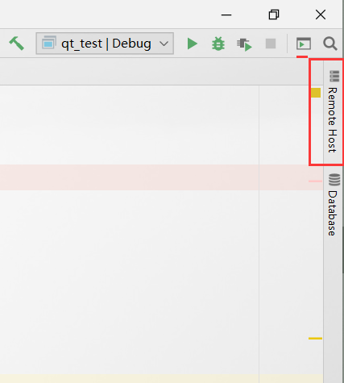
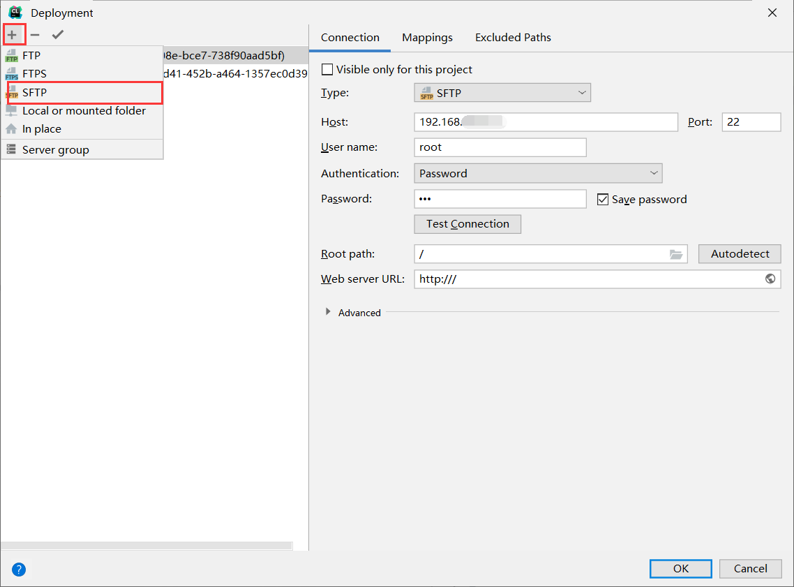
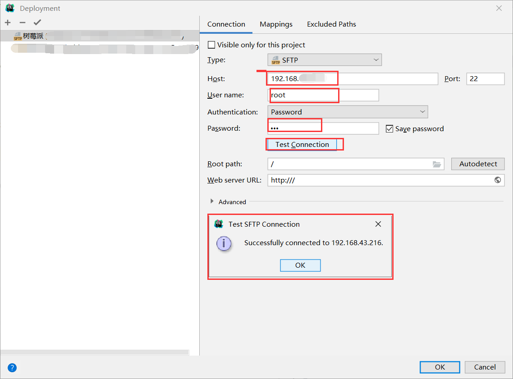
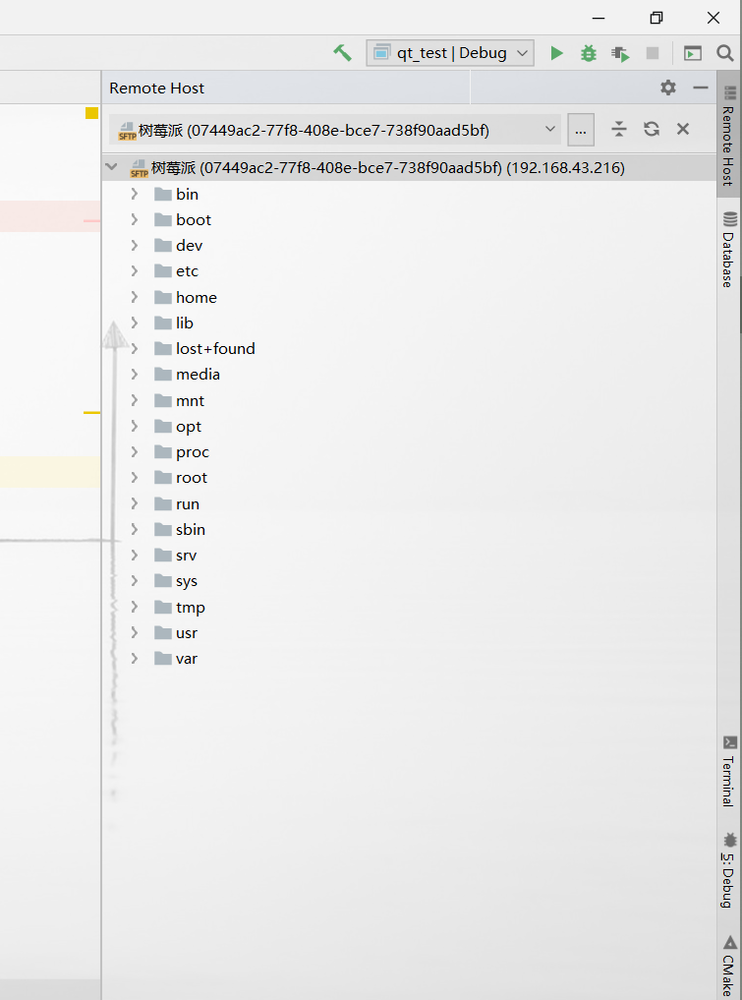
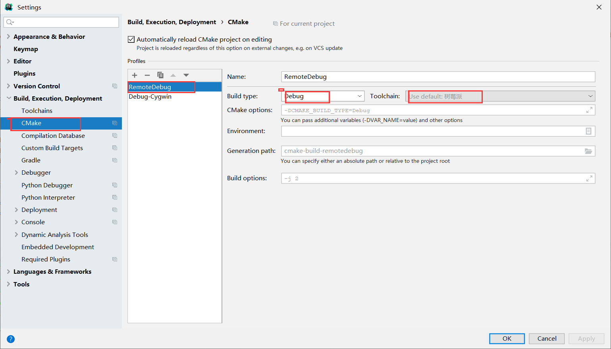
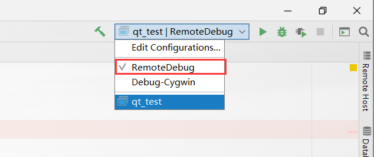

# CLion + 树莓派/Ubuntu  远程调试

Clion进行远程调试

在大三下半学期学习Linux高级编程时，老师布置的作业要在linux机器上进行，当时完成的十分艰苦，调试难受的一匹，当时就萌生了这个想法，因为Jetbrains官方文档的晦涩（英语差）不了了之。后来在多方群友的指导下，参悟此法，立地成佛。写下此博客。另：本文采用的是树莓派环境，因为上一篇文章配置的树莓派上的Qt，因此本文也采用树莓派，ubuntu上也是同样的的，毕竟都是Linux环境吗。

## CLion配置远程环境。


正常情况下，右边边栏会有RemoteHost按钮，没有可以点击Tools--> Deployment--> Browse RemoeHost设置。



- 新建连接，选择SFTP模式，为什么选它，emm可能是因为它能传文件吧。

    


- 依次填写Host（远程主机名，什么，你不知道？登远程主机输入“ifconfig”）、User name 、Password点击测试，出现Successful即可。别忘了点击OK呦。




- 选择好要存放的地址。


- 出现如下即可。



## 工具链配置

- 远程机（包括不限于树莓派）安装cmake

    		下载好相关cmake包，

    ```
    $:tar -xvf cmake-3.14.6.tar.gz
    $:cd cmake-3.14.6
    
    $:./configure
    $:make
    $:sudo make install
    
    $:cmake --version
    cmake version 3.14.6
    ```

    当然调试吗，  GDB和GCC、G++都是应该有的。

- 打开设置界面、选择远程工具链，注意填写远程地址。

    cmake安装上面的cmake操作得话，默认安装路径就是/usr/local/bin/cmake.不知道的话可以使用which cmake 获取路径，Debugger这里需要注意的是应使用/usr/bin/gdb.当然在另外安装GDB后，在/usr/local/bin/gdb路径在也有一个gdb，二者都可以使用。我当初在这里使用的是GDBServer。。。emmm。GBD和GDBServer是两种不同的调试方式，使用GDBServer还需要在linux上进行端口的配置。（幸好，在即将出来的2019.3版本的CLion上将简化这个步骤，十分期待啊！！！）


- 配置cmake的使用环境（这里使用刚配置好的树莓派工具链）。




此时在下图将出现刚配置好的cmake工具，因为我在cmake下配置了两个，一个是在本机Windows下使用，另一个是在远程机上使用，需要时切换即可。




点击debug按钮后，出现如下界面，在debug的控制台界面会显示当前文件在远端的保存位置，此时证明已成功。


