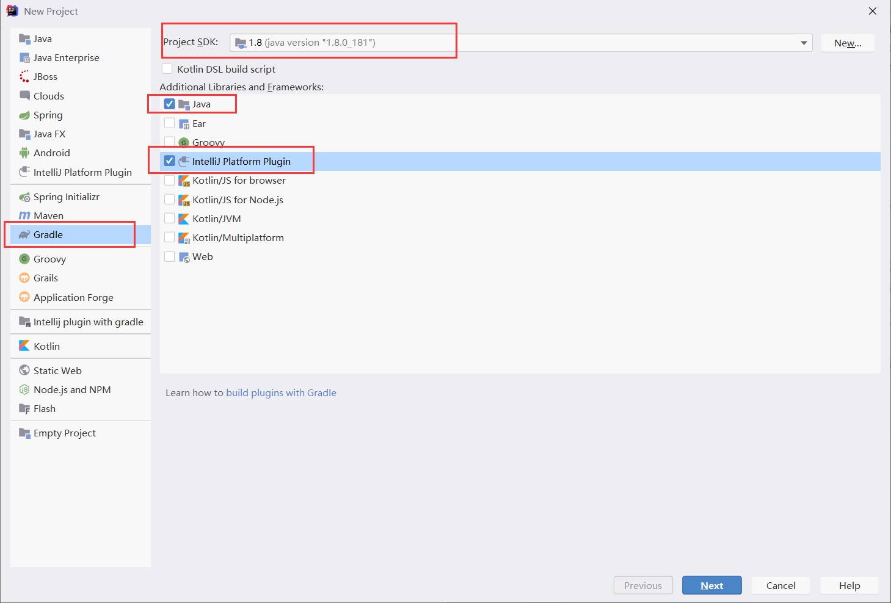

# IntelliJ Plugin之插件开发----环境配置

## 1.	环境配置

### 1.	Gradle配置

- 新建一个Gradle的Plugin项目。

- 配置Gradle

    此时的项目会进行依赖下载等，需要在命令行中输入**gradle**，这一步至关重要，因为默认的gradle配置是不使用命令行的，因而也看不到下载进度，每每都失败(可能是我没有耐心？)，在等待下载之后，即可进行和插件开发。

## 参考：

[gradle环境配置](https://www.jianshu.com/p/cb87f5e7568f)

[插件开发入门](https://zhuanlan.zhihu.com/p/57541660)