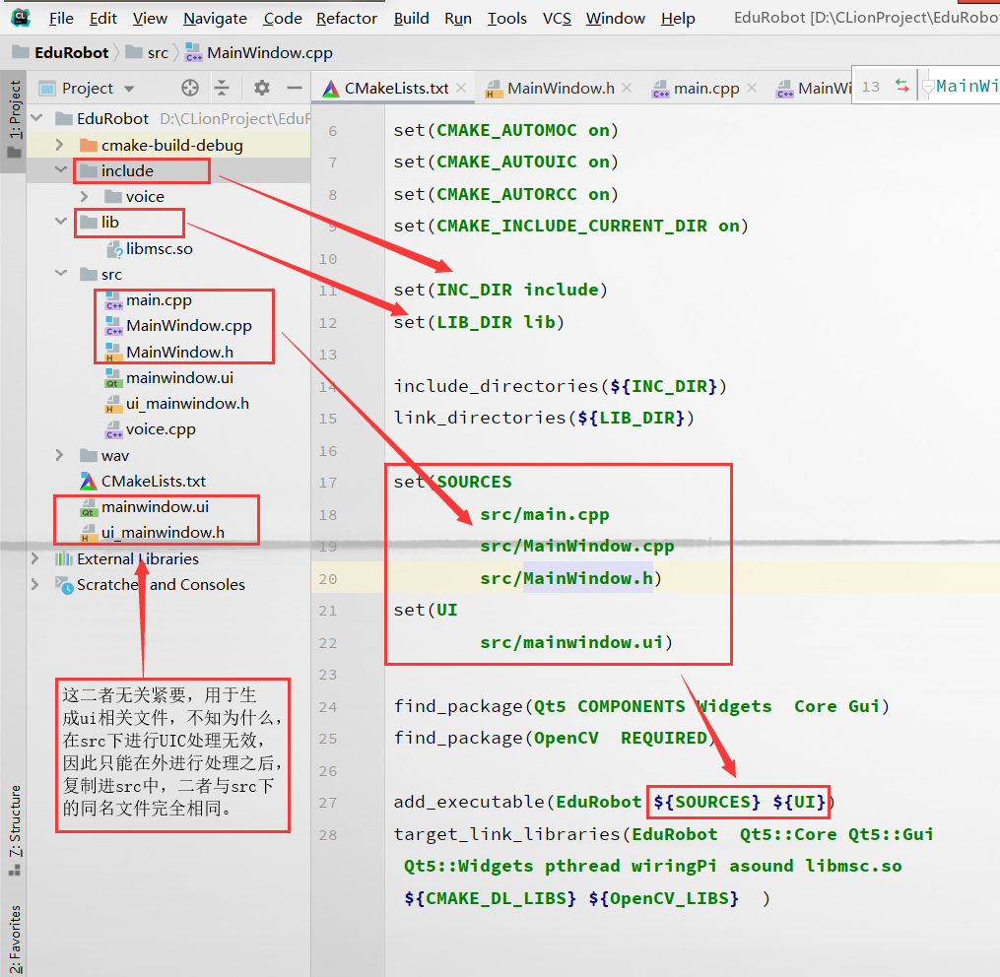

# Linux+CLion+树莓派远程编译时，Cmake编译出现undefined reference to `vtable for MainWindow'的解决办法

## 1.在win+CLion上进行远程qt开发时碰到以下错误：

- 错误提示：

```
undefined reference to `vtable for MainWindow'
```

- 原因：源文件的目录结构有问题？？

- 解决方法：

```
将目录结构不分为include、lib等。直接放在一个文件下，不论是*.ui、*.cpp、*.h等。
```
2019.10.15更新：

- 最新一次发生该情况时，试着将含有qt特征文件（含有qt的mainwindow等特征性）放置在src下，而include、lib等另做处理，程序编译无错误。参考我的文件目录结构与cmake文件。
    

参考：[https://stackoverflow.com/questions/14015792/why-am-i-getting-undefined-reference-to-vtable-errors-when-linking-this-qt](https://stackoverflow.com/questions/14015792/why-am-i-getting-undefined-reference-to-vtable-errors-when-linking-this-qt)

