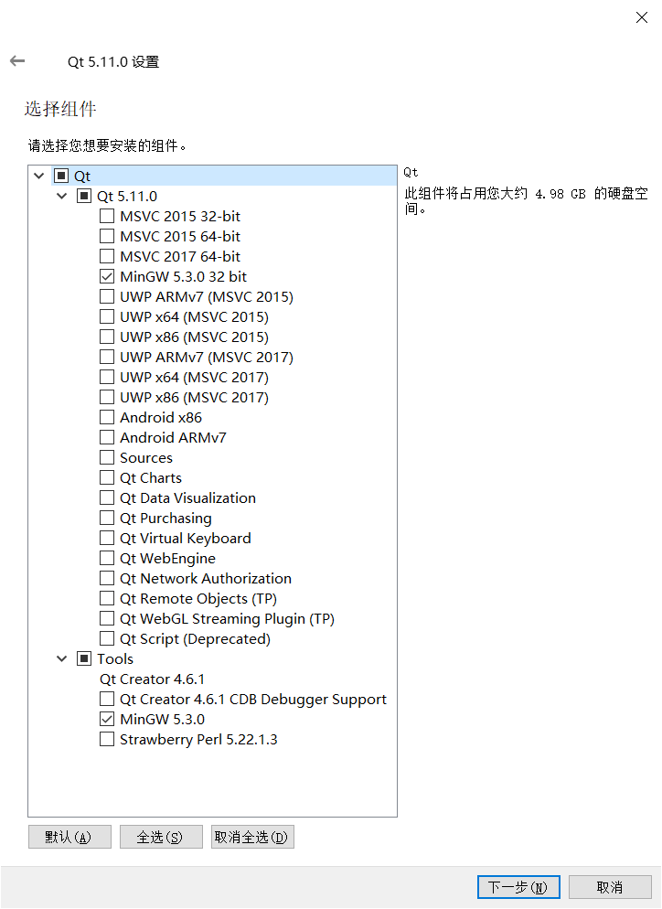
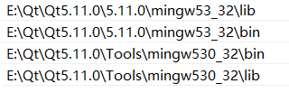
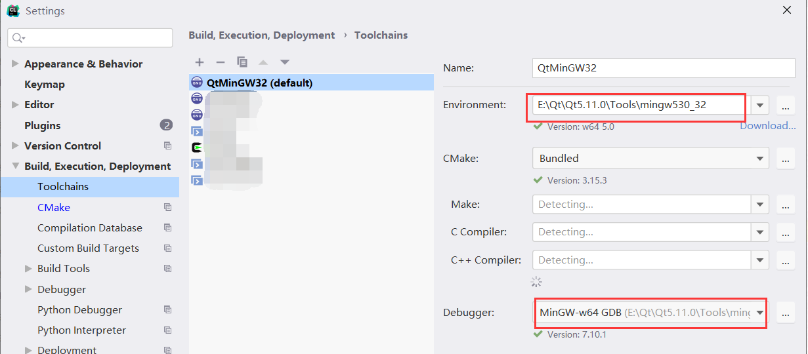
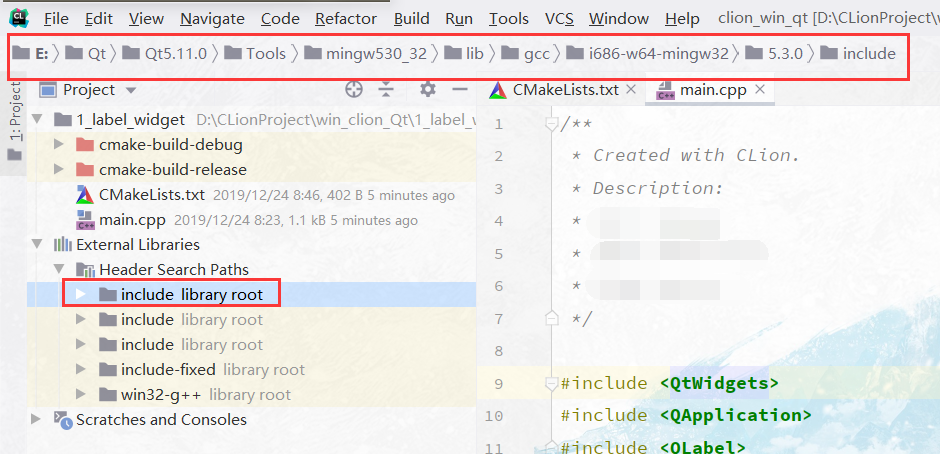
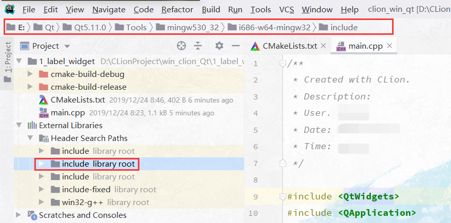
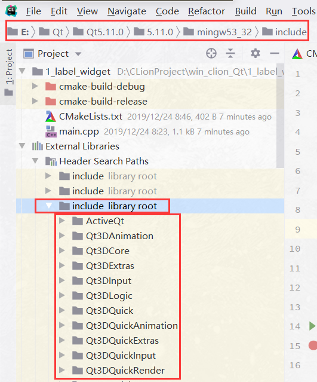

# Win10 + CLion + QT 编译Windows本地qt应用程序

## 1.	Qt的安装与配置。

### 1.1	安装

- Qt的编译需要使用Qt自带的MinGW编译器以及Qt库。

    

### 1.2	环境变量的配置。（Path中）



此布过后，一定要下一步之前重启，使环境变量生效。

## 2.	CLion配置

### 2.1	工具链的选择



### 2.2 CmakeList.txt文件配置

```
cmake_minimum_required(VERSION 3.15)
project(1_label_widget)

set(CMAKE_CXX_STANDARD 14)
set(CMAKE_AUTOMOC on)
set(CMAKE_AUTOUIC on)
set(CMAKE_AUTORCC on)
set(CMAKE_INCLUDE_CURRENT_DIR ON)

#set(CMAKE_PREFIX_PATH E:\Qt\Qt5.11.0\5.11.0\mingw53_32) 没有配置环境变量时需要配置该项

find_package(Qt5 COMPONENTS Widgets)

add_executable(1_label_widget main.cpp)

target_link_libraries(1_label_widget Qt5::Widgets )
```

### 2.3	检查External Libraries

正确配置环境变量后，将出现以下5个外部库。





这个库将是编写Qt使用的主要库。




### 2.4	未解决

CmakeList.txt中怎样使用图片，图标等。

## 3.	参考

- [Win10配置CLion的Qt开发环境](https://blog.csdn.net/iamjingong/article/details/80876040?locationNum=8&fps=1)

- [CLion开发Qt的相关组件，如Designer等](https://blog.csdn.net/qq_33365649/article/details/91508348)

