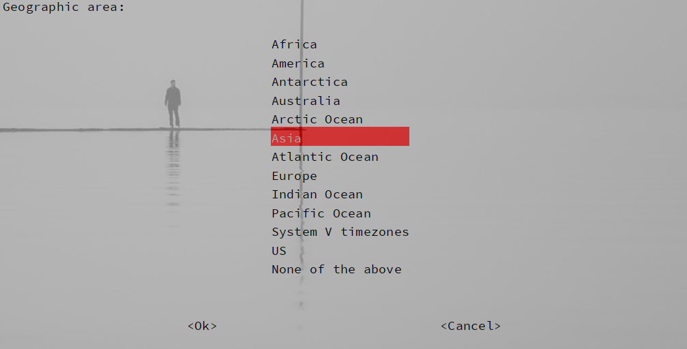
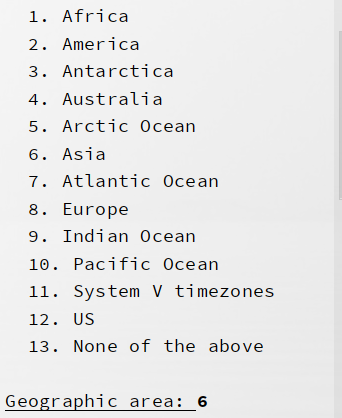
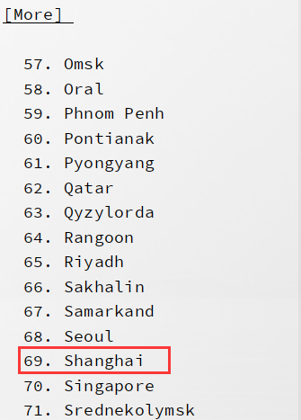

# 树莓派时间同步问题

## 1.	树莓派将数据发送至服务器时，发现时间不同步，相差8小时

```
$:date								//显示树莓派系统时间，相差win10时间8小时
Sat  9 Nov 07:03:31 GMT 2019
$:sudo dpkg-reconfigure tzdata		//修改时间
```

## 2.	修改时区信息

- 上面一条命令是有界面的（类似于win10 BIOS的样式）依次选择6：Asia（亚洲），69：shagnhai（上海）。




- 当终端显示界面较小时，采用数字设置。
- 出现[More]时，没有所需要的可以按下**[回车]**键到下一页。





## 3.	重新查看时间

```
$:date
Sat  9 Nov 15:05:31 GMT 2019
```

此时时间已修正。