# 阿里云服务器环境搭建

## 1.	Root远程可登陆

### 1.1	修改配置文件

```
#:vim /etc/ssh/sshd_config
修改 #PermitRootLogin prohibit-password  ----->
	PermitRootLogin yes
```

### 1.2	重启SSH服务

```
#:/etc/init.d/ssh restart
```


##  2.数据库

### 2.1	安装

```
#:apt-get install mysql-server;
```

### 2.2	查看状态

```
#:systemctl status mysql.service 或
#:sudo service mysql status
```

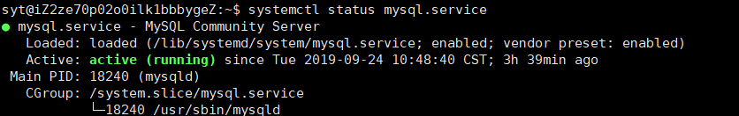

### 2.3	修改字符集

参考[修改字符集](https://blog.csdn.net/yeya24/article/details/81836218)

### 2.4	修改MySQL root密码

```
$:mysql
mysql>:use mysql;
mysql>:update mysql.user set authentication_string=password('XXX') where user='root'
```

### 2.5	数据库远程连接

修改配置文件

```
vim vim /etc/mysql/mysql.conf.d/mysqld.cnf
注释 bind-address           = 127.0.0.1
```

### 2.6	使root远程登录

```
$:mysql -u root -p
输入密码
mysql>use mysql;
mysql>:delete from user where user='';	//删除匿名账户
mysql>:grant all privileges on *.* to 'root'@'%' identified by 'XXX' with grant option;		//给root授予在任意主机（%）访问任意数据库的所有权限,并设置root远程登录密码(与root登录意义不同)
```


### 2.7	重启MySQL服务

```
$:service mysql restart
```


## 3. JDK

### 3.1	查看所有jdk

```
#：sudo apt-get install jdk*
```

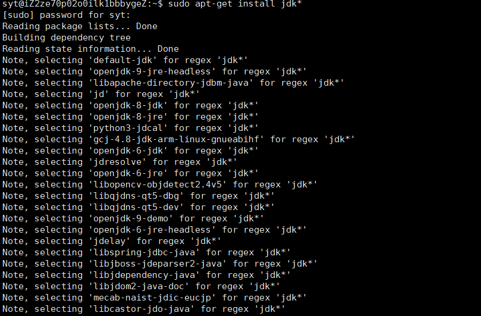

### 3.2	选择版本安装：

- 选择的1.8版本

```
#：sudo apt-get install openjdk-8-jdk
```

### 3.3	查看是否安装成功

```
#：java -version
```

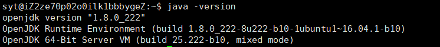

## 4.	Tomcat

### 4.1	安装

```
#:sudo apt-get install tomcat9
```

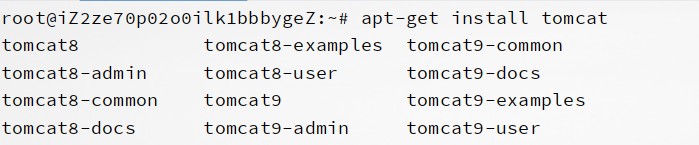

### 4.3	查看版本

```
#:find / -name version.sh
/usr/share/tomcat9/bin/version.sh		//我的本地信息
```


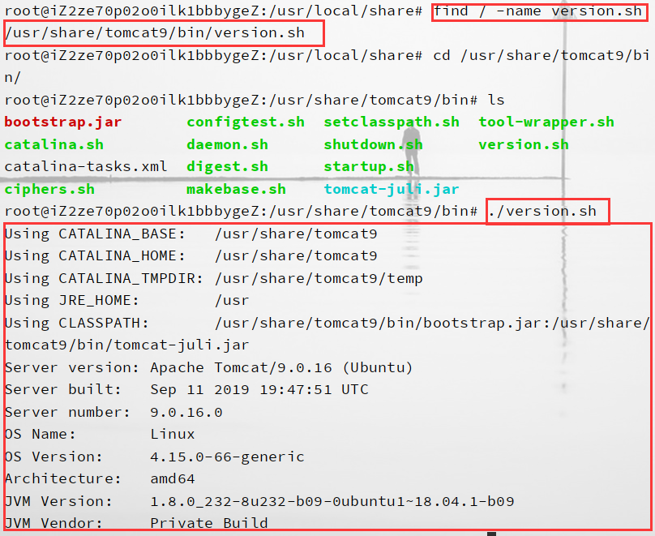

### 4.2	阿里云设置安全组，配置Tomcat端口

### 4. 部署web项目

1. 配置数据库
2. 找到**webapps**目录放入war文件，自动生成目录

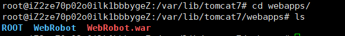

 3.  打开网页后面ip：8080：项目名称

     ```
     http://101.200.148.140:8080/WebRobot/
     ```

     

     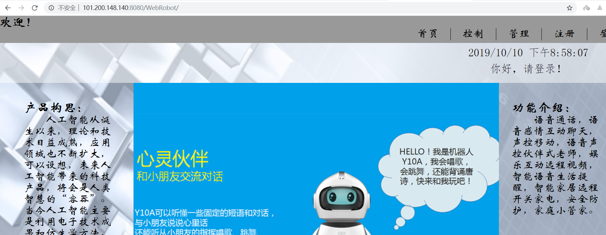

 4.  数据库连接错误

     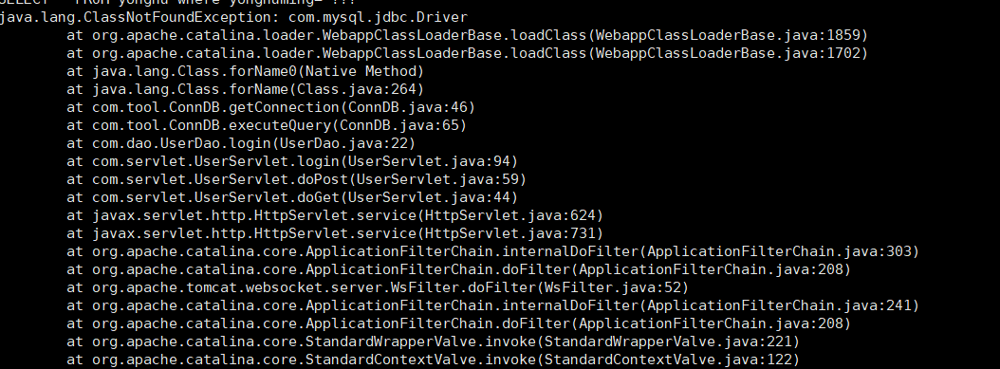
     
 5.  查看后台输出

     ```
     cd /var/lib/tomcat/logs
     tail -f catalina.out
     结束查看：ctrl+c
     ```

     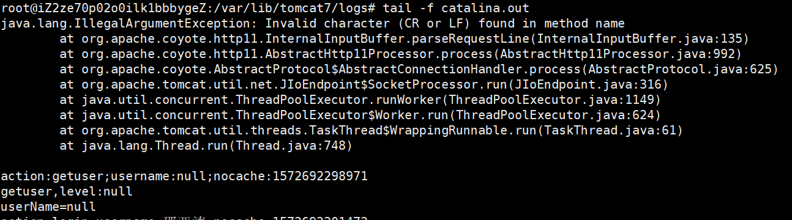

### 5. 数据库远程连接

1. mysql默认是只允许本地主机访问127.0.0.1，并关闭了远程连接，所以安装之后打开远程连接，并修改配置允许其他ip访问。

   ```
   vim /etc/mysql/mysql.conf.d/mysqld.cnf
   ```

   发现`bind-address = 127.0.0.1`。把它注释掉

   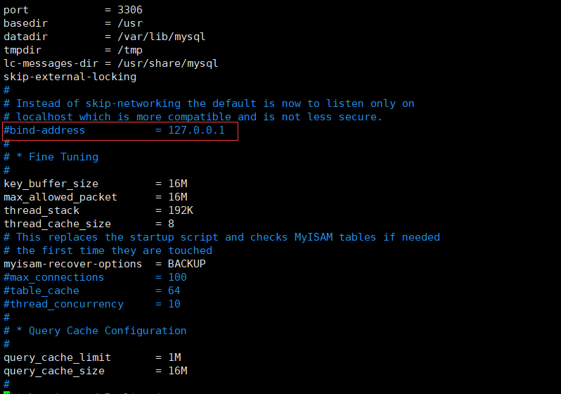

2. 登录

   ```
   mysql -u root  -p
   
   use mysql                #打开mysql数据库
   
   update user set host='%' where user='root' and host='localhost';
   #root可以为其他用户
   flush privileges;        #刷新权限表，使配置生效
   ```

   备注：您也可以添加一个用户名为yuancheng，密码为123456，权限为%（表示任意ip都能连接）的远程连接用户。命令参考如下：

   ```
   grant all on *.* to '用户名'@'%' identified by '密码';
   
   flush privileges;
   ```

3. 更改阿里云服务器

   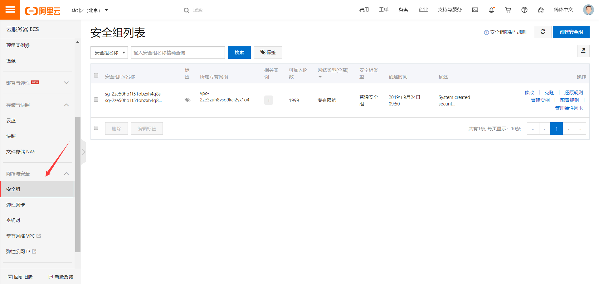

   添加MySQL端口

   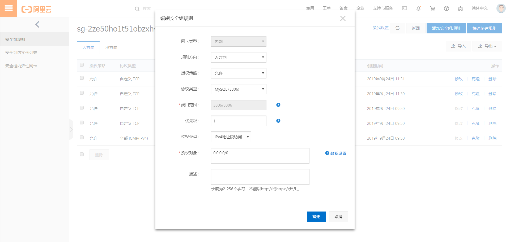

4. 连接成功

   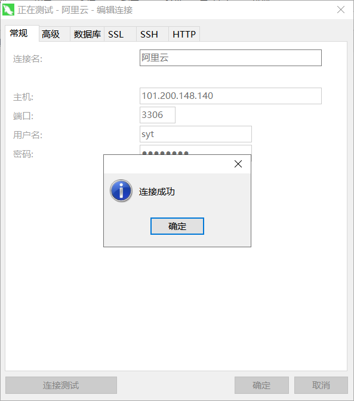

### 6. 外网视频监控实现

1. 阿里云服务器安装配置Apache2

   

   ```
   安装Apache2 
   apt-get install apache2 
   加载模块 
   a2enmod proxy proxy_ajp proxy_balancer proxy_connect proxy_ftp proxy_http 
   编辑proxy配置文件 
   nano /etc/apache2/mods-enabled/proxy.conf 
   ```

   配置文件内容

   ```
   ProxyRequests Off
           <Proxy *>
              AddDefaultCharset off
              Order deny,allow
              Allow from all
              #Require all denied
              #Require local
           </Proxy>
           <VirtualHost *:80>
                   ProxyPass /proxy        http://127.0.0.1:10005
                   ProxypassReverse /proxy http:127.0.0.1:10005
           </VirtualHost *:80>
   ```

2. 安装过其他服务器

   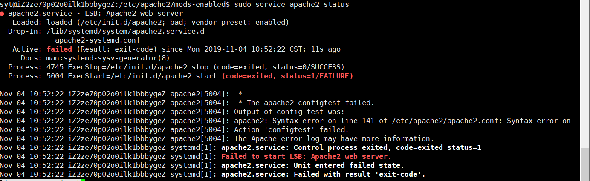

   1. 卸载Apache2：`sudo apt-get remove --purge apache2 apache2-utils`
   2. 安装Apache2：`sudo apt-get install apache2`

3. 修改阿里云安全组规则

   

